# Инструкция Git

 **Git**  - (**система управления версиями**) это консольная утилита, для отслеживания и ведения истории изменения файлов, в вашем проекте. Чаще всего его используют для кода, но можно и для других файлов. Например, для картинок - полезно для дизайнеров. Сохраняет в памяти  не файлы целиком, а разницу между файлами.*
 

 

Создателем системы управления версиями Git является **Линус Бенедикт Торвальдс** — финно-американский программист. Создатель ядра Linux.

С помощью Git-a вы можете откатить свой проект до более старой версии, сравнивать, анализировать или сливать свои изменения в репозиторий.

Так же ваши репозитории можно хранить и в интернете. Обычно для этого используют три сервиса:

* GitHub

* Bitbucket

* GitLab

## - Установка

* **Git для Windows,Mac,Linux:**  [https://git-scm.com/downloads](https://git-scm.com/downloads)

    При первом использовании Git необходимо представитсься. Для этого нужно ввести в терминал команды:

    1. git config --global user.name "Ваше имя английскими буквами" git

    2. config -- global user.email ваша_почта@example.com

## - Настройка репозитория

* Инициализация нового репозитория: ***git init*** - используется для создания новго репозитория. Команду ***git init*** выполняют только один раз для первоначальной настройки нового репозитория. Выполнение команды приведет к созданию нового подкаталога ***.git*** в вашем рабочем каталоге. Кроме того, будет создана новая главная ветка.

    

    

## - Сохранение изменений

* ***git add*** -  добавляет изменение из рабочего каталога в раздел проиндексированных файлов. Она сообщает Git, что вы хотите включить изменения в конкретном файле в следующий коммит. Однако на самом деле команда ***git add*** не оказывает существенного влияния на репозиторий: изменения регистрируются в нем только после выполнения команды ***git commit***.

    **Распространенные опции :**

    Проиндексировать все изменения в файле <file> для следующего коммита:

    

    Проиндексировать все изменения в каталоге <directory> для следующего коммита:

    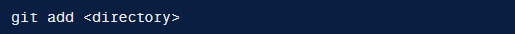

    Если создано много файлов или внесено много изменений к ним, то тогда можно использовать следующую команду: 

    

    Данная команда добавит в индекс все файлы, в которых были изменения, а также новые файлы.

* ***git commit*** -  делает для проекта снимок текущего состояния изменений, добавленных в раздел проиндексированных файлов. Такие подтвержденные снимки состояния можно рассматривать как «безопасные» версии проекта — Git не будет их менять, пока вы явным образом не попросите об этом. Перед выполнением команды ***git commit*** необходимо использовать команду ***git add***, чтобы добавить в проект («проиндексировать») изменения, которые будут сохранены в коммите.

    

    **Распространенные опции :**

    Коммит проиндексированного состояния кода. Эта команда откроет текстовый редактор с предложением ввести комментарий к коммиту. После ввода комментария сохраните файл и закройте текстовый редактор, чтобы выполнить коммит:

    

    Выполнение коммита состояния со всеми изменениями в рабочем каталоге. Эта команда включает только изменения отслеживаемых файлов (тех, которые были в какой-то момент добавлены в историю с помощью команды git add):

    

    Быстрая команда, которая создает коммит с указанным комментарием. По умолчанию команда git commit открывает локально настроенный текстовый редактор с предложением ввести комментарий к коммиту. При передаче параметра -m текстовый редактор не открывается, а используется подставленный комментарий:

    

    Команда для опытных пользователей с параметрами -a и -m. Эта комбинация параметров создает коммит всех проиндексированных изменений и добавляет к коммиту подставленный комментарий:

    

* ***git diff*** -  это функция, анализирующая два входных набора данных и отображающая различия между ними. ***git diff*** представляет собой многоцелевую команду Git, которая инициирует функцию сравнения источников данных Git — коммитов, веток, файлов и т. д.

    **Изменения после последнего коммита:**

    По умолчанию команда ***git diff*** выводит все неподтвержденные изменения, внесенные после последнего коммита.

    

    **Сравнение файлов в двух коммитах:**

    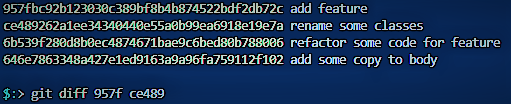

    **Чтение вывода команды diff:**

    1. ***Входные данные сравнения***

        В этой строке отображаются входные данные сравнения. Как видите, для сравнения переданы файлы a/diff_test.txt и b/diff_test.txt:

        

    2. ***Метаданные***

        В этой строке отображаются внутренние метаданные Git. Скорее всего, они вам не понадобятся. Номера в этих выходных данных соответствуют хеш-идентификаторам версий объектов Git:

        

    3. ***Маркеры изменений***

        Эти строки представляют собой легенду обозначений для каждого источника входных данных сравнения. В данном случае изменения из файла a/diff_test.txt помечаются символом ---, а из файла b/diff_test.txt — символом +++:

        

    4. ***Сравниваемые фрагменты***

        Остальные выходные данные сравнения — это список сравниваемых фрагментов. При сравнении отображаются только разделы файла, в которых есть изменения. В данном примере имеется только один такой фрагмент, поскольку обрабатывается простой сценарий. Фрагменты имеют собственную ограниченную семантику вывода:

        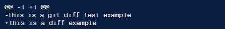
        
        Первая строка — это заголовок фрагмента. К началу каждого фрагмента добавляется заголовок, ограниченный символами @@. Заголовок кратко описывает изменения в файле. В нашем простом примере заголовок -1 +1 означает, что имеются изменения в первой строке. В реальных случаях заголовок может выглядеть так:

        

        В данном примере заголовка было извлечено 6 строк начиная со строки 34. Кроме того, после строки 34 было добавлено 8 строк.

        Остальное содержимое фрагмента сравнения — это недавние изменения. Каждой измененной строке предшествует символ + или -, указывающий на источник входных данных сравнения. Как уже упоминалось, символ - указывает на изменения в файле a/diff_test.txt, а + — на изменения в файле b/diff_test.txt.

## - Проверка репозитория 

* ***git status*** -  отображает состояние рабочего каталога и раздела проиндексированных файлов. С ее помощью можно проверить индексацию изменений и увидеть файлы, которые не отслеживаются Git. Информация об истории коммитов проекта не отображается при выводе данных о состоянии. Для этого используется команда ***git log***.

    Выводит список проиндексированных и неотслеживаемых файлов, а также файлов, удаленных из индекса Git:

    

    Команда git status относительно проста в использовании. Она показывает, какие изменения были внесены с помощью команд git add и git commit. Сообщения о состоянии также содержат инструкции по индексированию файлов либо отмене этой операции. В примере выходных данных ниже показаны три основные категории вызова git status:

    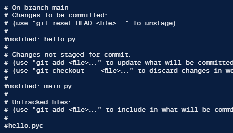

* ***git log*** -  отображает отправленные снимки состояния и позволяет просматривать и фильтровать историю проекта, а также искать в ней конкретные изменения. С помощью ***git status*** можно просматривать рабочий каталог и раздел проиндексированных файлов, в то время как ***git log*** показывает только историю коммитов.

    Выводит полную историю коммитов в стандартном формате. Если выходные данные занимают более одного экрана, можно выполнить прокрутку с помощью клавиши Пробел или нажать q для выхода.

    

    Пример вывода данных команды ***git log***:

    

## - Отмена изменений  

* ***git checkout*** -  это простой способ «загрузить» любой из этих сохраненных снимков на компьютер разработчика. При стандартном процессе разработки указатель ***HEAD*** обычно указывает на главную ветку main или другую локальную ветку. Но при переключении на предыдущий коммит ***HEAD*** указывает уже не на ветку, а непосредственно на сам коммит. Такая ситуация называется состоянием открепленного указателя ***HEAD***, и ее можно представить так:

    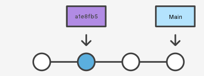

    Переход к старой версии файла не перемещает указатель ***HEAD***. Он остается в той же ветке и в том же коммите, что позволяет избежать открепления указателя ***HEAD***. После этого можно выполнить коммит старой версии файла в новый снимок состояния, как и в случае других изменений. Соответственно, такое использование команды git checkout применительно к файлу позволяет откатиться к прежней версии отдельного файла.

    * Пример использования команды ***git checkout***:

        Допустим, история вашего проекта выглядит примерно так:

        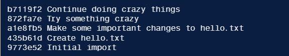

        Для просмотра коммита «Make some important changes to hello.txt» можно использовать команду git checkout в следующем виде:

        

        Это приведет к тому, что ваш рабочий каталог будет в точности соответствовать состоянию коммита a1e8fb5. Вы можете просматривать файлы, компилировать проект, запускать тесты и даже редактировать файлы, не боясь потерять текущее состояние проекта. Никакие внесенные здесь изменения не будут сохранены в репозитории. Чтобы продолжить разработку, необходимо вернуться к текущему состоянию проекта:

        ]

## - Переписывание истории  

* ***git reflog (Справочные журналы)*** -  то механизм, который используется в Git для регистрации обновлений, применяемых к концам веток и другим ссылкам на коммиты. ***Reflog*** позволяет вернуться к коммитам, даже если на них нет ссылок из какой-либо ветки или метки. После перезаписи истории ***reflog*** содержит информацию о старом состоянии веток и позволяет при необходимости вернуться к этому состоянию. Каждый раз при обновлении конца ветки любым способом (переключение веток, загрузка новых изменений, перезапись истории или просто добавление новых коммитов) в ***reflog*** добавляется новая запись. 

    Отображается reflog локального репозитория:

    

    Переход к старой версии файла не перемещает указатель ***HEAD***. Он остается в той же ветке и в том же коммите, что позволяет избежать открепления указателя ***HEAD***. После этого можно выполнить коммит старой версии файла в новый снимок состояния, как и в случае других изменений. Соответственно, такое использование команды git checkout применительно к файлу позволяет откатиться к прежней версии отдельного файла.

    С помощью этой команды вызывается журнал ссылок ***HEAD***. Вывод команды должен выглядеть примерно так:

    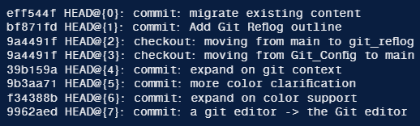

    Необходимо отметить, что reflog только предоставляет страховку на тот случай, когда изменения попали в коммит в локальном репозитории, и что в нем отслеживаются только перемещения концов веток репозитория. Кроме того, записи reflog имеют определенный срок хранения. По умолчанию этот срок составляет ***90 дней***.

## - Переписывание истории

* ***git reflog (Справочные журналы)*** -  то механизм, который используется в Git для регистрации обновлений, применяемых к концам веток и другим ссылкам на коммиты. ***Reflog*** позволяет вернуться к коммитам, даже если на них нет ссылок из какой-либо ветки или метки. После перезаписи истории ***reflog*** содержит информацию о старом состоянии веток и позволяет при необходимости вернуться к этому состоянию. Каждый раз при обновлении конца ветки любым способом (переключение веток, загрузка новых изменений, перезапись истории или просто добавление новых коммитов) в ***reflog*** добавляется новая запись.

    Отображается reflog локального репозитория:

    

    Переход к старой версии файла не перемещает указатель ***HEAD***. Он остается в той же ветке и в том же коммите, что позволяет избежать открепления указателя ***HEAD***. После этого можно выполнить коммит старой версии файла в новый снимок состояния, как и в случае других изменений. Соответственно, такое использование команды git checkout применительно к файлу позволяет откатиться к прежней версии отдельного файла.

    С помощью этой команды вызывается журнал ссылок ***HEAD***. Вывод команды должен выглядеть примерно так:

    

    Необходимо отметить, что reflog только предоставляет страховку на тот случай, когда изменения попали в коммит в локальном репозитории, и что в нем отслеживаются только перемещения концов веток репозитория. Кроме того, записи reflog имеют определенный срок хранения. По умолчанию этот срок составляет ***90 дней***.

## - Работа с удалёнными репозиториями

* ***git clone*** -  Если проект уже настроен в центральном репозитории, наиболее распространенным способом создать его локальный клон является команда clone. Клонирование, как и команда git init, обычно выполняется один раз. Получив рабочую копию, разработчик в дальнейшем выполняет все операции контроля версий из своего локального репозитория.

    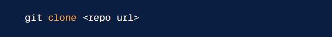

* ***git push*** -  Команда git push используется для выгрузки содержимого локального репозитория в удаленный репозиторий. Она позволяет передать коммиты из локального репозитория в удаленный. Эта команда симметрична команде git fetch: при извлечении с помощью fetch коммиты импортируются в локальные ветки, а при публикации с помощью push коммиты экспортируются в удаленные ветки. Настроить удаленные ветки можно с помощью команды git remote. Команда push может перезаписать изменения, поэтому при ее использовании следует соблюдать осторожность.

    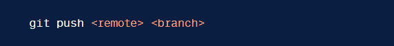

    Команда git push чаще всего используется для публикации выгружаемых локальных изменений в центральном репозитории. Для того чтобы поделиться изменениями, внесенными в локальный репозиторий, с удаленными участниками команды, необходимо выполнить команду push.

* ***git pull*** -  Команда git pull используется для извлечения и загрузки содержимого из удаленного репозитория и немедленного обновления локального репозитория этим содержимым. Слияние удаленных вышестоящих изменений в локальный репозиторий — это обычная задача рабочего процесса, возникающая при совместной работе на основе системы Git. Команда git pull на самом деле представляет собой комбинацию двух других команд: git fetch и git merge. На первом этапе git pull выполняется команда git fetch, ограниченная локальной веткой, на которую указывает HEAD. Сразу после загрузки содержимого команда git pull выполняет слияние. Для слитого содержимого создается новый коммит, а указатель HEAD обновляется и начинает указывать на этот новый коммит.

    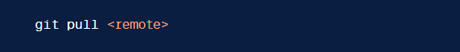

## - Выполнение запроса pull

Порядок действий:

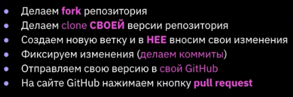

