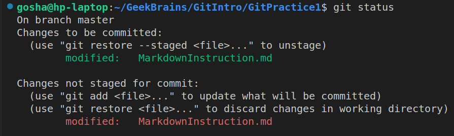
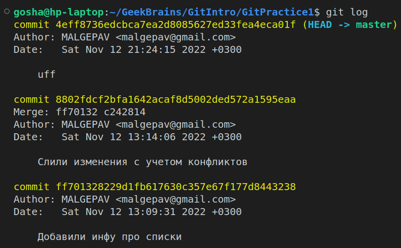
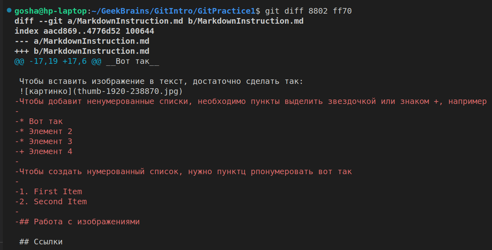
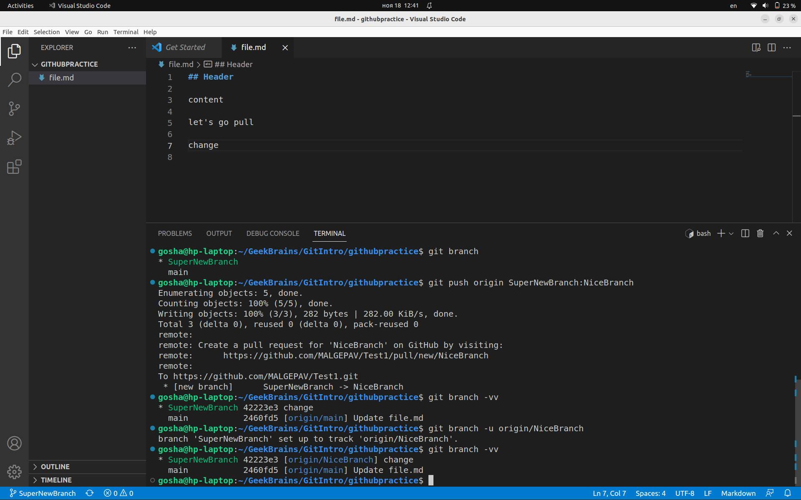

# __Некоторые базовые команды для работы с Git в терминале__

> **_"Земную жизнь пройдя до половины,   
я очутился в сумрачном лесу, ..."_** 
Данте Алигьери, *"Божественная комедия"*

## 1. **Начало работы с Git:**
+ ### **git --version** 

    выводит версию программы Git в случае ее корректной установки
+ ### **git config --global user.name "_USERNAME_"**

+ ### **git config --global user.email _email@adress.com_**

    устанавливают соответственно имя пользователя и e-mail, которые будут отображаться в журнале версий

+ ### __git init__
    создает в текущей рабочей папке репозиторий, то есть возможность контроля версий

## 2. __Сохранение версий файлов в репозитории__
- ### **git status**
    показывает состояние файлов в рабочей папке: неотслеживаемые файлы, проиндексирванные файлы,измененные файлы и т. п.

    

- ### **git add _filename1_ _filename2_ _filename3_**
    добавляет файлы _filename1_, _filename2_, и _filename3_ 
    к индексированным (_staged_) и делает их отслеживаемыми, если они таковыми не были

    - **git add .**

        добавляет к индексированным __*все*__ файлы в рабочей папке

- ### **git commit -m "_comment_"**

    производит фиксацию (*commit*) индексированных файлов с указанным комментарием

    - __git commit -am "_comment_"__

        фиксирует __*все отслеживаемые*__   файлы в репозитории, минуя стадию индексирования

- ### __git diff__
    показывает неиндексированные сохраненные изменения в файлах 
        
## 3. **Работа с сохранеными версиями**

* ### __git log__ 
    выводит в обратном хронологическом порядке список сохраненных версий файлов с их хеш-кодами, информацией об авторе и его комментарием:

    
    
    - __git log -p__

        к обычнгму выводу git log добавляется информация об изменениях в файлах

    - __git log -graph__

        показывает историю коммитов с визуализацией веток.

* ### __git checkout *hash*__
    открывает версию файлов с указанным хеш-кодом

- ### __git diff *hash1 hash2*__
    показывает разницу между двумя версиями с данными хеш-кодами (достаточно использовать только первые 4 цифры кода)

## 4. **Удаление файлов**
 * ### __git rm *filename1 filename2*__

    удаляет указанные файлы из рабочей папки и из списков отслеживаемых и неотслеживаемых файлов после следующей фиксации версии
    
    * ### __git rm -f *filename1*__
        принудительно удяляет файл даже из списка индексированных

## 5. Работа с ветками

* ### __git branch__
    Выводит список имеющихся веток, текущая ветка выделена 

* ### __git branch *branchname*__
    создает ветку *branchname*

 * ### __git branch -d *branchname*__
    удаляет ветку *branchname* 

    * ### __git branch -M *oldbranchname* *newbranchname*__
    переименовывает ветку *oldbranchname* в *newbranchname*

* ### __git checkout *branchname*__

    осуществляет переход на ветку *branchname*

    + ### __git checkout -b *branchname*__
        создание ветки *branchname* и переход на нее

* ### __git merge *branchname*__
    сливает текущую ветку с веткой *branchname*, при этом изменения записываются в текущую ветку.

    
## 5. Работа с удаленными репозиториями

* ### __git clone *URL*__
    добавляет в текущую папку копию репозитория находящегося по адресу *URL*, сам удаленный репозиторий получает имя *origin*, локальная ветка *master* начинает отслеживать (track) удаленную ветку *origin/master*

* ### __git add remote *repname* *URL*__
    добавляет удаленный репозиторий находящийся по адресу *URL* присваивая ему имя *repname*

* ### __git checkout -b *localbranch* *repname*/*remotebranch*__
    создает локальную ветку *localbranch*,
    отслеживающую удаленную ветку *remotebranch* с репозитория *repname*

* ### __git branch -u *repname/remotebranchname*__
    текущая локальная ветка начинает отслеживать удаленную ветку *remotebranchname* с репозитория *repname*

* ### __git branch -vv__
    выводит список локальных веток с информацией о том, за чем следит каждая ветка 

    

* ### __git push__
    "заливает" текущую локальную ветку на удаленную, которую отслеживает 
    
    - ### __git push *repname* *localbranchname:remotebranchname*__

        заливает локальную ветку *localbranchname* на удаленную ветку *remotebranchname* репозитория *repname*

* ### __git pull__
    "заливает" в текущую локальную ветку (выполняя слияние) удаленную, которую она отслеживает
    

[Книга "__Pro Git__" авторов Scott Chacon и Ben Straub](https://git-scm.com/book/en/v2)

