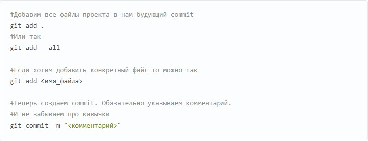

# Инструкция по работе с Git

## Установка Git

Перед началом работы с Git, необходимо установить его на наш компьютер.

Переходим по ссылке ниже и следуем инструкции установки со стандартными параметрами:

[Ссылка на установочный файл со всплявающей подсказкой](https://git-scm.com/download/win "Сайт Geek Brains"). Это — [без подсказки](https://git-scm.com/download/win)

## Начало работы с Git

Сперва нужно *представиться* нашей **прорамме**, чтобы __она__ знала с _кем работает_. Проводим две команды _**последовательно**_:

1. git config --global user.name
2. git config --global user.email

Затем нужно создать репозиторий. Для этого проходим в папку нашего проекта и проводим команду git init.

## Первые и самые важные команды

Теперь Git отслеживает изменения файлов нашего проекта. Но, так как мы только создали репозиторий в нем нет нашего кода. Для этого необходимо создать commit.

Следуем инструкциям с картинки:

## Процесс работы с Git

Не стоит после каждого изменения файла делать commit. Чаще всего их создают, когда:

* Создан новый функционал
* Добавлен новый блок на верстке
+ Исправлены ошибки по коду
+ Вы завершили рабочий день и хотите сохранить код

Это поможет держать вашу ветки в чистоте и порядке. Тем самым, вы будете видеть историю изменений по каждому нововведению в вашем проекте, а не по каждому файлу.

## Несколько полезных команд

Команда | Пояснение
--------|-----------
git log | журнал изменений
git status | статус изменений
git branch | работа с ветками
git checkout | переключение между ветками и коммитами
git merge | слияние веток

## Вдохновляющая цитата 

> Логика может привести Вас от пункта А к пункту Б, а воображение — куда угодно.

Применяйте логику и воображение при работе в Git!

## Работа с чужими репозиториями

Для того, чтобы предложить свои изменения в чужие репозитории, нам необходимо проделать следующие действия:
1. Зайти по ссылке на чужой реопзиторий.
2. Производим действие FORK (копируем этот репозиторий к себе)
3.  Копируем ссылку нашего репозитория, в VSCode с помощью команды git clone <имя ссылки> добавляем этот репозиторий на наш компьютер. Чтобы переместиться между папками используем команду cd <имя папки>.
4. Создаем новую ветку.
5. Производим необходимые изменения в папке и файлах.
6. Коммитим.
7. Проводим команду git push (отправляем нашу версию репозитория на GitHub)
8. В GitHub обновляем страницу, меняем ветку и щелкаем по кнопке "compare", добавляем свои комментарии к изменениям.

## Заключение

Работать с Git довольно просто, главное практика! 