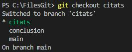
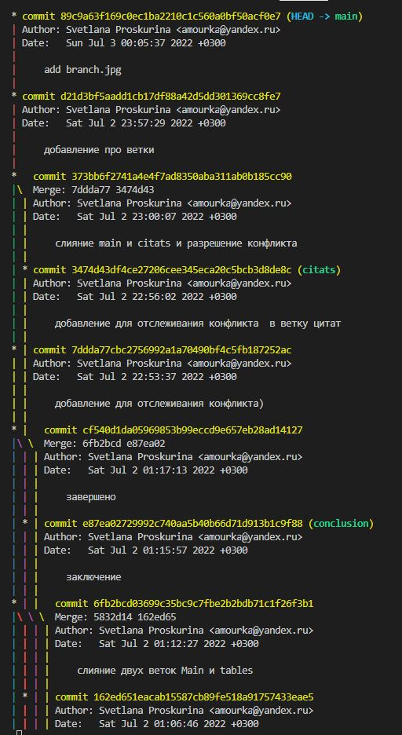

# Инструкция по работе с Git
## **Приветствую, уважаемый пользователь!** 

Данная инструкция содержит наиболее часто используемые команды в терминале Git.
Перед тем как начать работу с Git, следует представиться системе, для этого с помощью команды *__git config --global__* необходимо ввсети свое имя и адрес электронной почты:

`git config --global user.name "My Name"`

`git config --global user.email my_email@example.com`

Команда *git config --list* позволит вам увидеть, что ваши данные занесены в конфигурацию Git.

Для того чтобы начать работу с отслеживанием файлов необходимо создать пустую папку в любом месте на вашем диске, и затем, перейдя в терминал Git выполнить команду *__git init__*, при этом надо удостовериться в терминале, что вы находитесь по нужному пути. Например, если ваша папка находится в корневом каталоге диска C и имеет имя например, __FilesGit__, то путь в терминале выглядит вот так:

`C:\FilesGit>`

_Примечание: Желательно чтобы название папки и путь по которому она лежит состоял только из латинских букв._

Пример команды в терминале:

`git init`

Затем необходимо создать новый файл, с расширением, например, _.txt_, который вы хотите отслеживать.

_Примечание: Для получении информации о расширениях файлов, которые может отслеживать Git обратитесь к глобальной сети интернет_ Например, [ссылка](https://techarks.ru/qa/git/yavlyaetsya-li-git-poleznim-tol-HP/?ysclid=l51ktne5iz633728349/):

>Является ли git полезным только для текстовых файлов/исходного кода?

После создания нового файла, для контроля его изменений необходимо выполнить команду:

***git add*** - позволяет добавить новый файл репозитория для отслеживания.

Пример команды в терминале:

`git add file_name`

Также необходимо выполнять данную команду при внесении изменений в файл. Команда __git add__ выполняет добавление изменений в файл и следующая команда 

***git commit*** - обеспечивает их фиксацию и сохранение.

Для того чтобы было понимание того, какие изменения внесены в файл, к команде __*git commit*__ добавляется флаг **-m**, следом за которым в кавычках (**" "**) пишется сообщение о внесенных изменениях.

Пример команды в терминале:

`git commit -m "сообщение об изменениях"`

***git log*** - позволяет увидеть все изменения, которые были сделаны с файлами репозитория.

Пример команды в терминале:

`git log`

***git checkout*** - позволяет переключаться между версиями, номер версии можно увидеть в журнале, используя команду ***git log***
Пример команды в терминале:

*git checkout <буквенный код версии из журнала>*:

Пример команды в терминале:

`git checkout commit 9a231b6fdde49680e1aea18a73579353ec4aa1e6`

Теперь поговорим о таком элементе проекта в Git как __ветка__. При создании проекта, Git создает базовую ветку, которая называется **master**. Она считается центральной веткой, т.е. в ней содержится основной код приложения.

Просмотреть какие ветки есть в проекте позволит команда ***git branch***, которая выводит полный список веток. Текущая ветка выделяется звездочкой (*). 

Пример отображения представлен ниже:

Для создания новой ветки используется команда **git branch <name_branch>**. Например, вот так:

`git branch images`

Для переключения на новую ветку используется команда __*git chekout <name_branch>*__. Например, вот так:

`git chekout images`

После того как работа в ветке закончена и проверена. программист может захотеть слить эту ветку с основной, то есть добавить изменения в базовую ветку. Для этого используется команда ***git merge  <name_branch>***. Только перед этим необходимо убедиться, что вы нахдитесь в основной ветке, с которой хотите слить ветку ответвления, для перехода между ветками используем команду __git chekout__. 

Пример из терминала:

__*git branch -d <name_branch>*__ - эта команда позволяет удалить ненужную ветку.

Есть еще одна команда, которая позволяет увидеть всю структура веток с изменениями в графическом, более наглядном представлении. Эта команда записывается следующим образом:

`git log --graph`

Продолжение следует...
