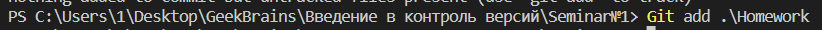
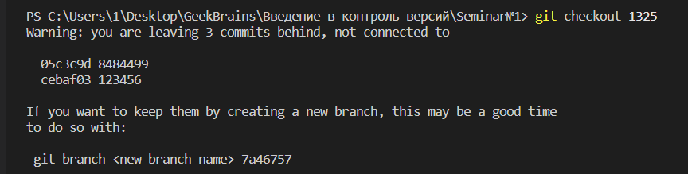
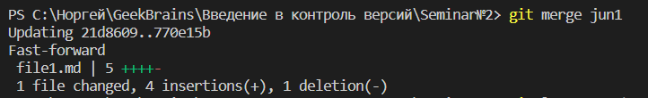

**Инструкция  по использованию команд GIT**

## **1. Установка GIT и регистрация в Github**

`GitHub­` это сервис для хранения репозиториев. Репозиторий научного проекта будет находиться именно там, поэтому если у вас еще нет аккаунта на `GitHub`, вам необходимо пройти стандартную процедуру регистрации.

Установка **Git** - установить **GIT** можно по ссылкав в зависимости от операционной системы.

*Ссылки для загрузки Git:*

| *Linux* | *Mac* | *Windows* |  
|-----------|:-----------:|-----------:|  
| [git-scm/linux](http://git-scm.com/download/linux )  | [git-scm/mac](http://git-scm.com/)| [git-scm/windows](http://git-scm.com/download/win)

Загрузка начнется автоматически. Дополнительная информация находится на сайте  [msygit.github.io](http://msysgit.github.io/.)
 
  ## **2. Основные команды GIT**

<details><summary>git version</summary>
<p>

#### Прежде чем создавать репозиторий и инициализировать Git, проверим текущую установленную версию пограммы.Для этого в терминале введём команду:

```ruby
   `git --version` 
```


</p>
</details>

<details><summary>git init</summary>
<p>

#### Указываем папку, в которой git начнёт отслеживать изменения В папке создаётся скрытая папка .git версию пограммы. Для этого в терминале введём команду:

```ruby
   `git init`
```

</p>
</details>

<details><summary>git status</summary>
<p>

#### Показывает текущее состояние гита, есть ли изменения, которые нужно закоммитить(сохранить)

```ruby
   `git status`
```

</p>
</details>

<details><summary>git add</summary>
<p>

#### Добавляет содержимое рабочего каталога в индекс (staging area) для последующего коммита. Эта команда дается после добавления файлов. Писать название целиком не обязательно: терминал дозаполнит данные автоматически:

```ruby
   `git add`
```

</p>
</details>

<details><summary>git commit</summary>
<p>

#### Команда **git commit** берёт все данные, добавленные в индекс с помощью **git add**, и сохраняет их слепок во внутренней базе данных, а затем сдвигает указатель текущей ветки на этот слепок.

```ruby
   `git commit`
```

</p>
</details>

<details><summary>git diff</summary>
<p>

#### Показывает разницу между текущим файлом и сохранённым. 

```ruby
   `git diff`
```

</p>
</details>

<details><summary>git log</summary>
<p>

#### Журнал изменений. Перед переключением версии файла в Git используйте команду **git log**, чтобы увидеть количество сохранений

```ruby
   `git log`
```

</p>
</details>

<details><summary>git branch (creat new branch)</summary>
<p>

#### Работа с черновиками. Если у нас несколько версий черновика, мы можем вывести на экран ветку, где находимся, командой **git branch**. Создать ветку можно командой **git branch**. Делать это надо в папке с репозиторием: 

```ruby
   puts `git branch <название новой ветки>`
```

</p>
</details>


<details><summary>git checkout</summary>
<p>

#### Переключение между версиями. Для работы нужно указать не только интересующий вас коммит, но и вернуться в тот, где работаем, при помощи команды **git checkout master**
```ruby
   `git checkout`
```

</p>
</details>

<details><summary>git branch (creat new branch)</summary>
<p>

#### Работа с черновиками. Если у нас несколько версий черновика, мы можем вывести на экран ветку, где находимся, командой **git branch**. Создать ветку можно командой **git branch**. Делать это надо в папке с репозиторием: 

```ruby
   `git branch <название новой ветки>`
```

</p>
</details>

<details><summary>git branch (delete branch)</summary>
<p>

#### Если ветка  больше не нужна, ее можно удалить c помощью команды: 

```ruby
   `git branch -d <название  ветки>`
```

</p>
</details>


<details><summary>git log --graph</summary>
<p>

#### Ключ -graph в связке с командой log позволяет отобразить коммиты в виде дерева. 

```ruby
   `git log --graph`
```

</p>
</details>

<details><summary>git merge</summary>
<p>

#### Чтобы слить любую ветку с текущей, вызываем : 

```ruby
   `git merge <имя ветки для слияния с текущей>`
```

</p>
</details>


