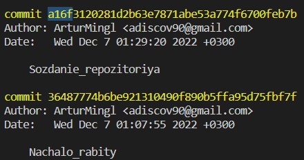
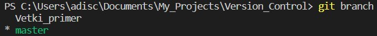
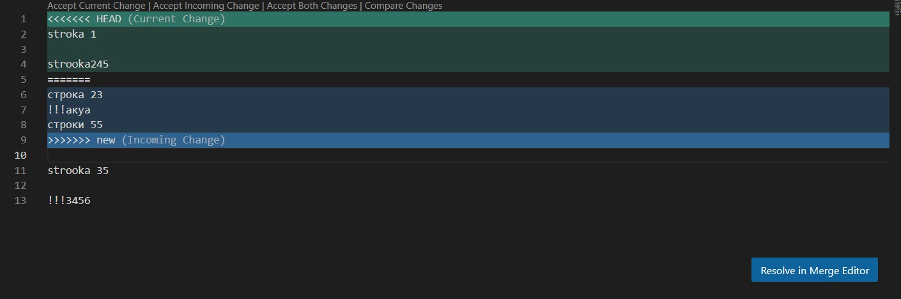
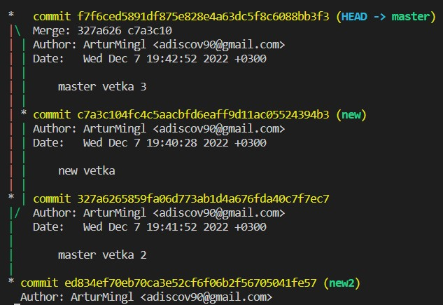
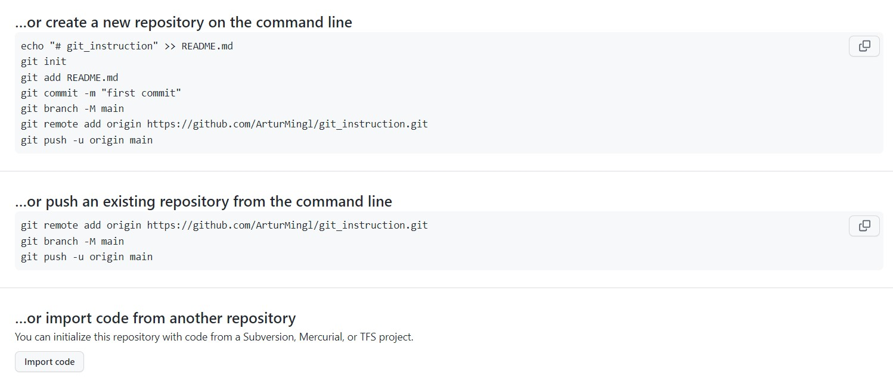

# **Инструкция по работе с Git** #

## **Начало работы** ##

При установке Git первым делом следует указать имя пользователя и адрес электронной почты.

Для этого воспользуйся командами

**git config --global user.name "Artur"**

**git config --global user.email Mingl@example.com**

Чтобы убедиться, что git работает нормально нужно воспльзоваться командой **git --version** 

## **Создание локального репозитория** ##

Для создания локального репозитория требуется:

1. Создать папку
2. Выбрать её в VS Code и с ПКМ открыть во встроенном терминале
3. Ввести команду **git init**

Команда **git init** создаёт файл .git в выбраной папке

Репозиторий создан. Можно проверить его статус с помощью команды **git status**

## **Работа с версиями в локальном репозитории** ##

Для того, чтобы git отслеживал изменения в файле, введи команду **git add _название файла с раширением_**

Команда **git add .** позволяет отслеживать сразу все файлы в репозитории

Теперь, чтобы сохранить изменения в файле (далее *создать коммит*), введи команду **git commit -m "комментарий к коммиту"**

Команда **git commit -am "комментарий"** позволяет объединить команды add и commit

Команда **git log** - позволяет увидеть журнал всех коммитов. У каждого комита есть уникальный номер (нам достаточно знать только первые 4 значения)

Команда **git log -p** не только показывает журнал коммитов, но и разницу между ними

Команда **git reflog** показывает усечённую версию журнала коммитов

Команда **git checkout _номер коммита_** - позволяет переключиться и посмотреть необходимую версию файла

Команда **git checkout master** - переносит к актуальной версии файла

Команда **git diff** - показывает разницу между текущим файлом и последним коммитом. Нажатие **q** позволяет выйти из режима diff 

_В любой непонятной ситуации пробуй нажать **q**_

## **Работа с ветками** ##

## Создание веток

Чтобы увидеть список веток используй команду **git branch**
С помощью **git branch** можно узнать, на какой ветке ты находишься

Команда **git branch _название ветки_** - создаёт новую ветку

Чтобы перейти на новую ветку используй команду **git checkout _название ветки_**

Команда **git checkout -b _название ветки_** позволяет создать ветку и сразу на неё перейти

Теперь команда **git checkout master** будет означать переход на основную ветку

*В новой ветке отображаются коммиты этой ветки и родительской ветки. Если создать ещё одну ветку, то коммиты другой ветки в ней отображаться не будут. В мастер ветке отображаются только коммиты этой ветки.*

## Слияние веток

После того, как в новой ветке файл изменён и закоммичен, можно слить ветки. Для этого нужно перейти в главную ветку с помощью команды **git checkout master** и ввести команду **git merge _название ветки, которую сливаешь_**

Во время слияния могут возникнуть конфликты в строках кода (когда одинаковые строки написаны по разному)

*Попытался создать конфликт. Даже если ветки отличаются git пишет Already up to date и изменения не вносятся. Вроде бы дело в том, что создана только одна ветка и коммит был сначала в мастер ветке, а потом в новой ветке. Но это не точно)*

Скриншот конфликта. Можно оставить текущий вариант или заменить его на входящий вариант, либо оставить оба

Слияние веток считается завершённым только после коммита

До коммита можно отменить слияние веток командой **git merge --abort**

После слияния ветку можно удалить с помощью команды **git branch -d _название ветки_**

Так же ветку можно удалить и без слияния с помощью команды **git branch -D _название ветки_**

Команда **git log --graph** отображает дерево коммитов визуально

## **.gitignore** ##

Чтобы некоторый класс файлов не добавлять автоматически в репозиторий и не видеть в списке неотслеживаемых, создается файл .gitignore со списком соответствующих паттернов

* *.a - пропускать файлы, заканчивающиеся на .a
* !lib.a - но отслеживать файлы lib.a, несмотря на пропуск файлов на .a
* /TODO - игнорировать только корневой файл TODO, а не файлы вида subdir/TODO
* build/ - игнорировать все файлы в папке build/
* doc/*.txt - игнорировать doc/notes.txt, но не doc/server/arch.txt

## **Удалённые репозитории** ##

Для работы с уже существующим удалённым репозиторием нужно скопировать ссылку на репозиторий на GitHub и ввести команду **git clone _ссылка на репозиторий_** (git создаст полную локальную копию удалённого репозитория)

Для работы на удалённом репозитории нужно:
* Создать новый репозторий на GitHub
* GitHub предложит 3 варианта дальнейших действий

Рассмотрим 2 вариант
* Создать локальный репозиторий
* Копировать команды в GitHub и всставить в git, либо написать их самому

**git remote add origin _ссылка на репозиторий_**

**git branch -M main**

**git push -u origin main**

После внесения изменений и коммита можно залить на удалённый репозиторий командой **git push**

Если на удалённом репозитории были внесены изменения, можно скопировать их на локальный командой **git pull**

Для работы над проектом без доступа к репозиторию нужно предложить изменения следующим образом:
* Зайти на нужный репозиторий
* Нажать кнопку **Fork** (репозиторий скопируется на твой аккаунт)
* Сделать локальную копию репозитоия
* Создать новую ветку и внести изменения
* Отправить изменения на удалённый репозиторий
* На GitHub отправить запрос на вливание изменений хозяину репозитория **Compare and pull reguest**