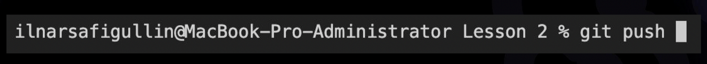
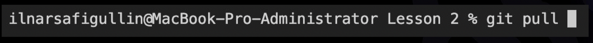

# Инструкция по использованию Git
## Содержание 
### [Контроль версий](#контроль-версий)
### [Что такое Git](#brчто-такое-git)
### [Работа с Git](#brработа-с-git)
### [Команды Git](#brкоманды-git)
### [Работа с удаленными репозиториями](#brработа-с-удаленными-репозиториями)

#  Контроль версий
💡Контроль версий – это система, записывающая изменения в файл или набор файлов в течение времени и позволяющая вернуться к определенной версии.

 (пример: мы создали сайт, он работает, пользователи не испытывают проблем. Но прошло время и мы решили изменить функциональность. Прежде чем вносить изменения, сохраняем рабочую версию сайта на компьютере или сервере. Это будет архив «Рабочая версия нашего сайта». Спустя время появляется еще одна версия нашего сайта, допустим, 2.0. При возникновении проблем всегда можно откатиться до первой версии и запустить сайт заново)

##  Для чего нужен контроль версий
- Возможность хранить различные версии проекта
- Возможность возвращаться к различным версиям проекта
- Возможность работать в команде

 

    💡Система контроля – это реализованная возможность замены информации с использованием сохраненных версий врепозитории.

  

    💡Репозиторий - это место где хранятся файлы, находящиеся под контролем версий вместе с историей их изменений.  

#  Что такое Git
Когда мы работаем в команде, контроль версий помогает синхронизировать усилия. Для этой задачи существует программа, которая берет на себя контроль версий над проектом и позволяет переключаться между ними.

    💡Git - программа для контроля версий. Она сохраняет в памяти не файлы целиком, а разницу между файлами

 (пример: есть файл с одной страницей текста, мы редактируем текст, добавляем два слова и сохраняем как отдельный файл. И у нас оказывается два файла “предыдущая версия” и “новая версия”. Но git работает иначе, он сохранит первую страницу, то что было и сохранит те два добавленных два слова. А когда надо будет воспользоваться этим файлом он сам его предоставит отредактированным и возможностью посмотреть и поработать с предыдущей версией) 

#  Работа с Git
 Создадим папку и дадим ей имя на английском языке и без пробелов. Например “Hello_git”.

 

2. Открываем Visual Studio Code. “Файл” → “открыть папку…” → находим нашу папку   “ctr + O”.

 

3. Что бы git начал контролировать все то что происходит в папке, начал сохранять версии, необходимо дать команду  для отслеживания происходящего в этой папке.

 

4. С git можно работать с помощью графического интерфейса и с помощью терминала (ниже будет инструкция по работе с git  в терминале).

       💡Терминал - это программа, которая принимает команды, введенные с клавиатуры, и передает их операционной системе для выполнения. 

 

5. Запускаем терминал “ctr + `". И сейчас никакого отслеживания контроля версии в нашей папке не происходит, чтобы начать это делать необходимо запустить 
git.
Но сейчас никакого отслеживания контроля версии в нашей папке не происходит, чтобы начать это делать необходимо запустить git.

 

6. Для начала необходимо убедиться, что git настроен. Для этого в терминале пишем: `git --version` (пробелом мы отделяем имя программы от тех параметров, которые мы в неё передаем). Если git установлен и настроен правильно, то мы увидим на экране текущую версию программы. 
 
В данном случае на экран вывелось `git version 2.36.1.windows.1`. 
 
Программа работает! 

 

7. Теперь, чтобы Git начал отслеживать все что происходит в нашей папке его необходимо активировать. Для этого можно написать `git initialize` Но необязательно писать все слово целиком, можно обойтись всего четырьмя буками (и так для всех остальных команд) `git init`. На экране появился текст который говорит, что в этой папке Git  отслеживает все изменения.
Открыв нашу папку, можно увидеть появившуюся скрытую папку “.git”

 

8. Можем узнать статус папки, то есть что в ней происходит. Для этого пишем команду  `git status` 
> Git говорит:
> 
> - "On branch master” - что мы находимся в ветке 
 > - “No commits yet” - что на данный момент ничего не зафиксирован
> - “Nothing to commit (create/copy files and use "git add" to track)” - что сейчас пока фиксировать (сохранять) пока нечего, а с скобочках инструкция, что необходимо сделать, чтобы сохранить изменения

 

9. Создадим новый файл.  Кликаем по пустой области нашей развернутой папки, выбираем “Создать файл” и задаем ему имя “hello_world.md”. РАсширения файла “.md” необходимо для того, чтобы познакомиться с языком разметки Markdown. 

 

10. Напишем текст “Hello world!”. И заметим, что до момента сохранения на ярлыке нашего файла горит белый кружок - индикатор, говорящий, что файл не сохранен:
  
    А после сохранения “Сtrl + S” кружок пропадает:  
   
 

11. Посмотрим что стало с Git после того, как мы создали файл “hello_world.md”.
 
    Чтобы вызвать ранее введённую команду   `git status` , пользуемся стрелками на клавиатуре. Перебираем недавно введённые команды нажатием стрелки «вверх».
> Git говорит:
> 
> - "Untracked files” - что есть неотслеживаемые файлы *hello_world.md*
> - “use "git add<file>...”” - чтобы Git начал отлеживать изменения в файлах необходимо эти файлы добавить
   
 

12. Добавим файл для отслеживания. В терминале введем `git add he`  и нажмем ”Tab”. Это необходимо чтобы терминал самостоятельно дозаполнил названия файла.
    
    На экране появится текст `git add .\hello_world.md`
    
    Никаких сообщений об ошибке не появилось 
    
    Стрелочками выбираем команду `git status`
И вот теперь видим, что Git начал отслеживать наш файл

> Git говорит:
> 
> - "Changes to be committed” - есть изменения которые могут быть не сохранены
> - “*new file: hello_world.md*” - и указывает, что был создан новый файл 
  
 

13. Чтобы сохранить текущий статус вызываем команду и указать некоторый комментарий  `git commit -m “Created a new file”`
    
    m - параметр обозначающий message, а  затем в кавычках указать для себя комментарий к этому сохранению. 
> Git говорит:
> 
> - "[master (root-commit) 454a861] Created a new fil” - появилось некоторый commit с комментарием
> - “1 file changed, 1 insertion(+)” - 1 файл изменен, в него добавлено 1 строка
> - “create mode 100644 hello_world.md” - файл в котором происходит наша работа

 

14. Изменим наш файл, добавив строчку с текстом “Начинаем наше  знакомство с контролем версий”. Сохраним “Ctrl + S”.
    
    Теперь у нас есть сохраненная версия файла с предыдущей версией и есть некоторые изменения, которые мы внесли в этот файл.
    
    Узнаем текущий статус нашего файла вызвав в терминале команду `git status`

> Git говорит:
> 
> - "On branch master” - что мы находимся в ветке
> - "Changes to be committed” - есть изменения которые могут быть не сохранены
> - “*modified: hello_world.md*” - показывает, что есть измененный файл

 

15. Сохраним текущее состояние.

        💡Сохранять измененное состояние файла нужно по той причине, что файлов может быть несколько, а текущее сохранение мы хотим сделать с конкретными файлами. По этому даже для отслеживаемых файлов  для того чтобы их сохранить, необходимо вызывать команду `git add`
     В терминале введем `git add he`  и нажмем ”Tab”. Ошибок нет. Вводим 

> Git говорит:
> 
> - "Changes to be committed” - есть изменения которые могут быть не сохранены
> - “new file: hello_world.md” - и указывает, что был создан новый файл  

 

И теперь сохраним `git commit -m “Added a new line”`
> Git говорит:
> 
> - "[master 3daf3a3] Added a new line” - появилось некоторый commit с комментарием
> - “1 file changed, 3 insertions(+), 1 deletion(-)” - 1 файл изменен, в него добавлено 3 строка и что-то удалил
> - “create mode 100644 hello_world.md” - файл в котором происходит наша работа

 

16. Теперь у нас есть с которым мы можем работать, переходить от одной версии к другой. Но для этого необходимо видеть, какие версии существуют и для этого есть команда `git log` (log - журнал изменений).
> Git говорит:
> 
> - commit 3daf3a384755e654be001d2d050225bf0e60869f (HEAD -> master) Author: Каверин Руслан Андреевич @mail.ru] Date: Sat Jun 25 11:45:09 2022 +0300
> 
> Added a new line  - первое сохранение, когда добавляли новую строку
> 
> - commit 454a8618ab56808e13aff8ae3e7c6839a8e80283 Author: Каверин Руслан Андреевич [@mail.ru] Date: Sat Jun 25 11:20:10 2022 +0300
> 
> *Created a new file*  - второе сохранение, когда создали новый файл

 

17. Чтобы перейти к какому-то сохранению в терминале необходимо вызвать команду `git checkout` и указать какое сохранение нам нужно, можно написать первые четыре символа commit’а: `git checkout 454a`
Мы перешли к старой версии

        💡Мы сохраняли разные статусы нашего файла и научились между ними переключаться. Но сам файл создан, с ним ничего не происходит, у нас есть актуальные его составляющие. Git может показать то состояние, которое у него было, с помощью команды `git checkout` мы можем переключаться между разными версиями. Важно понимать, что чтобы дальше работать над этим файлом, необходимо вернуться в актуальное состояние `git checkout master`
    
#  Команды Git
`git init`- инициализация: указываем папку, в которой git начнёт отслеживать изменения. В папке создаётся скрытая папка .git

`git status` - показывает текущее состояние гита, есть ли изменения, которые нужно сохранить

`git add` - добавляет содержимое рабочего каталога в индекс (staging area) для последующего коммита. Эта команда дается после добавления файлов. Писать название целиком не обязательно: терминал дозаполнит данные автоматически.

`git commit` - зафиксировать или сохранить (Команда `git commit` берёт все данные, добавленные в индекс с помощью git add, и сохраняет их слепок во внутренней базе данных, а затем сдвигает указатель текущей ветки на этот слепок)

`git log` - журнал изменений (Перед переключением версии файла в Git используйте команду git log, чтобы увидеть количество сохранений)

`git checkout` - переключение между версиями. Для работы нужно указать не только интересующий вас коммит, но и вернуться в тот, где работаем, при помощи команды `git checkout master`

`git diff` - показывает разницу между текущим файлом и сохранённым. (Перед переключением версии файла в Git используйте команду `git log`, чтобы увидеть количество сохранений)

#  Новые команды Git
`git clone` - команда позволяет склонировать внешний репозиторий на наш ПК 

`git pull` - команда позволяет скачать все из текущего репозитория и автоматически
сделать merge с нашей версией 
`git push` - эта команда позволяет отправить нашу версию репозитория на внешний
репозиторий. ТРЕБУЕТ АВТОРИЗАЦИИ на внешнем репозитории 

#  Работа с удаленными репозиториями 

    💡 Git- программа для локальной работы (можем работать локально) 
    GitHub - сервис, что позволяет интегрироваться с Git и настроить удаленную работу с репозиторием (можем хранить репозиторий на Git Hab)
 

##  Как перенести репозиторий с GitHub на компьютер

1. Создаем папку Test в VS Code, переходим на GitHub и скачиваем репозиторий (папка version_control)

2. Открываем терминал и вызовем команду git clone `https://…` Git скопировал репозиторий с GitHub на наш компьютер

3. Вводим `git status` и видим ошибку, так как мы работаем в папке Test, а не в папке скопированного с GitHub репозитория. Необходимо ввести `cd version_control`  и мы перейдем в наш репозиторий. Теперь введем `git status` и увидим, что мы находимся в ветке master 

##  Как перенести репозиторий с компьютера на GitHub
1. Для этого создаем новую папку, открываем её в VS Code и создадим новый репозиторий `git init`. Создадим файл .md и что-нибудь напишем `git add (имя файла)`,  далее закоминтим `git commit -m “...”`

2. Загружаем наш репозиторий на GitHub 
Зададим имя, снизу ничего не редактируем 

3. GitHub подсказывает как мы можем загрузить репозиторий 
> - Создать репозиторий через терминал:
> - Существующий репозиторий привязать к удаленному репозиторию
> - Импортировать код из другого репозитория 

4. Наша вторая ситуация “Существующий репозиторий привязать к удаленному репозиторию”

> `git remote add origin [https://github.com/Ruslan7121/test.git]` - у нас появляется новый удаленный репозиторий, и мы указываем ссылку, на тот репозиторий с которым будем работать
> 
> 
> `git branch -M main` - указываем какая ветка будет основной 
> 
> `git push -u origin main` - направляем локальный репозиторий на GitHub 

Вставляем все три сторчки в терминал 

    💡 При первом связывании Git с сервисом GitHub необходимо их подружить, необходимо авторизировать. Команда `push` записывает изменения в тот репозиторий куда мы их отправляем (необходимо авторизоваться!)

Проверяем репозиторий на GitHub 

Добавим изменение в локальном файле, чтобы посмотреть как изменится онлайн файл. `git add имя файла`, `git status`, `git commit -m “…”` и посмотрим как изменился онлайн файл. А там ничего не изменилось, так как изменения оказались локальными. Вызываем команду `git push` и теперь в онлайн файле появились изменения.

5. На GitHub изменим информацию в файле, пролистаем вниз,  добавим коммит, нажать *commit changes*

Теперь чтобы обновить локальный файл в git вызываем команду `git pull`, после этого изменения в файле подтянутся в локальный файл (так же сольются ветки Git с GitHub) 