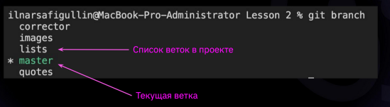
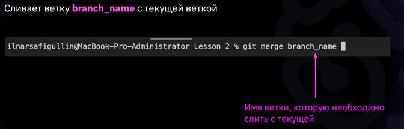
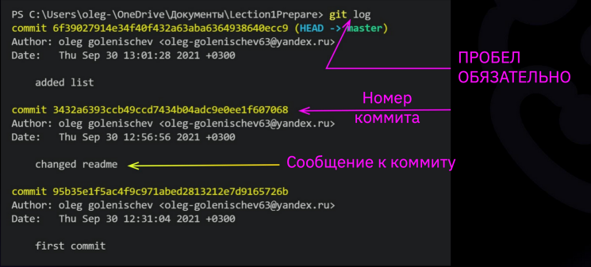

# Instructions for working with GIT (basic commands)
For more information visit the [website](https://git-scm.com/).

## Creating a local repository
To create a repository - a plece where GIT will track file changes - you need to create and select a folder, then use the **git init** command to initialized this folder as a GIT repository.

Also you can create a local repository by clonning the repository from GITHUB with the **get clone [GitHubUrl]** command:

## User setup
To work with GIT. you must first provide him with your data: name and email. For this use commands:

* **git config --global user.name "[name]"**
* **git config --global user.email "[email]"**

If you don't, GIT will ask you for your data: 

## Add file to track and commit changes
After making changes to the file, you need to save it, then use following commands:

* The **git add file.extension** command will add your file as it looks now to your next commit (stage)
* The **git commit -m "[note]"** command will commit your files, save the note about their version and show the changes.

* After the first use connand *git add* for your file, for its next commits you can use the **git commit <u>-a</u>m** command.

## Checking current status

The **git status** command shows:
* which branch you are on;
* which files in the working directory are modified and ready to be committed or not;
* which files are untracked:

## Branches and switching between branches or commits

If you want to work on your own version of a shared file independently of other coworkers, you mus create a separate branch using the **git branch [branchname]** command.

You can also use the **git branch** command which shows you:
* all created branches;
* the branch where you are now - marked with a star * and green highlight;

To switchng between branches and commits you can use the **git checkout [branchName/commitNumber]** command.

After using this command you will move to selected branch/commit and can modify and commit the file without changing the main version of the shared file.

When you are done with the file on the branch, you can use the **git chechout master** command to return the master branch and then use the **git merge [branchName]** command  to merge the version of the main file and the file modified on the branch.

If at the moment of the merge the main (master) file doesn't contain changes in the part that is chanded in the branch file, the canges in the branch file will simply be added to the main file.

But if the main file and the branch file are changed in the same parts, there will be a version conflict when they are merged, which must be resolved by the user.

After a successful merge you can delete the extra branch if don't need it, using the **git branch -d [branchName]** command 

## Log and reflog

To see the commits in the current branch you can use the **git log** command which shows:
* the current branch;
* commits in the branch;
* the *git commit id* (hash) - you can use first four numbers to checkout to this commit;
* author, date and comment of the commit

To see any references in the local repository use the **git reflog** command, which shows type of reference, its hash number and description;

To see graphical representation of the commits history in all branches use the **git log --graph** command.

## Difference trecking

To see changes since the last commit, you can use the following commands:
* the **git diff** command shows what is changes bus not staged (not added to the next commit):

* the **git diff --staged** command shows which changes is staged but not yes commited:

## Ignoring untracked files

If you don't want git to remind you of files or folders that are in the repository but are untracked you can do the following:
* create new file named [.gitignore] in the main repository folder;
* list the names of files and folders to be ignored in the .gitignore file (afer that their names will be highlighted gray):

* stage and commit .gitignore file:
