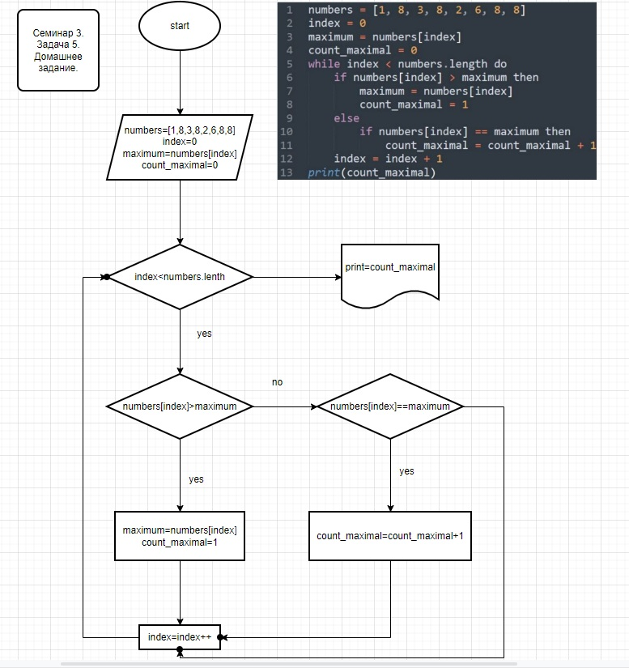

# __Краткий support для начинающих по Markdown__
## 1. Блок цитирования
> Блок цитирования создается с помощью символа "<"
## 2. Полужирное и курсивное начертание
- **Чтобы задать для текста полужирное начертание, заключите его в двойные звездочки** - "**"
- *Чтобы задать для текста курсивное начертание, заключите его в одинарные звездочки* - "*"
- ***Чтобы задать для текста полужирное и курсивное начертание, заключите его в тройные звездочки*** - "***"
## 3. Заголовки
Поддерживается шесть уровней заголовков Markdown:

1. "#"
2. "##"
3. ...
6. "######"

Между последним символом "#" и содержимым заголовка должен присутствовать пробел

## 4. Изображения
Для изображений по умолчанию поддерживаются следующие типы файлов:

- .jpg
- .jpg

**Пример:** *ДЗ. Введение в программирование. Семинар 3. Задание 5.*

## 4. Синтаксис включаемых файлов

- Блочные включаемые файлы предназначены для значительных объемов текста: один или два абзаца, общая процедура или общий раздел. Не используйте их для фрагментов текста меньше одного предложения.

[!INCLUDE ["Hello world"](Hello%20world.md)]

**Пример:** *Включение файла из онлайн работы на курсе: Введение в контроль лекций. Семинар 1.*

## 5. Отступ

> В Markdown пробелы перед первым символом строки определяют выравнивание строки относительно предшествующих строк.
 >>Отступы имеют особое значение в нумерованных и маркированных списках, так как позволяют отображать несколько уровней вложенности в иерархическом или структурированном формате.

>>>[!Совет] 
Чтобы задать отступ текста для выравнивания с предыдущим абзацем или элементом в нумерованном или маркированном списке, следует использовать пробелы.

## 6. Списки (нумерованные, маркированные, контрольные)

### 1. Нумерованный список

**Чтобы создать нумерованный список, можно использовать все единицы. При публикации числа отображаются в возрастающем порядке в виде последовательного списка.**

1. Первый пункт внешний
1. Второй пункт внешний
   1. Первый пункт внутренний
   1. Второй пункт внутренний
1. Конец

### 2. Маркированный список

__Для создания маркированного списка используйте "-" или "*", за которым следует пробел в начале каждой строки:__

- Первый пункт внешний
- Второй пункт внешний
   - Первый пункт внутренний
   - Второй пункт внутренний
- Конец

### 3. Контрольный список

__Контрольные списки можно использовать на сайте документации с помощью пользовательского расширения Markdown:__

> [!div class="checklist"]
> * List item 1
> * List item 2
> * List item 3

**Если бы, мы были использовали расширение Markdown, то вместо точек, были бы такие галочки:*

## 7. Таблицы

Использование вертикальных линий и строк является самым простым способом создания таблиц в Markdown. Чтобы создать стандартную таблицу с заголовком, вставьте пунктирную линию после первой строки.

|№  |1   |2|
|:----------|:-----------:|:------------:|
|A     |Имя      |Фамилия        |
|B|Даниил   |Теремовский|

**Можно выровнять столбцы с помощью двоеточий включив их вначало/по обе стороны/в конце пунктирной линии*

## 8. Основные команды Git

__В заключение, перечислим основные команды Git:__

- git init - инициализация локального репозитория
- git status - получить информацию от git о его текущем состоянии
- git add - добавить файл или файлы к следующему коммиту
- git commit -m "message" - создание коммита
- git log - вывод на экран истории всех коммитов с их хеш-кодами
- git checkout - переход от одного коммита к другому
- git chekout master - вернутся к актуальному состоянию и продолжить работу
- git diff - увидеть разницу между текущем файлом и закоммиченным файлом
- git branch -d - удаление ветки
- git branch - создать ветку
- git log --graph - список коммитов (расширенный с ветвями)
- git merge - слияние веток
- git reset --hard <имя коммита> - удалить все данные до выбранного коммита (опасно)

## 9. Работа с удалённым репозиторием
1. копирование удалённого репозитория в локальную папку:
     -  git clone <ссылка>
2. внесение изменений локально
     - произвести требуемые изменения локально
3. получение изменений из удалённого репозитория
     - git pull - команда, позволяющая принять изменения из удаленного репозитория к которому Вы подключены
      - возможно, пока вы работаете локально, кто-то уже внес изменения в удаленный репозиторий, эта команда позволяет увидеть изменения
4. внесение изменений в удалённый репозиторий
     - git push - команда, позволяющая отправить свои изменения в удаленный репозиторий

## 10. GitHub

*Если Вам необходимо сделать fork чужой работы, необходимо выполнить несколько действий перед Блоком 9:*

1. Зайти на страницу пользователя, чью работу мы хотим переделать
1. Выбрать необходимую работу 
1. При условии публичности работы, справа будет кнопка Fork, нажать
1. На следующей странице добавить комментарии и подтвердить действия
1. Работа будет скопированна к вам на страницу
1. также немного правее будет кнопочка Code, при нажатии откроется ссылку, которую необходимо скопировать
1. Далее переходим к Блоку №9

*По завершению всех действий, Ваша локальная работа загрузится к Вам на страницу на GitHub. Чтобы предложить свои изменения, которые вы сделали, необходимо нажать на кнопку: Compare & pull request и следовать несложным инструкциям.*

# Напутствие
__Успехов в работе с git!__

***04.10.2022*** 

***daniilteremovskiy@gmail.com***
