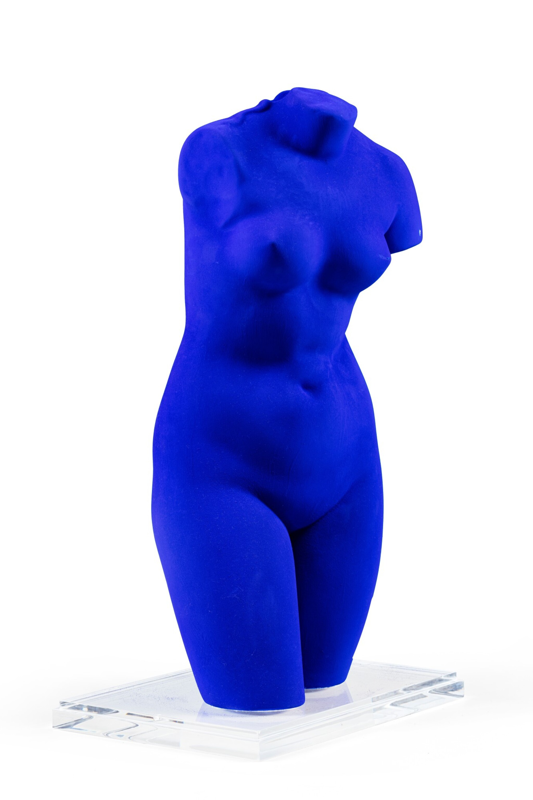

# Инструкция по работе с Markdown

## Выделение текста

Чтобы выделить текст курсивом, необходимо обрамить его звездочками (*) или знаком нижнего подчеривания (_). Например, *вот так* или _вот так_.

Чтобы выделить текст полужирным, необходимо обрамить его двойными звездочками (**) или двойным знаком нижнего подчеркивания (__). Например, **вот так** или __вот так__.

Альтернативные способы выделения текста жирным или курсивом рнужны для того, чтоы мы могли совмещать оба способа. Например, _текст может быть выделен курсивом и при этом быть **полужирным**_.

## Списки

Чтобы добавить ненумерованные списки, необходимо выделить пункты звездочкой (*) или знаком +. Например, вот так:
* Элемент 1
* Элемент 2
* Элемент 3
+ Элемент 4

Чтобы доавть нумерованные списки, необходимо пункты пронумеровать. Напимер:
1. Первый пункт
2. Второй пункт

## Работа с изображениями

Чтобы вставить изображение в текст, достаточно написать следующее:

## Ссылки

## Работа с таблицами

## Цитаты

## Заключение