

__Инструкция по работе с основными командами Git__:  

1) Команда **Git --version** покажет какая версия программы Git установленна на ПК. 

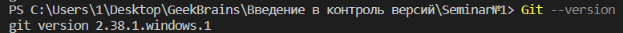

2) Команда __Git init__ начнёт отслеживание данной папки, в которой Git начнёт отслеживать изменения.

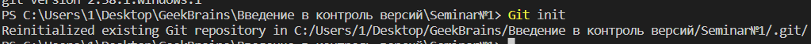

3) Команда __Git status__ покажет есть ли изменения, которые нужно закоммить (сохранить).

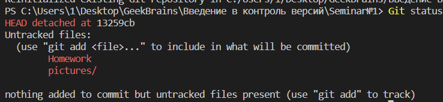

4) Команда __Git add__ *your file name* добавит файл из каталога в индекс для последующего коммита.

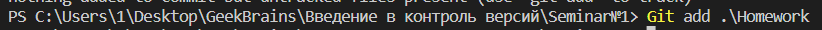

5) Команда __Git add    .__ добавит всё вайлы из католога в индекс для последующего добалвения коммита.

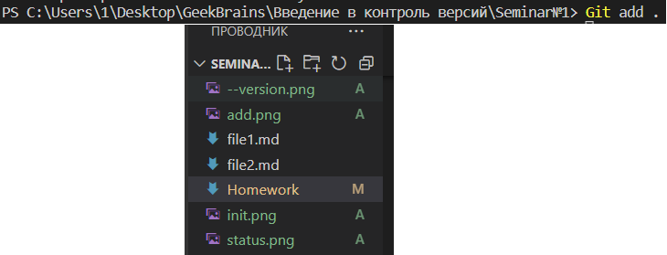

6) Команда __Git -rm "*your file name*"__ удалит нужный файл из отслеживаемых в индексе.

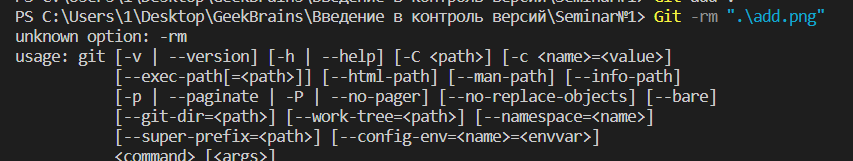

7) Команда __Git commit -m "*your commit name*"__ позволяет закоммитить (сделать сохранение) файл.

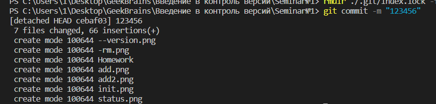

8) Команда __Git commit - am "*your commit name*"__ позволяет добавить файл в индекс и закоммитить его одним действием.

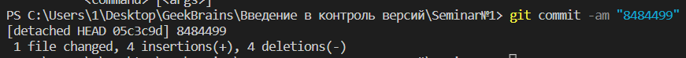

9) Команда __Git log__ открывает журнал сохранений.

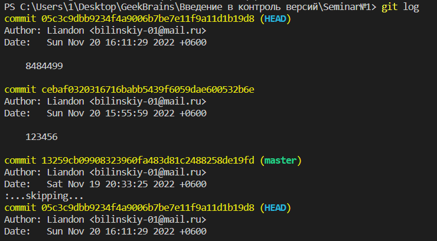

10) Команда __Git diff__ показывает разницу между текущим файлом и сохранённым.

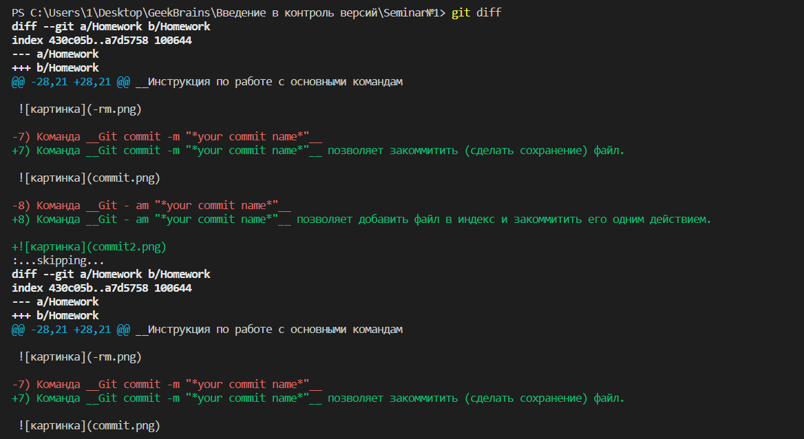

11) Команда __Git checkout *your commit or branch name*__ позволяет открыть заданный коммит или ветку.

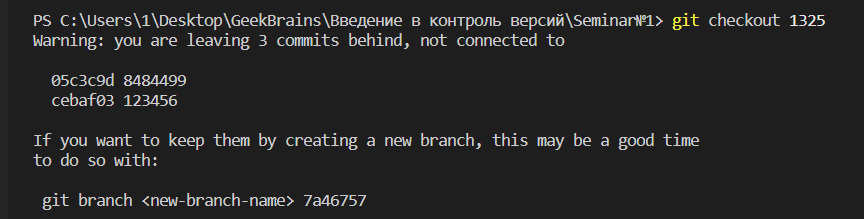

12) Команда __Git checkout master__ позволяет вернуться к изначальной ветке.

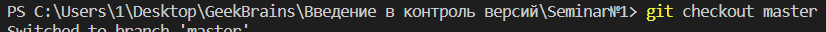

13) Команда __rmdir ./.git/index.lock -force__ позволяет завершить предыдущий процесс в репозитарии.

14) Команда __Git reflog__ позволяет вывести список всех коммитов.

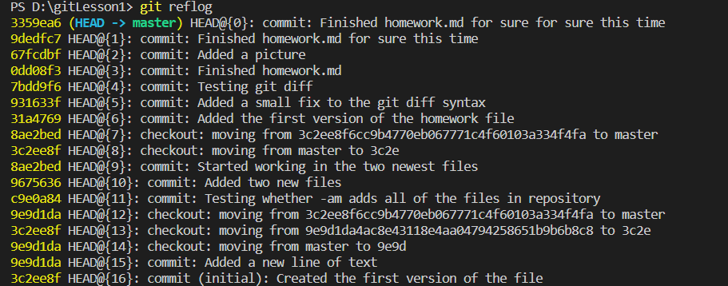

15) Команда __Git -p__ показывает все действия над файлами.

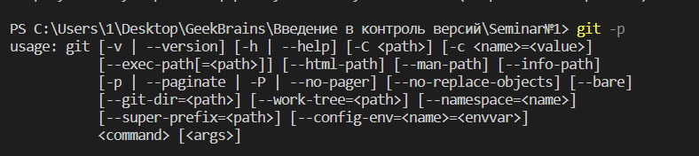

16) Команда __git branch__ позволяет посмотреть список веток, сохраённых в репозитории.

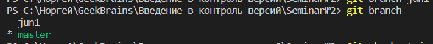

17) Команда __git branch *your branch name*__ позволяет создать новую ветку.

18) Команда __git checkout -b *your branch name*__ позволяет одновременно создать новую ветку и переключиться на неё

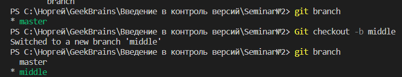

19) Команда __git merge__ позволяет слить любую ветку с *текущей* веткой.

20) Команда __git branch -d *your branch name*__ позволяет удалить названную ветку.

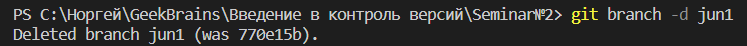

21) Команда __git branch -m *your branch NEW name*__ позволяет переименовтаь текущую ветку.

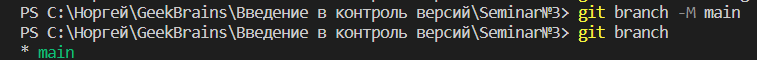

22) Команда __Git log --graph__ открывает журнал коммитов в виде дерева.

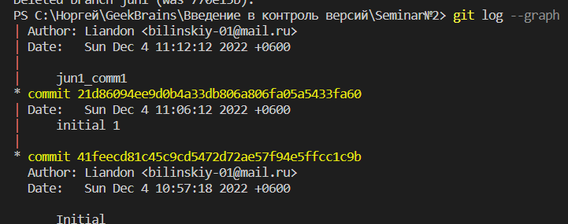

23) Команда __Git remote add *origin https://github.com/*__ позволяет подключить удалёный репозиторий к локальному.

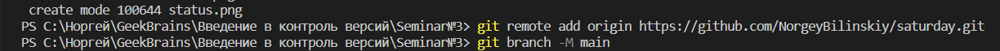

24) Команда __Git remote__ позволяет открыть список удалёных подключений и их псевдонимов.

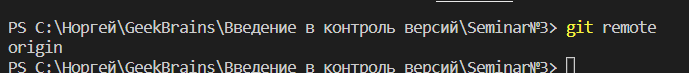

25) Команда __Git remote -v__ позволяет увидеть на какие удалёные репозитории отправляются данные и с каких удалёных репозиториев извлекаются данные.

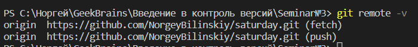

26) Команда __Git remote rm *your connection name*__ позволяет удалить названое подключение из локального репозитория.

27) Команда __git clone__ позволяет загрузить в проект удалёный репозитарий (создаёт копию удалёного репозитория на локальном компьюетере).

28) Команда __git push -u__ позволяет загрузить проект на созданный удалёный репозиторий в GitHub.

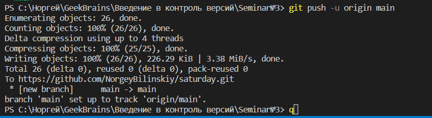

29) Команда __git pull__ позволяет загрузить в проект из удалёного репозитория все данные и автоматически слить их с уже имеющимися. 

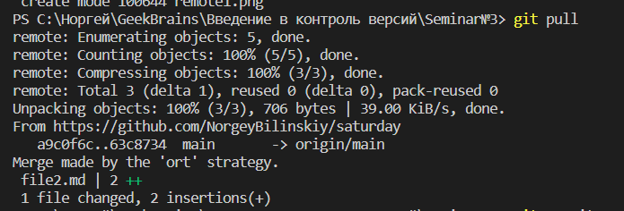

30) Команда __git pull request__ позволяет загрузить в копию удалёного репозитория новую ветку с изменениями, которые затем можно предложить владельцу начального репозитория.

Более подробно про команды Git вы можете почитать на сайте: 
(https://github.com/git-guides)

