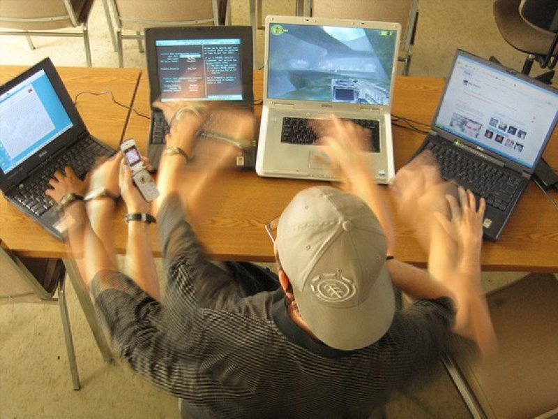
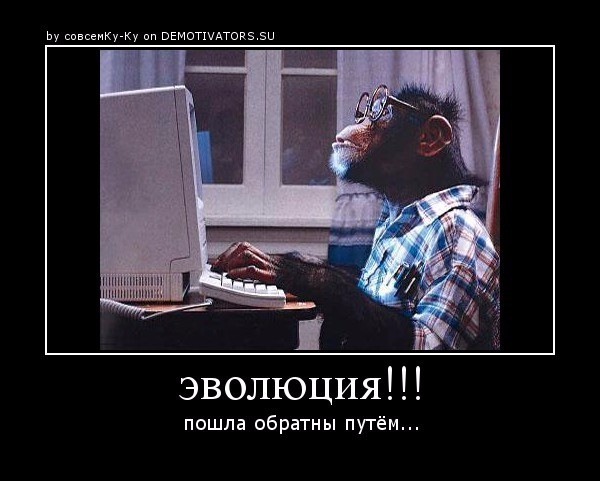
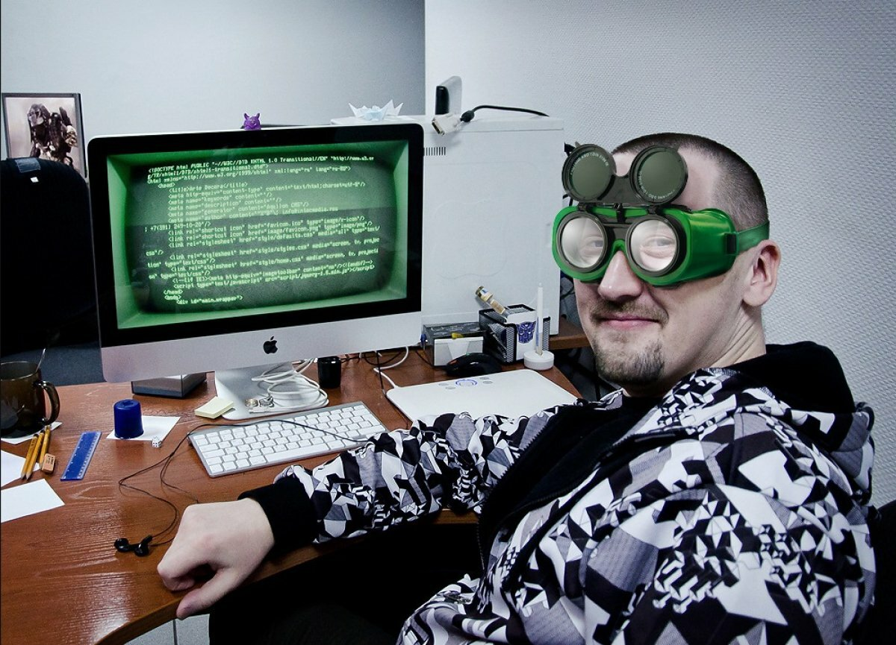

# Визитная карточка будущего программиста
# Синькова Александра Викторовича

Родился 20.12.1977 года в Краснодарском крае.
Закончил Армавирский государственный педагогический институт. В данное время работаю в сортивной школе старшим методистом, но всю жизнь мечтал стать программистом. Заниматься разработкой алгоритма и программ.

Программирование — это, несомненно, творческая деятельность. Каждый день я буду сталкиваться с различного рода задачами и находить для них изящные и элегантные решения. При этом чем выше будет мой уровень как профессионала, тем более сложные и нестандартные цели передо мной будут ставить. И если я буду получаеть удовольствие от интеллектуального труда, то эта профессия для меня. 

Написание кода — это профессия, в которой большую роль играет самообразование. Это постоянно прогрессирующая и совершенствующаяся область, и для того, чтобы оставаться грамотным специалистом, необходимо посвящать немалую часть времени знакомству с новыми разработками и технологиями.

В сущности, для устройства на ту или иную вакансию зачастую необязательно иметь диплом по специальности — на собеседовании потенциальный работодатель будет в первую очередь оценивать ваши профессиональные навыки, предложив для решения несколько тестовых задач.

Когда освою курс хочу быть вот таким:

А не таким:

или таким:

# НАДЕЮСЬ У МЕНЯ ПОЛУЧИТСЯ!!!

