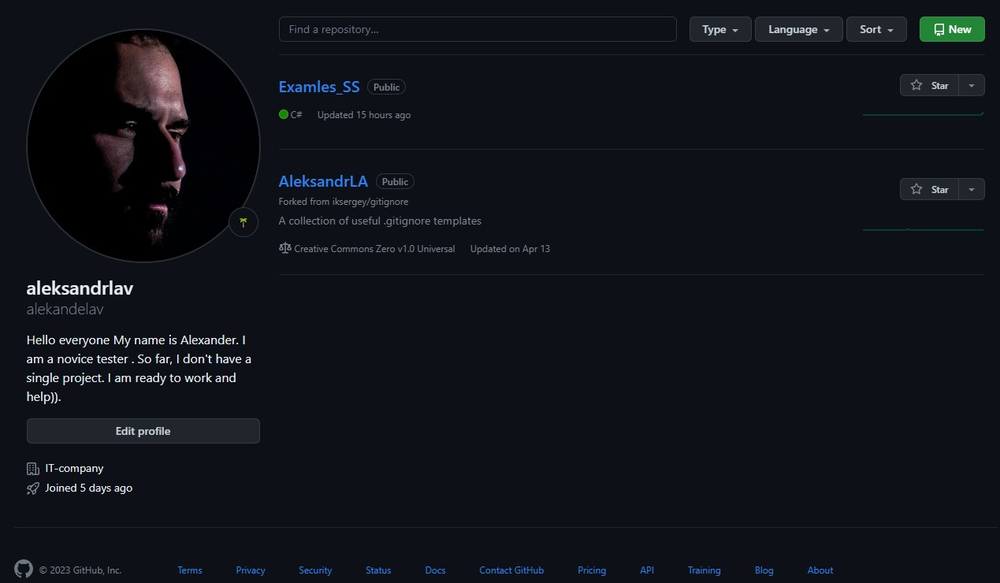

### 
## Всем привет, я  Александр.

__Я работаю сменным специалистом в it компании. Уже 2 года только начинаю разбираться в програмировании.
Решил пойти учиться на тестировщика так как мне эта профессия очень понравилась. 
Ранее я изучал html и сss и решил не останавиться на одном. Думаю дальше, я стану больше понимать что такое програмирование.__
git status
