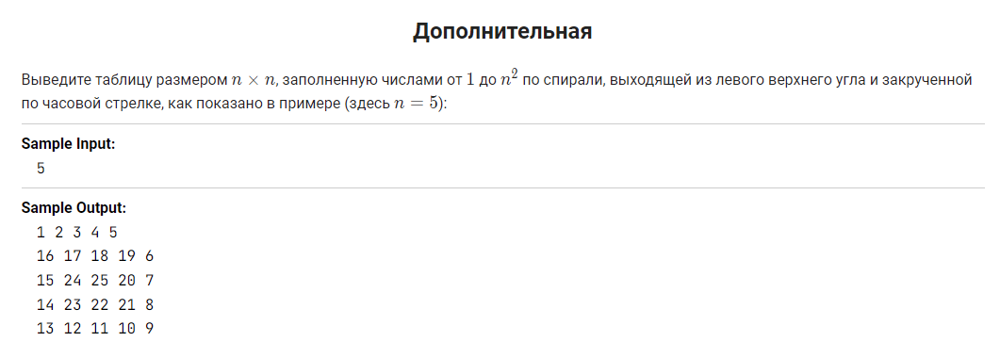

теперь само ДЗ, я старался и придумывал

1 уровень - обязательный:

    Дополнить файл с инструкцией по работе с Git и направить pull request в  мой репозиторий, Файл с инструкцией необходимо дополнить информацией о работе с  удаленными репозиториями. В системе подгрузить скриншот отправленного pull request.

2 уровень - рекомендуемый:

    Дополнить pull request своей визитной карточкой гитхаба readme.md. Постарайтесь написать свои мечты и желания, которые хотите реализовать с помощью новой профессии)) чтоб путеводная звезда горела и помогала учиться.

3 уровень - (по желанию) hardcore. 

    Перед вами непростая и интересная задача. Попробуйте сделать блок-схему и если получится, то крепите к pull request.

Эта задача, по слухам, предлагается на собеседовании в Гугл! дерзайте, попробуйте свои силы!

https://stepik.org/lesson/3369/step/11?unit=952

ниже будут приведены комментарии людей

кстати несколько вариантов вставки картинок , кто - то давно интересовался

https://ask-dev.ru/info/12384/add-images-to-readmemd-on-github

**Контроль версий** необходим, чтобы:

* хранить разные версии проекта;
* возвращаться к разным версиям проекта.

**Чтобы поделить текст на параграфы, между ними нужно оставить пустую строку:**

Первый параграф

Второй параграф
Продолжение второго параграфа

**Чтобы выделить заголовок, перед текстом ставят знак решетки #, при этом между # и словом должен быть пробел. Всего существует 6 уровней заголовков:**

# Заголовок 1
## Заголовок 2
### Заголовок 3
#### Заголовок 4
##### Заголовок 5
###### Заголовок 6

# Выделение текста

**Для выделения текста курсивом нужно использовать одну звездочку * :**

*Тестирование*

**Для выделения текста жирным нужно использовать две звездочки ** :**

**Тестирование**

**Для выделения текста сразу обоими стилями нужно использовать три звездочки *** :**

***Тестирование***

**Чтобы зачеркнуть текст, нужно использовать две тильды ~~**

~~Тестирование~~

# Цитирование

**Чтобы параграф отобразился как цитата, нужно поставить перед ним закрывающую угловую скобку >:**

> Оформление цитаты

# Списки

## Нумерованные списки

**Для создания нумерованного списка перед пунктами нужно поставить число с точкой:**

1. Список 1
2. Список 2
3. Список 3

## Ненумерованные списки

**Для создания ненумерованного списка нужно поставить перед каждым пунктом звёздочку * :**

* Список 1
* Список 2
* Список 3

# Ссылки

**Чтобы поместить ссылку, нужно заглючить ее в угловые скобки <>:**

<https://gb.ru>

# Картинки

**Картинки оформляются по принципу, схожему с принципом оформления ссылкок, только перед квадратными скобками нужно поставить восклицательный знак: :**

# Основные команды Git

* *git init* - инициализация;

* *git status* - показывает текущее состояние гита, есть ли изменения, которые нужно сохранить;

* *git commit -am* - зафиксировать/сохранить;

* *git log* - журнал изменений;

* *git diff* - показывает разницу между текущим файлом и сохраненным;

* *git add* - добавить файл/файлы к коммиту;

* *git checkout* - переход от одного коммита к другому;

* *git checkout master* - вернуться к актуальному состоянию и продолжить работу;

* *git branch* - вывести список всех имеющихся веток;

* *git branch branch_name* - создать новую ветку;

* *git checkout branch_name* - перейти на другую ветку;

* *git merge branch_name* - слить ветки;

* *git branch -d branch_name* - удалить уже слитую ветку;

* *git log -- graph* - увидеть лог коммитов с визуализацией между ними;

* *git checkout -b branch_name* - создать новую ветку и сразу туда переместиться;

* *git clone* - сделать локальную копию удаленного репозитория;

* *git pull* - "стянуть/выкачать" все изменения из удаленного репозитория на свой компьютер;

* *git push* - отправить изменения в удаленный репозиторий.

> *У меня, наверно, самые простые мечты - я хочу начать менять свою жизнь (а, ой, уже началала), переехать от родителей и завести собаку :)*