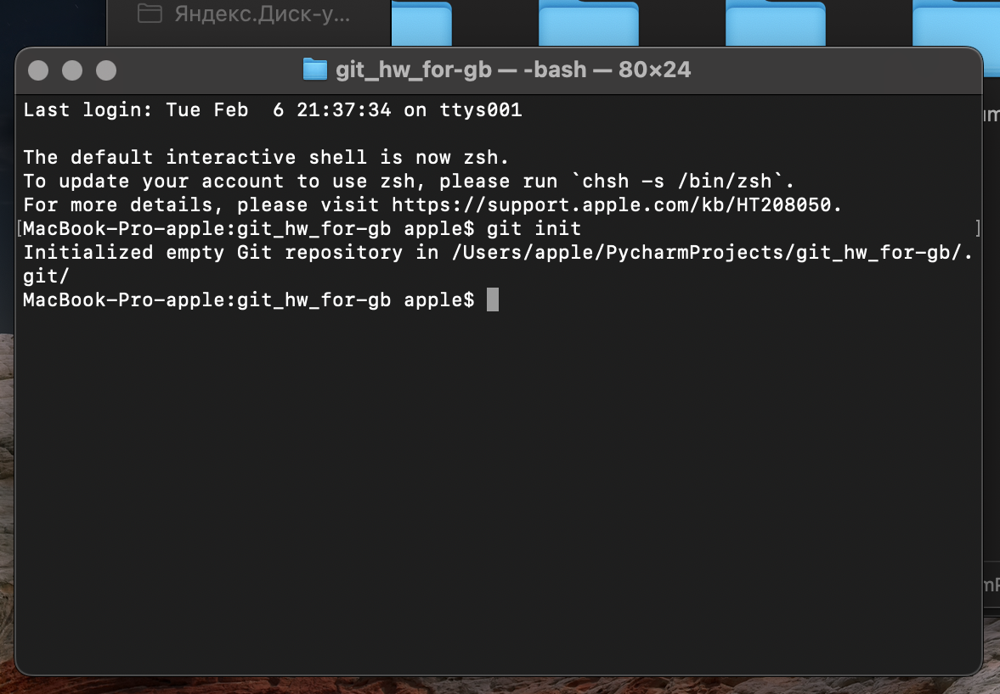
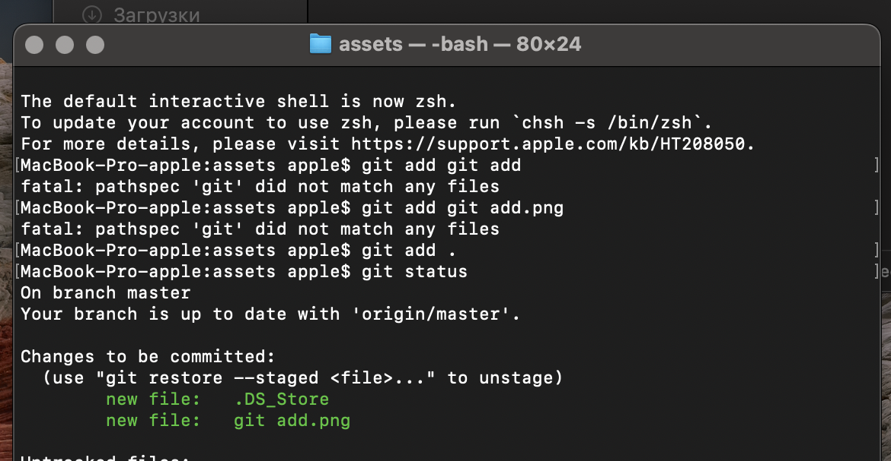
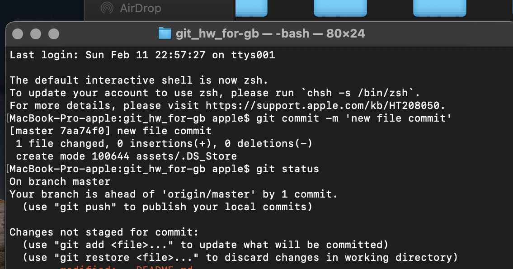

# Инструкция для работы с Git и удалёнными репозиториями

## Что такое Git?
Git - это одна из реализаций распредлённых систем контроля версий, имеющая как и локальные, так и удалённые репозитории. Является самой популярной реализацией систем контроля версий в мире.

## Подготовка репозитория
Для создания репозитория необходимо выполнить команду *git init* в папке с репозиторием. И у Вас будет создан репозиторий (появится скрытая папка .git).



## Создание коммитов

### Git add
Для добавления изменений в коммит используется команда *git add*. Чтобы использовать команду *git add* напишите *git add <имя файла>* либо *git add .* для добавления всех изменённых и неотслеживаемых файлов в категорию подготовленные.



### Просмотр состояния репозитория
Для того, чтобы посмотреть состояние репозитория, используется команда *git status*. Для этого необходимо в папке с репозиторием написать *git status*, и Вы увидите, были ли изменения в файлах или нет.


Если ранее, Вы не изменяли файлы и/ или не прописывали *git add*, то Вы увидите следующие сообщения:

* `On branch master` — сообщение означает, что в настоящий момент активна ветка *master*. Как правило, это основная ветка в репозитории
* `No commits yet` — пока нет коммитов (мы их еще не делали)
* `Nothing to commit` — значит, что все изменения были зафиксированы, и нет новых изменений в файлах для фиксации изменений

Команда *git status* — это основная команда для отслеживания изменений файлов, находящихся в репозитории. Команда выводит информацию о тех файлах репозитория, которые пока ещё не находятся под версионным контролем или не отслеживаются, и о тех файлах, которые были изменены, и изменения которых ещё не были зафиксированы.

### Создание коммитов
Для того, чтобы создать коммит (сохранение), необходимо выполнить команду *git commit*. Если эту команду подать без параметров, то откроется редактор, в котором нужно будет добавить сообщение к этому коммиту.

Можно добавить сообщение после команды *git commit* с помощью параметра *-m*, после которого включается сообщение в кавычках. На скриншоте показано выполнение команды *git commit* и следом за ней *git status*. Под параметром *-m* команды на фиксацию изменений передано сообщение о коммите.



### История коммитов
Если вы заглянете в *git log*, то увидите, что Ваш последний коммит пропал из списка. А *git status* покажет, что все файлы остались в индексе.
Однако Вы можете посмотреть историю коммитов с помощью команды *git log --pretty=format:"%h %ad %an %s" --stat*.
Либо построить дерево изменений: *git log --oneline --graph*.

## Просмотр изменений в коде
С помощью различных интерпретаций команды *git diff* Вы можете посмотреть интересующие Вас изменения и разницы:

* `git diff --cached` - изменения, выполненные для коммита
* `git diff --staged` - разницу между индексом и последним коммитом
* `git diff` - разницу между репозиторием и индексом (**неотслеживаемые файлы игнорируются**)
  
* `git diff --name-only --diff-filter=U` - список всех конфликтующих файлов
* `git diff cf5c7e 35d5ce7` - разницу между проиндексированными и непроиндексированными изменениями
* `git diff-tree --no-commit-id --name-only -r <commit-ish>` - список всех файлов, изменённых коммитом

## Git checkout
С помощью различных интерпретаций команды *git checkout* Вы можете сделать быстрый возврат или переключение:

* `git checkout` - быстрый переход к предыдущей ветке
* `git checkout text.txt` - отменить изменения в файле, вернуть состояние файла, имеющееся в индексе (**опасная операция**)
* `git checkout b9533bb` - переключиться на коммит с указанным хешем (переместить HEAD на указанный коммит, рабочую директорию вернуть к состоянию на момент этого коммита)
* `git checkout master` - переключиться на коммит, на который указывает master (переместить HEAD на коммит, на который указывает master, рабочую директорию вернуть к состоянию на момент этого коммита)
* `git checkout -b new-branch 5589877` - создать ветку new-branch, начинающуюся с коммита c хешем 5589877 (переместить HEAD на указанный коммит, рабочую директорию вернуть к состоянию на момент этого коммита, создать указатель на этот коммит (ветку) с указанным именем)
* `git checkout 5589877 index.html` - восстановить в рабочей директории указанный файл на момент указанного коммита (и добавить это изменение в индекс) (*git reset index.html* для удаления из индекса, но сохранения изменений в файле)

## Продолжение

### 1. Инициализация репозитория
Для **инициализации** репозитория следует использовать команду `git init`.

### 2. Добавление файлу версионности
Чтобы добавить файлу версионности необходимо использовать команду `git add`.

### 3. Создание веток
Чтобы создать новую ветку необходимо использовать команду `git branch <name_branch>`.
Чтобы перейти на другую ветку - `git checkout <name_branch>`.

### 4. Слияние веток
`git merge <name_branch>` - слияние ветки с именем указанным в команде, сливается в ветку, в которой мы находимся.

### 5. Удаление веток
`git branch -d <name_branch>` - удаление уже слитой ветки; производится из любой другой ветки.
`git branch -D <name_branch>` - принудительное удаление ветки, даже если там есть неслитая информация.

## Работа с удалёнными репозиториями

### Просмотр удалённых репозиториев

Для того, чтобы просмотреть список настроенных удалённых репозиториев, Вы можете запустить команду `git remote`. Она выведет названия доступных удалённых репозиториев. Если Вы клонировали репозиторий, то увидите как минимум *origin* — имя по умолчанию, которое Git даёт серверу, с которого производилось клонирование:
```
$ git clone https://github.com/schacon/ticgit
Cloning into 'ticgit'...
* remote: Reusing existing pack: 1857, done.
* remote: Total 1857 (delta 0), reused 0 (delta 0)
Receiving objects: 100% (1857/1857), 374.35 KiB | 268.00 KiB/s, done.
Resolving deltas: 100% (772/772), done.
Checking connectivity... done.
$ cd ticgit
$ git remote
origin
```
Вы можете также указать ключ *-v*, чтобы просмотреть адреса для чтения и записи, привязанные к репозиторию:
```
$ git remote -v
origin	https://github.com/schacon/ticgit (fetch)
origin	https://github.com/schacon/ticgit (push)
```
Если у Вас больше одного удалённого репозитория, команда выведет их все. Например, для репозитория с несколькими настроенными удалёнными репозиториями в случае совместной работы нескольких пользователей, вывод команды может выглядеть примерно так:
```
$ cd grit
$ git remote -v
bakkdoor  https://github.com/bakkdoor/grit (fetch)
bakkdoor  https://github.com/bakkdoor/grit (push)
cho45     https://github.com/cho45/grit (fetch)
cho45     https://github.com/cho45/grit (push)
defunkt   https://github.com/defunkt/grit (fetch)
defunkt   https://github.com/defunkt/grit (push)
koke      git://github.com/koke/grit.git (fetch)
koke      git://github.com/koke/grit.git (push)
origin    git@github.com:mojombo/grit.git (fetch)
origin    git@github.com:mojombo/grit.git (push)
```
Это означает, что мы можем легко получить изменения от любого из этих пользователей. Возможно, что некоторые из репозиториев доступны для записи и в них можно отправлять свои изменения, хотя вывод команды не даёт никакой информации о правах доступа.

### Добавление удалённых репозиториев
Для того, чтобы добавить удалённый репозиторий и присвоить ему имя (*shortname*), просто выполните команду `git remote add <shortname> <url>`:
```
$ git remote
origin
$ git remote add pb https://github.com/paulboone/ticgit
$ git remote -v
origin	https://github.com/schacon/ticgit (fetch)
origin	https://github.com/schacon/ticgit (push)
pb	https://github.com/paulboone/ticgit (fetch)
pb	https://github.com/paulboone/ticgit (push)
```
Теперь вместо указания полного пути Вы можете использовать *pb*. Например, если Вы хотите получить изменения, которые есть у Пола, но нет у Вас, Вы можете выполнить команду `git fetch pb`:
```
$ git fetch pb
* remote: Counting objects: 43, done.
* remote: Compressing objects: 100% (36/36), done.
* remote: Total 43 (delta 10), reused 31 (delta 5)
Unpacking objects: 100% (43/43), done.
From https://github.com/paulboone/ticgit
[new branch]      master     -> pb/master
[new branch]      ticgit     -> pb/ticgit
```
Ветка master из репозитория Пола сейчас доступна Вам под именем *pb/master*. Вы можете слить её с одной из Ваших веток или переключить на неё локальную ветку, чтобы просмотреть содержимое ветки Пола.

### Получение изменений из удалённого репозитория — Fetch и Pull
Как Вы только что узнали, для получения данных из удалённых проектов, следует выполнить: `git fetch [remote-name]`.

Данная команда связывается с указанным удалённым проектом и забирает все те данные проекта, которых у Вас ещё нет. После того как Вы выполнили команду, у Вас должны появиться ссылки на все ветки из этого удалённого проекта, которые Вы можете просмотреть или слить в любой момент.

Когда Вы клонируете репозиторий, команда *clone* автоматически добавляет этот удалённый репозиторий под именем *origin*. Таким образом, `git fetch origin` извлекает все наработки, отправленные на этот сервер после того, как Вы его клонировали (или получили изменения с помощью *fetch*). Важно отметить, что команда `git fetch` забирает данные в Ваш локальный репозиторий, но не сливает их с какими-либо вашими наработками и не модифицирует то, над чем Вы работаете в данный момент. Вам необходимо вручную слить эти данные с вашими, когда Вы будете готовы.

Если ветка настроена на отслеживание удалённой ветки, то Вы можете использовать команду `git pull` чтобы автоматически получить изменения из удалённой ветки и слить их со своей текущей. Этот способ может для вас оказаться более простым или более удобным. К тому же, по умолчанию команда `git clone` автоматически настраивает Вашу локальную ветку *master* на отслеживание удалённой ветки *master* на сервере, с которого Вы клонировали репозиторий. Название веток может быть другим и зависит от ветки по умолчанию на сервере. Выполнение `git pull`, как правило, извлекает (*fetch*) данные с сервера, с которого Вы изначально клонировали, и автоматически пытается слить (*merge*) их с кодом, над которым Вы в данный момент работаете.

### Отправка изменений в удалённый репозиторий (Push)
Когда Вы хотите поделиться своими наработками, Вам необходимо отправить их в удалённый репозиторий. Команда для этого действия простая: `git push <remote-name> <branch-name>`. Чтобы отправить Вашу ветку *master* на сервер *origin*, Вы можете выполнить следующую команду для отправки ваших коммитов: `git push origin master`.

Эта команда срабатывает только в случае, если Вы клонировали с сервера, на котором у Вас есть права на запись, и если никто другой с тех пор не выполнял команду *push*. Если Вы и кто-то ещё одновременно клонируете, затем он выполняет команду *push*, а после него выполнить команду *push* попытаетесь Вы, то Ваш *push* точно будет отклонён. Вам придётся сначала получить изменения и объединить их с Вашими и только после этого Вам будет позволено выполнить *push*.

### Просмотр удалённого репозитория
Если хотите получить побольше информации об одном из удалённых репозиториев, Вы можете использовать команду `git remote show <remote>`. Выполнив эту команду с некоторым именем, например, *origin*, Вы получите следующий результат:
```
$ git remote show origin
* remote origin
  Fetch URL: https://github.com/schacon/ticgit  
  Push  URL: https://github.com/schacon/ticgit  
  HEAD branch: master  
  Remote branches:  
    master                               tracked    
    dev-branch                           tracked    
  Local branch configured for 'git pull':  
    master merges with remote master    
  Local ref configured for 'git push':  
    master pushes to master (up to date)
```
Она выдаёт URL удалённого репозитория, а также информацию об отслеживаемых ветках. Эта команда любезно сообщает Вам, что если Вы, находясь на ветке *master*, выполните `git pull`, ветка master с удалённого сервера будет автоматически влита в Вашу сразу после получения всех необходимых данных. Она также выдаёт список всех полученных ею ссылок.

Однако, если Вы используете Git более интенсивно, Вы можете увидеть гораздо большее количество информации от `git remote show`:
```
$ git remote show origin
* remote origin
  URL: https://github.com/my-org/complex-project
  Fetch URL: https://github.com/my-org/complex-project
  Push  URL: https://github.com/my-org/complex-project
  HEAD branch: master
  Remote branches:
    master                           tracked
    dev-branch                       tracked
    markdown-strip                   tracked
    issue-43                         new (next fetch will store in remotes/origin)
    issue-45                         new (next fetch will store in remotes/origin)
    refs/remotes/origin/issue-11     stale (use 'git remote prune' to remove)
  Local branches configured for 'git pull':
    dev-branch merges with remote dev-branch
    master     merges with remote master
  Local refs configured for 'git push':
    dev-branch                     pushes to dev-branch                     (up to date)
    markdown-strip                 pushes to markdown-strip                 (up to date)
    master                         pushes to master                         (up to date)
```
Данная команда показывает какая именно локальная ветка будет отправлена на удалённый сервер по умолчанию при выполнении `git push`. Она также показывает, каких веток с удалённого сервера у Вас ещё нет, какие ветки всё ещё есть у Вас, но уже удалены на сервере, и для нескольких веток показано, какие удалённые ветки будут в них влиты при выполнении `git pull`.

### Удаление и переименование удалённых репозиториев
Для переименования удалённого репозитория можно выполнить `git remote rename`. Например, если вы хотите переименовать *pb* в *paul*, Вы можете это сделать при помощи `git remote rename`:
```
$ git remote rename pb paul
$ git remote
origin
paul
```
Стоит упомянуть, что это также изменит имена удалённых веток в Вашем репозитории. То, к чему вы обращались как *pb/master*, теперь стало *paul/master*.

Если по какой-то причине Вы хотите удалить удалённый репозиторий — Вы сменили сервер или больше не используете определённое зеркало, или кто-то перестал вносить изменения — Вы можете использовать `git remote rm`:
```
$ git remote remove paul
$ git remote
origin
```
При удалении ссылки на удалённый репозиторий все отслеживаемые ветки и настройки, связанные с этим репозиторием, так же будут удалены.
