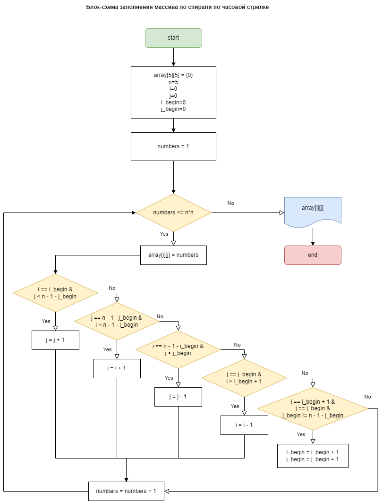

теперь само ДЗ, я старался и придумывал

1 уровень - обязательный:

    Дополнить файл с инструкцией по работе с Git и направить pull request в  мой репозиторий, Файл с инструкцией необходимо дополнить информацией о работе с  удаленными репозиториями. В системе подгрузить скриншот отправленного pull request.

2 уровень - рекомендуемый:

    Дополнить pull request своей визитной карточкой гитхаба readme.md. Постарайтесь написать свои мечты и желания, которые хотите реализовать с помощью новой профессии)) чтоб путеводная звезда горела и помогала учиться.

http://github.com/ellandry

👋 Hi, I’m Elena Andrianova (@ellandry)
👀 I’m interested in Data science, analytics in international trading and Customs administration
🌱 I’m currently learning programming on Python
💞️ I’m looking to collaborate on Customs administration other countries
📫 How to reach me - ellandry777@gmail.com

3 уровень - (по желанию) hardcore. 

    Перед вами непростая и интересная задача. Попробуйте сделать блок-схему и если получится, то крепите к pull request.

Эта задача, по слухам, предлагается на собеседовании в Гугл! дерзайте, попробуйте свои силы!

