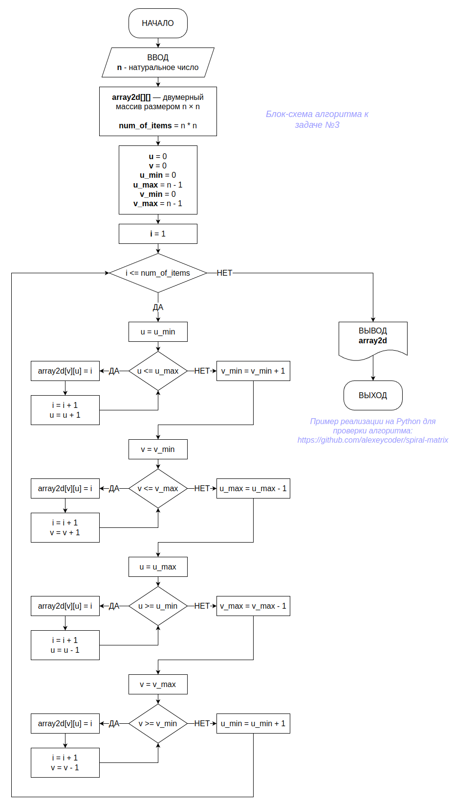

# Визитная карточка с GitHub.com

### 👋 Hi there! I'm Alexey

- 🔭 I'm intended to improve my developing skills in various programming languages on persistent basis.
- 🌱 I’m currently learning Git, C, C++, bash,...
- 🤑️ I'm going to be a professional.
- 📫 How to reach me: Russia

😄 Good time to everyone! 👯

# Блок-схема алгоритма для задачи №3

(Пример реализации на Python &mdash; <https://github.com/alexeycoder/spiral-matrix/blob/main/spiral.py>)

