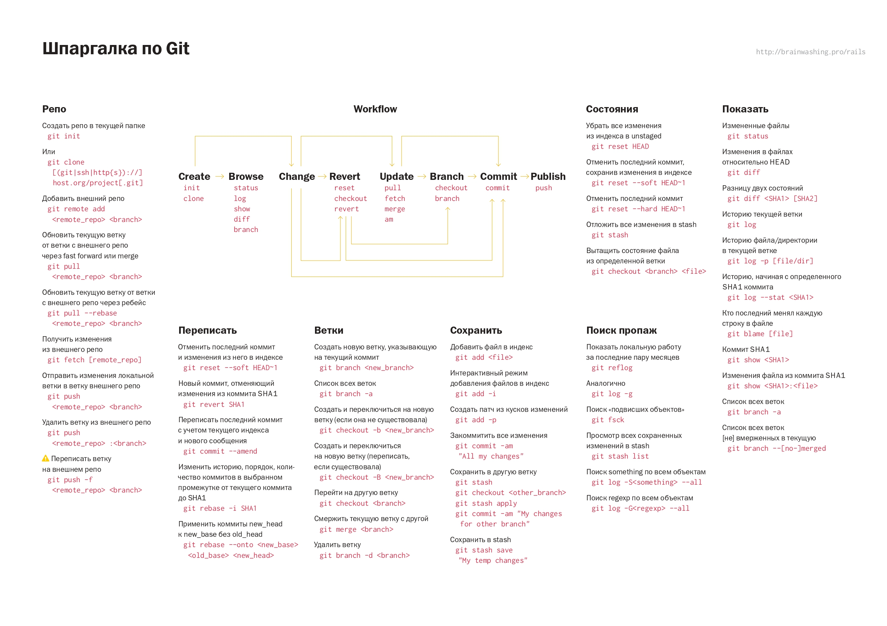

теперь само ДЗ, я старался и придумывал

1 уровень - обязательный:

    Дополнить файл с инструкцией по работе с Git и направить pull request в  мой репозиторий, Файл с инструкцией необходимо дополнить информацией о работе с  удаленными репозиториями. В системе подгрузить скриншот отправленного pull request.

2 уровень - рекомендуемый:

    Дополнить pull request своей визитной карточкой гитхаба readme.md. Постарайтесь написать свои мечты и желания, которые хотите реализовать с помощью новой профессии)) чтоб путеводная звезда горела и помогала учиться.

3 уровень - (по желанию) hardcore. 

    Перед вами непростая и интересная задача. Попробуйте сделать блок-схему и если получится, то крепите к pull request.

Эта задача, по слухам, предлагается на собеседовании в Гугл! дерзайте, попробуйте свои силы!

https://stepik.org/lesson/3369/step/11?unit=952

ниже будут приведены комментарии людей

кстати несколько вариантов вставки картинок , кто - то давно интересовался

https://ask-dev.ru/info/12384/add-images-to-readmemd-on-github

# Инструкция для работы с Markdown

## Выделение текста

Чтобы выделить текст курсивом необходимо обрамить его звездочками(*) или знаком нижнего подчеркивания (_). Например, *вот так* или _вот так_

Чтобы выделить текст полужирным, необходимо обрамить его двойными звездочками(**) или двойным знаком нижнего подчеркивания(__). Например, **вот так** или __вот так__

Альтернативные способы выделения текста жирным или курсивом, нужны для того, чтобы мы могли совмещать оба этих способа. Например, _текст может быть выделен курсивом и при этом быть **полужирным**_.

## Списки

Чтобы добавить не нумерованные списки, необходимо пункты выделить звездочкой(*) или знаком +. Например вот так:
* Элемент 1
* Элемент 2
* Элемент 3
+ Элемент 4

Чтобы добавить нумеролванные списки, необходимо просто пронумеровать. Например, вот так:
1. Первый пункт
2. Второй  пункт

## Работа с изображениями

Чтобы ыставить изображение в текст, достаточно написать следущее:

## Ссылки

Markdown поддерживает два стиля оформления ссылок:

* Гиперссылка, с немедленным указанием адреса (внутритекстовая)
* Гиперссылка, подобная сноске.

Подразумевается, что помимо URL-адреса существует еще текст ссылки. Он заключается в квадратные скобки. Для создания внутритекстовой гиперссылки необходимо использовать круглые скобки сразу после закрывающей квадратной. Внутри них необходимо поместить [URL-адрес](https://gist.github.com/Jekins/2bf2d0638163f1294637#Links). В них же возможно расположить название, заключенное в кавычки, которое будет отображаться при наведении, но этот пункт не является обязательным.

## Цитаты

Для обозначения цитат в языке Markdown используется знак «больше» («>»). Его можно вставлять как перед каждой строкой цитаты, так и только перед первой строкой параграфа. Также синтаксис Markdown позволяет создавать вложенные цитаты (цитаты внутри цитат). Для их разметки используются дополнительные уровни знаков цитирования («>»). Цитаты в Markdown могут содержать всевозможные элементы разметки. Цитаты в языке Markdown выглядят следующим образом:

>Это пример цитаты,
>в которой перед каждой строкой
>ставится угловая скобка.

### Вложение цитаты в цитату выглядит следующим образом:

> Первый уровень цитирования
>> Второй уровень цитирования
>>> Третий уровень цитирования
>
>Первый уровень цитирования

## Заключение

Рассмотрено было в данном курсе как создавать репозиторий, настраивать наш проект, делать commit, оформление текста и смотреть логи проекта.

Это базовые команды для использования GIT. Конечно команд очень много, но мы только сделали маленькие шажки в изучение этой темы, которые позволяют нам уже сейчас работать с контролем версий ваших будущих проектов.

Ниже будут приложены иллюстрации с описанием комманд

 

  

##  Работа с удаленными репозиториями в git:

1. Необходимо сделать __форк (fork)__ интересующего нас аккаунта
2. С помощью команды __git clone__ делаем копию для нашей версии этого репозитория
3. Потом создаем новую ветку командой __git branch__, в которую вносим наши изменения, их можно вносить только тут и 
обязательно делать __commit__ с пояснениями
4. Отправить все внесенные изменения на свой аккаунт можно с помощью команды __git push__ (push)
5. После всех выполненных действий, на Github появиться возможность отправить __pull reguest__  

