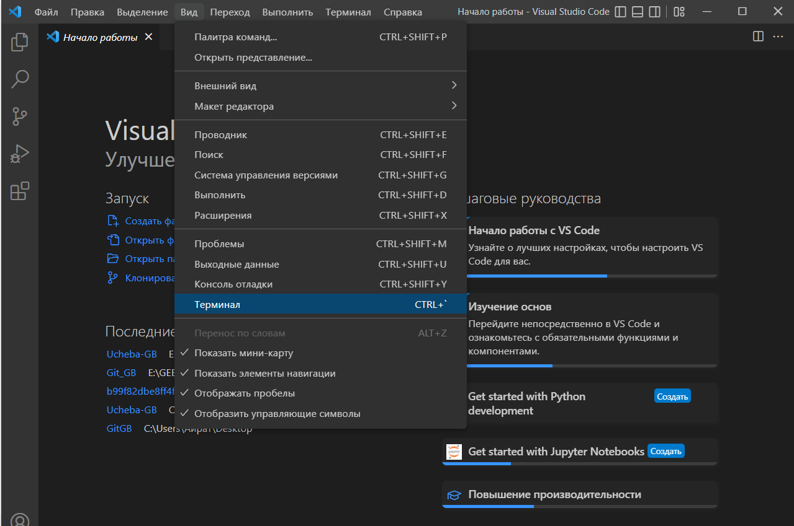
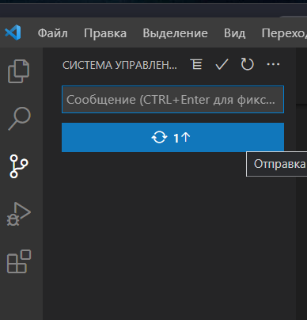

# Рассмотрим работу с Git

1. Вам необходимо скачать и установить Git по ссылке https://git-scm.com/downloads выбрав свою операционную систему.

2. После скачивания и установки Git, Вам необходимо запустить командную строку Git Bash и ввести следующие команды:
> **git config --global user.name "Ваше ФИО"**

> **git config --global user.email "ваш_адрес_электронной@почты.ru"**

3. Скачать и установить Visual Studio Code по следующей ссылке https://code.visualstudio.com/download, выбрав свою операционную систему.

4. После скачивания и устанвоки, при необходимости устанвоить в Visual Studio Code русский язык, для этого, вам нужно нажать кнопку Расширения в левом столбике (нижняя иконка "квадратики"),

 

после чего в поисковике набрать Russian Language Pack и установить расширение. Перезапустить Visual Studio Code.

5. После того как будет все готово, Вам необходимо создать папку в корне диска с названием на английском языке, без пробелов. Далее в VSCode Перейти и нажать сверху слева - ФАЙЛ > Открыть Папку > и открыть ранее созданную Вами папку.

6. Дальше переходим сверху в раздел Вид > Терминал.

7. В строке терминала вводим команду:
> **git init**

После чего Git начинает отслеживать изменения в вашей созданной папке.

8. Создаем файл с любым названием на английском языке, например readme.md с расширением md.

9. Ввводим в терминале команду:
> **git add readmi.md**

После чего в репозиторий будет добавлен Ваш файл readme.

10. Далее вносим данные, текс и т.д. в созданный вами файл readme. После внесения всех изменений, необходиом Перейти сверху слева в ФАЙЛ > Сохранить.

11. После сохранения ваших изменений, необходимо данные изменения предоставить (передвть/добавить) в репозиторий, для этого набираем следующие команды:
> **git add readme.md**

> **git commit -m "любое название или версии"**

12. Далее переходим в левый столбик и кликаем на иконку,

 третья сверху (с тремя кружочками) и нажимаем отправка фиксаций.
 
 

13. Преходим на GitHub и видим свои изменения и сохранения.

## Далее укажу некоторые возможности Markdown

* Для написания текста курсивом нужно текст поместить между символами " * " , *пример*

* Для написания текста полужирным нужно текст поместить между символами " ** " , **пример**

* Для написания текста полужирным курсивом нужно текст поместить между символами " *** " , ***пример***

* Для того чтобы текст был зачеркнут нужно текст поместить между символами " ~~ ",  ~~пример~~

* Для выделения  заголовка символ "#" можно использовать в начале, до 6-# символов 
## пример
### пример
#### пример
##### пример
###### пример

* Для подчеркивания текста нужно прописать знак на следующеей строке " = ", 

пример
= 

* Для нумерации просто ставим цыфры с точкой "1."
1. первый
2. второй

* Для написания с точкой в начале текста ставим "*" или "-"

* Для написания цитат в начале ставим " > "

> Строка для цитаты

## Далее я покажу и кратко опишу новые команды в терминале изученные мною git...

* **init** - создание репозитория или инициализируйте существующий

* **add** - сохранение файла после его изменения (перед тем как прописывать *git add "название"* сохраняем Ctrl+S)

* **commit -a -m "название"** - запись изменений в репозиторий

* **log** - показать журналы фиксации *commit*

* **status** - отоброжение состояния рабочего дерева

* **branch** - отоброжение вервей

* **branch name** - создание создание отдельной ветви для работы в ней отдельно от основной *"master"*

* **branch -d name** - команда для удаления ветви 

* **checkout name** - перейти на другую созданную ветвь или загрузить *commit* указав первые 4-е символа коммита
* **log --graph** - вывести список коммитов в виде графического дерева

* **log --oneline** - показывает все коммиты списком без информации о них

* **checkout -b branch_name** - создает новую ветвь и переходит сразе на неё

* **--all--oneline** - показывает все commit во всех ветках

* **merge name** - обьединяет 2 ветки дерева вместе

## Также узнал команды для работы с локальным и внешним репозиториями git...

* **clone (ссылка на репозиторий)** - клонирует репозиторий в новый каталог

**********************************************************
* ***fork***- кнопочка на GitHub (справа наверху) для полной копии репозитория с другого аккаунта

* **remote add origin (ссылка)** - создает новый удаленный репозиторий *(связывает локальный и удаленный репозиторий)*

* **branch -M main** - создает ветку каторая будет основной для редактирования чужого репозитория

* **push -u origin main** - для отправки удаленного репозитория

### Команды для использования репозитория не своего аккаунта
**********************************************************

* **push** - отправляет данные в GitHub удаленный репозиторий

* **pull** - отправит данные из GitHub в локальный репозиторий и обьединит их сделав *merge*

* **cd (вставить имя репозитория)** - переходит в другую папку с репозиторием 

* **cd..** -перейти в предыдущую папку

## Здраствуйте меня зовут ***Максим*** 

## **Это моё фото**
********************************************************

********************************************************
 Я учусь на данной платформе для того чтобы сменить свою работу на менее вредную и опасную, так как работаю на опасном производственном обьекте химической промышленности. Ну еще конечно же повысить свой доход.

Еще мне всегда хотелось научится програмированнию, но онлайн боялся из-за незнания. Ну и конечно думал не потяну. Хотя в школе очень любил информатику. Ну вот теперь я здесь готов покарять новые вершины, получать знания, развиватся уже как программист.