***

# **Первый вебинар по введению в контроль версий**

***

## **_1. Установка и регистрация_**

После установки необходимо «представиться» системе контроля версий. Это нужно сделать всего один раз, и git запомнит вас. Для этого нужно ввести в терминале 2 команды:

* git config --global user.name "Ваше имя английскими буквами"

* git config --global user.email "ваша почта@example.com"

## **_2. Создание репозитория_**

>Репозиторий или хранилище — это каталог, в котором хранятся файлы вашего проекта. Он может быть расположен в хранилище GitHub или в локальном хранилище на вашем компьютере. Вы можете хранить файлы кодов, изображения, аудио или всё, что связано с проектом, в хранилище.

---
1. Создайте папку на компьютере с любым именем на английском языке
2. Откройте [Visual Studio Code](https://code.visualstudio.com/). Если он еще не установлен, то загрузите его по ссылке.

3. В разделе проводник откройте вашу папку.

4. Создайте новый файл с расширением **_.md_**

5. Перейдите на вкладку **Вид** и включите **терминал**

> А сейчас начинается магия

6.      Ввести в терминале *git --version*. Смотрим правильно ли у нас установился git

        Команда *git init* преобразует всю нашу папку в репозиторий.

***

## **_3. Основные команды git_**

- **_git status_** - Команда git status отображает состояние рабочего каталога и раздела проиндексированных файлов. С ее помощью можно проверить индексацию изменений и увидеть файлы, которые не отслеживаются Git. Информация об истории коммитов проекта не отображается при выводе данных о состоянии.

- **_git add text.md_** - это первая команда в цепочке операций, предписывающей Git «сохранить» снимок текущего состояния проекта в истории коммитов. Когда git add используется как отдельная команда, она переносит ожидающие изменения из рабочего каталога в раздел проиндексированных файлов.

- **_git add ._** сохранит все файлы во всей папке.

- **_git commit_** - делает для проекта снимок текущего состояния изменений, добавленных в раздел проиндексированных файлов. Такие подтвержденные снимки состояния можно рассматривать как «безопасные» версии проекта — Git не будет их менять, пока вы явным образом не попросите об этом.

- **_git commit - am""_** - объединяет две команды **_git commit_** и **_git add text.md_**.

- **_git log_** - перечисляет коммиты, сделанные в репозитории в обратном к хронологическому порядке — последние коммиты находятся вверху.

- **_git reflog_** - выводит все созданные комиты

- **_git diff_** - функция сравнения источников данных Git — коммитов, веток, файлов и т. д. Сравнивает предыдущие версии с текущей.

- **_git diff  (первые цифры названия первого комита) (первые цифры названия второго комита)_** - возможность сравнить выбранные версии файла

- **_git chekout_** - позволяет перемещаться между ветками, созданными командой git branch . При переключении ветки происходит обновление файлов в рабочем каталоге в соответствии с версией, хранящейся в этой ветке, а Git начинает записывать все новые коммиты в этой ветке.

- **_git chekout master (main)_** - переходит к последней версии сохранения.

***

# **Второй вебинар по введению в контроль версий**

***

## **_1. Создание веток и работа с ними_**

> "Ветка" в Git — это простой перемещаемый указатель на один из таких коммитов. По умолчанию, имя основной ветки в Git — master (main). Как только вы начнёте создавать коммиты, ветка master (main) будет всегда указывать на последний коммит. Каждый раз при создании коммита указатель ветки master (main) будет передвигаться на следующий коммит автоматически.

>> Команда **git branch** — это своего рода "менеджер веток". Она умеет перечислять ваши ветки, создавать новые, удалять и переименовывать их.

Ветка или ветки создаются для возможности создать что-типо черновика, где мы можем потом не бояться за свой основной проект.

**git branch** перечисляем все существующие ветки в репозитории.

**git branch NEW_NAME_BRANCH** - создаем новую ветку с именем NEW_NAME_BRANCH.

**git checkout NEW_NAME_BRANCH** - переходим на ветку с именем NEW_NAME_BRANCH.

Мы создали новую ветку NEW_NAME_BRANCH и теперь в ней мы можем работать. 

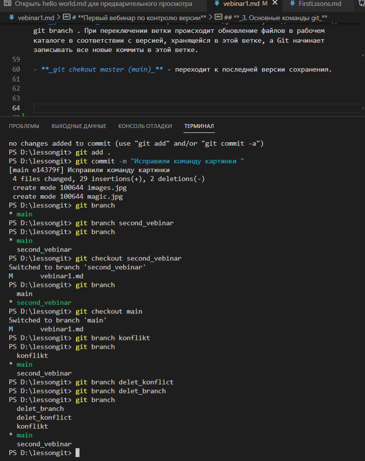

## **_2. Слияние веток_**

Вот мы и закончили свою работу в ветках, и готовы перенести работу в основную ветку master (main).Для этого нужно сделать следующее:

1. Проверяем все ли мы закомитили в наших ветках

2. Перейдем на главную ветку *_git checkout name_branch_*

3. Удосоверимся, что мы на главной ветке *_git branch_*

4. Введем команду объединения *_git merge name_branch_*

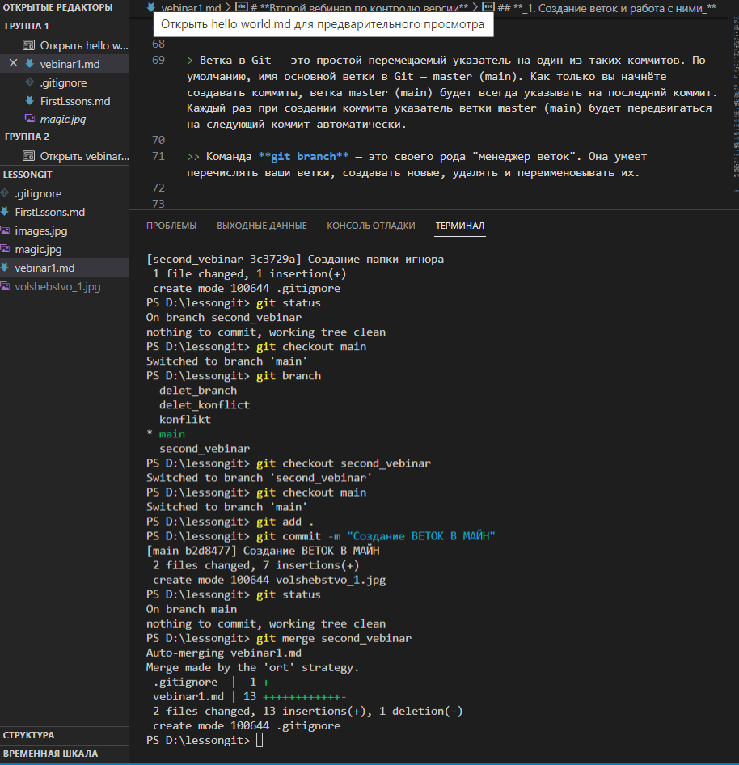

 ## **_3. Конфликт и решение конфликта при слиянии веток_**

Git позволяет выполнять слияния очень просто. В большинстве случаев Git самостоятельно решает, как автоматически интегрировать новые изменения.

Обычно конфликты возникают, когда два человека изменяют одни и те же строки в файле или один разработчик удаляет файл, который в это время изменяет другой разработчик. В таких случаях Git не может автоматически определить, какое изменение является правильным. Конфликты затрагивают только того разработчика, который выполняет слияние, остальная часть команды о конфликте не знает. Git помечает файл как конфликтующий и останавливает процесс слияния. В этом случае ответственность за разрешение конфликта несут разработчики.

Сообщение представляется примерно в таком виде 

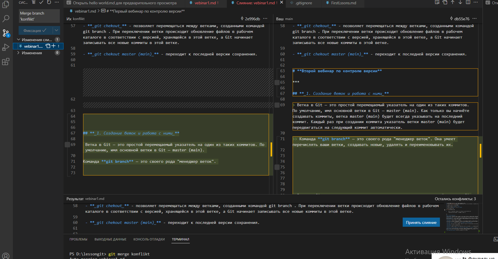

Программа выделяет строчки, которые вступли в конфликт друг с другом, но она сама решить не может, что для вас лучше, поэтому предлагает на выбор несколько вариантов решения. Нужно просто выбрать тот который вам подходит.

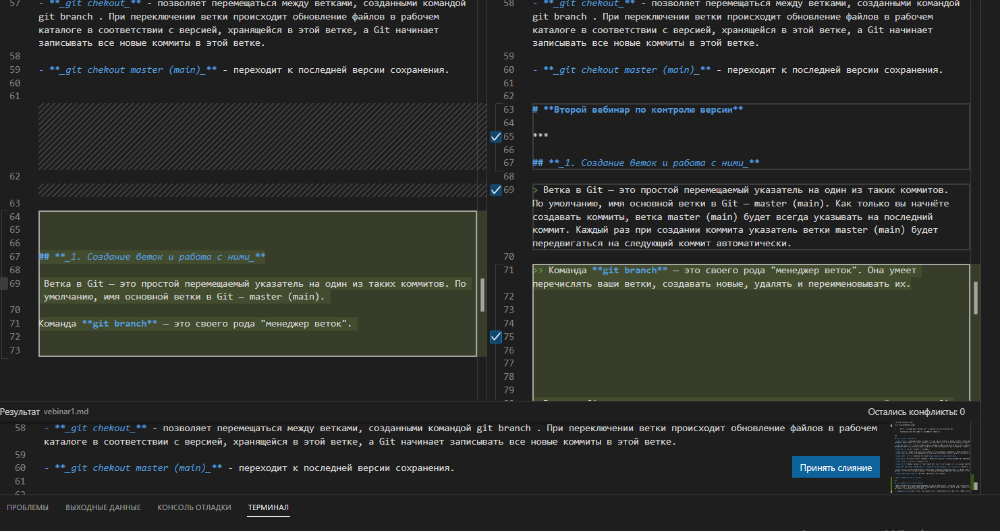

Если хотите проверить дополнительно текст на различия, то можно выполнить команду *_git diff_* . 

> ВАЖНО! 
> Не забывайте комитить!
> git commit

если вы всеже решили для себя, что вы не хотите оставлять это слияние, то можно использовать команду отката 

*_git merge --abort_*

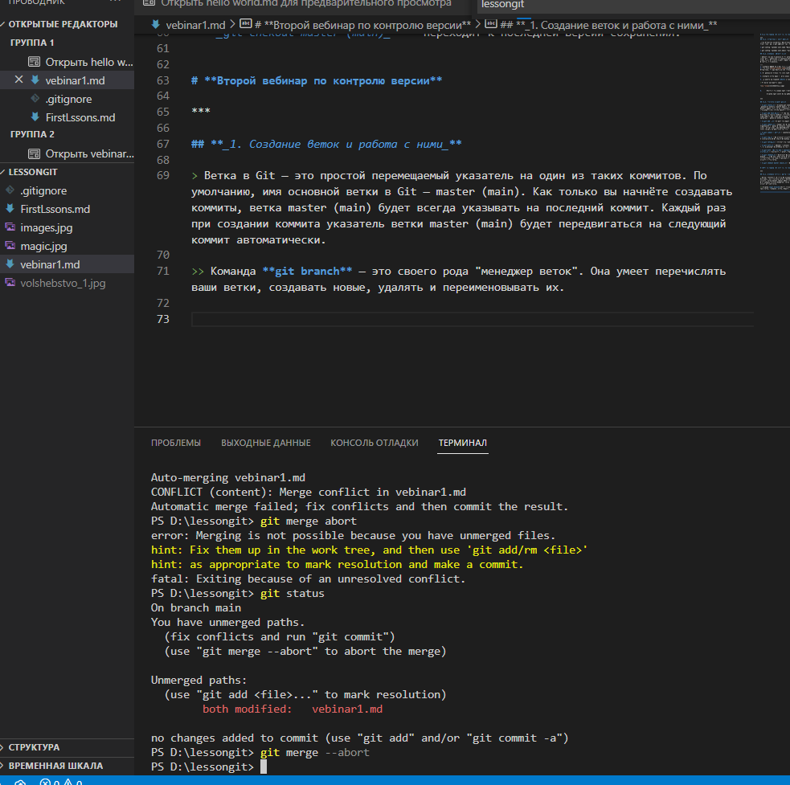

***

# **Третий семинар по введению в контроь версий**

***

## **1. GitHub, работа с удалёнными репозиториями.**

**GitHub** — крупнейший веб-сервис для хостинга IT-проектов и их совместной разработки. Веб-сервис основан на системе контроля версий Git и разработан на Ruby on Rails и Erlang компанией GitHub

+ В начале рассмотрим вариант работы с вашими удалеными репозиториями.

Первое, что необходимо сделать для работы с удаленными репозиториями - это зарегистрироваться на [GitHub](https://github.com/). 

> ВАЖНО! 
> На GitHub нужно заходить с браузера, который у вас стоит "по умолчанию" на компьютере.

Далее зайти в Visual Studio Code и нажать на учетную запись и войт при помощи GitHub

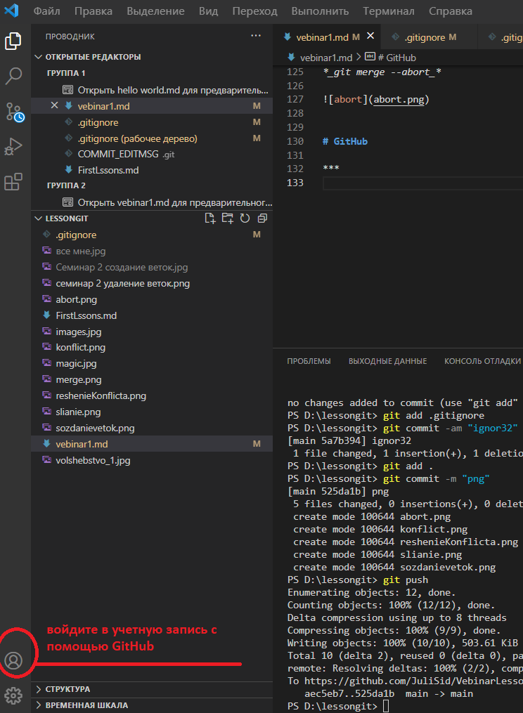

Откройте ваш репозиторий, который хотите подгрузить на GitHub. 

Врйдте на GitHub и перейдите на вкладку *Repositories* и нажмите кнопку сщздать новый *NEW*.

![reposit}(reposit.png)

Заполните строчку названия вашего репозитория. 

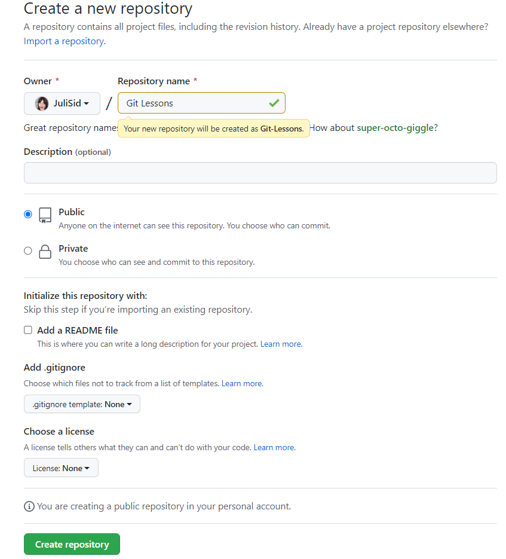

На появившейся странице скопируйте код из раздела **_…or push an existing repository from the command line_** и вставте его в терминал Visuai Studio Code. 

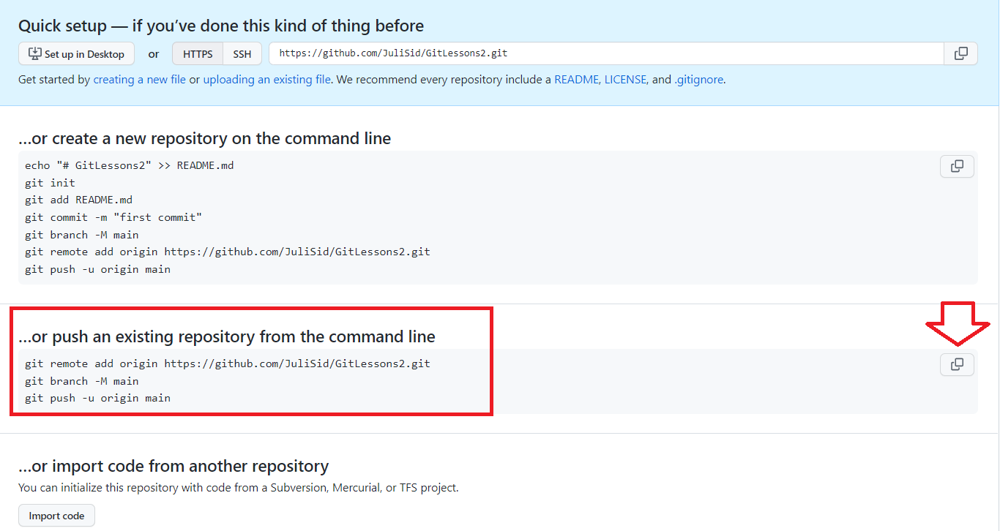

После этого на GitHub Появится ваш репозиторий.

## **_2. Для чего нужен pull request и как с ним работать?_**

> **pull request** — предложение изменения кода в чужом репозитории.

pull request это что-то типа сообщения автору оригинального репозитория со смыслом "эй, я тут сделал крутую штуку, рекомендую добавить ее в такую-то ветку". Автор оригинальной репозитория смотрит на ваши "изменения" и решает - принимать их (git pull) или не принимать, сделать слияние со своей основной веткой (git merge) или нет.

**С чего же начать?**

- Заходим в репозиторий автора, который вы хотите Пулл Реквестнуть.

- Нажимаем значок Fork

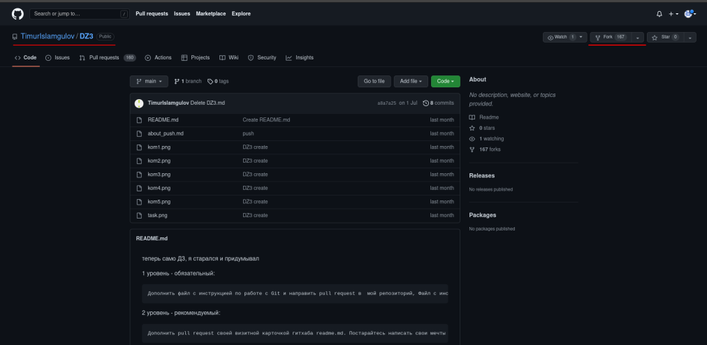

Репозиторий скопировался на вашу страницу в GitHub.

- В открывшемся окне нажмем кнопку CODE и скопируем адрес.

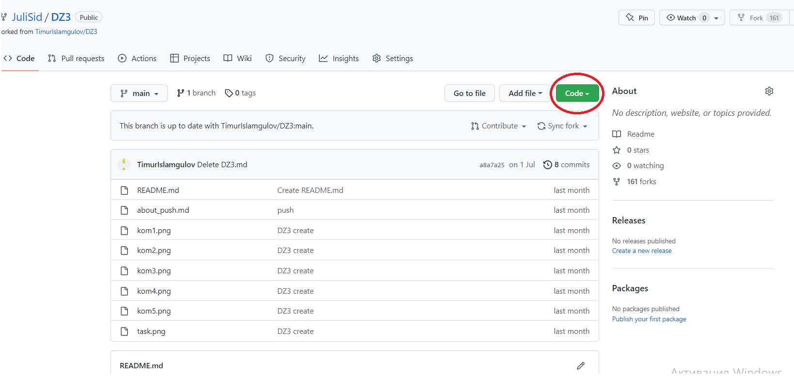

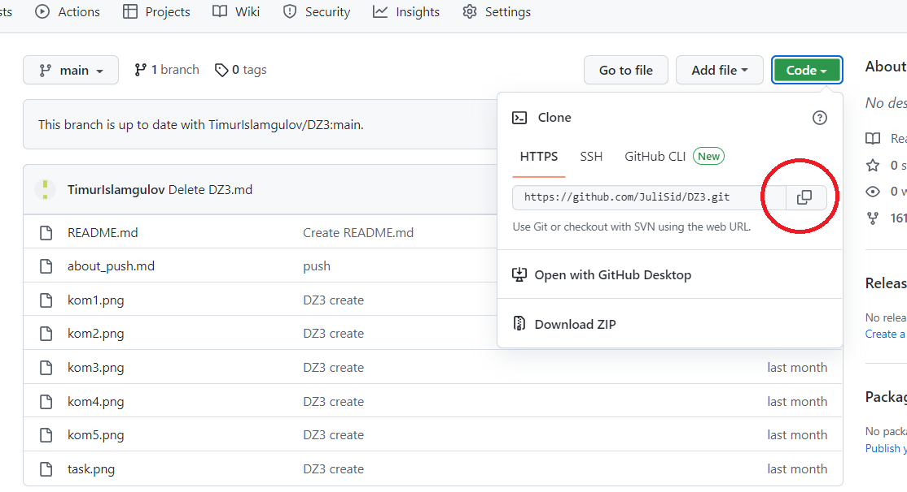

- Теперь идем в Visual Studio Code и в терминале пишем следущую команду:

> **_git clone_** + скопированный адрес 

- Теперь в вашей папке появилась подпапка с нзванием репозитория другого автора. Для корректной работы необходимо зайти в нее. Введите следущую команду:

> cd + название папки

- Теперь создаем новую ветку. 

>> Автор не сможет принять ваши изменения, так как не может программа мержить две ветки main.

- Вносим свои изменения в файл и комитим.

- Теперь мы должны запушить свои изменения на свою страницу в GitHub с помощью команды **_git push_**. Программа предложит свой вариант кода. Копируем его и проводим.

- Переходим в GitHub и обновляем страницу с репозиторием. Смотрим все измнения. Выбираем созданную ветку и нажимаем кнопку **Compare & pull request**

Опишите ваши изменения, чтобы автор имел понятия с чем работать и отправляйте.

Следите за вашим пулл-реквестом. Что прокомментируют люди, что скажет автор, примет или нет ваш пулл реквест, чтобы потом слить машу ветку или удалить, если она вам не нужна.

При просмотре пулл реквеста, кроме названия, описания и коммитов, так же отображаются:

+ Комментарии, оставленные к пулл реквесту;

        + Дополнительные коммиты, добавленные к ветви пулл реквеста; 

                + Комментарии к изменённым строкам или файлам, оставленные к любому из коммитов, включенных в пулл реквест.