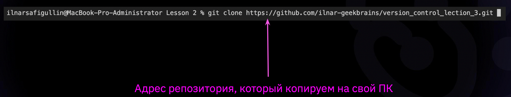

# Домашнее задание

# 1 уровень
- ## **git init** - *git начинает отслеживать файлы и их изменения, превращая папку в репозиторий.*

- ## **git add** - *добавляет файл для создания коммита(необходимо после пробела добавить имя файла).*

- ## **git --version** - *показывает текущую версию git, при правельной установки.*

- ## **git status** - *показывает, какой  текущий статус у элементов в репозитории.*

- ## **git commit -m** -*описать(зафиксировать) текущее состояние репозитория или конкретного файла*

- ## **git diff** - *посмотреть разницу между текущим состоянием и последним коммитом.* ПРИМЕР: git difF 35ta 77y8

- ## **git log** -  *команда покажет несколько последних коммитов.*(выйти из режима клавишей Q)

- ## **git reflog** - *показывает список всех коммитов*

## **Разными цветами можно выделять слова** при помощи командной строки  (где Х это наименования цвета по английски, словами)

- ## **git checkout**  - с помощью этой команды мы можем загрузить раннюю версию, используя те самые странные числа, которые сверху выделены желтым. Достаточно использовать первые 4 от нужнойверсии, указав их после команды.
    **Вернуть последнюю версию можно, использовать команду** *git checkout master.*
------------
-
    # 2 уровень - рекомендуемый:
    geekbrains пришёл за знаниями, а не за зарплатой.

    

    

    dct