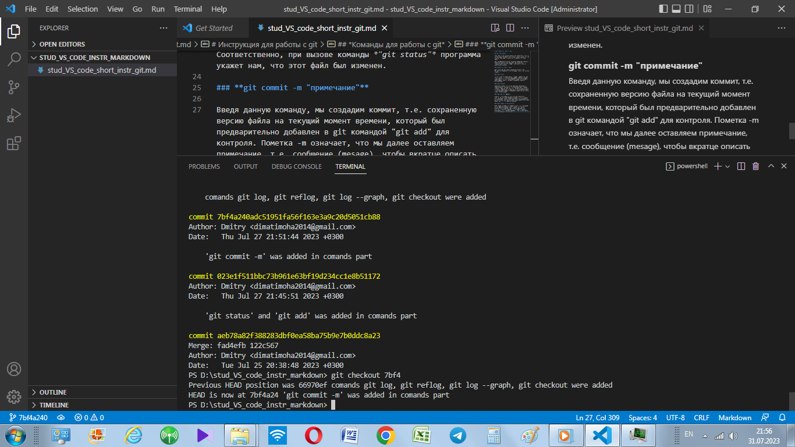

# Команды Marckdown
## По первому семинару *"Ведение в контроль версий"*

1. **git --version** - то с чего начинается работа.

2. **git init** - инициализация, создание репозитория
3. **git add md_command.md** - добавление в файл версионность в локальном репозитории

4. **git commit -m "Создали файл"** - создание коммита с комментарием
5. **git commit -am "Создали файл"** = git add + git commit - создание коммита и одновременно внесение изменений

6. **git status** - проверка статуса того файла с которым работаем

7. **git diff** - разница между двумя коммитами
8. **git log** - команда, выводящая список всех коммитов 
9. **git log -p** - журнал разниц коммитов
10. **git reflog** - 
11. **git rebase** - копирование набор коммитов и переносит их в другое место
12. **git log -graph** - выводим список коммитов в виде красвого дерева графа.

13. **git branch _images_** - создание новой ветки
14. **git branch** - список веток, звездочкой отмечена текущая ветка

15. **git checkout** - переключение между ветками/коммитами

## Работа с изображениями
1. Закидываем картинки в папку с репозиторием
2. Создаем файл .gitignore
3. вставляем названия файла картинок в поле 
4. Перемещаем все картинки построчно в gitignore

## Работа с удаленным репозиторием

git clone - команда применяемая для создания копии репозитория (как правило удаленного)

git pull - команда, прияменяющаяся для "вытягивания" изменений с удаленного репозитория на локальный (сочетает в себе также команду merge (слияние) )

git push - команда. применяющаяся для отправки изменений в удаленный репозиторий. **Требует авторизации !**

## Как сделать pull request

1. Делаем fork репозитория
2. Делаем clone 
3. new branch
4. commit
5. push GitHub
6. On gitHub pull request