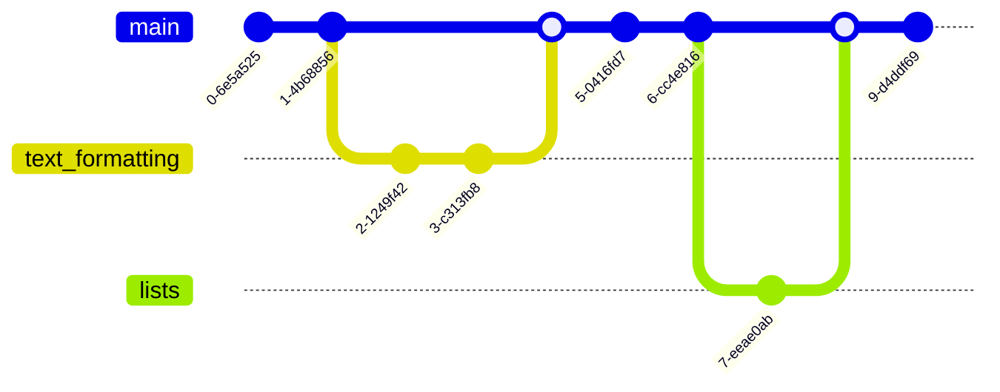

# Основы Git

## Создание Git-репозитория
---
Если у вас уже есть проект в каталоге, который не находится под версионным контролем Git, то для начала нужно перейти в него. Если вы не делали этого раньше, то для разных операционных систем это выглядит по-разному:

для Linux:

    $ cd /home/user/my_project

для macOS:

    $ cd /Users/user/my_project

для Windows:

    $ cd C:/Users/user/my_project

а затем выполните команду:

    $ git init

Эта команда создаёт в текущем каталоге новый подкаталог с именем .git, содержащий все необходимые файлы репозитория — структуру Git репозитория. На этом этапе ваш проект ещё не находится под версионным контролем. Подробное описание файлов, содержащихся в только что созданном вами каталоге .git, приведено в главе Git изнутри

Если вы хотите добавить под версионный контроль существующие файлы (в отличие от пустого каталога), вам стоит добавить их в индекс и осуществить первый коммит изменений. Добиться этого вы сможете запустив команду git add несколько раз, указав индексируемые файлы, а затем выполнив git commit:

    $ git add *.c
    $ git add LICENSE
    $ git commit -m 'Initial project version'

## О ветвлении в двух словах
---
Почти каждая система контроля версий в какой-то форме поддерживает ветвление. Используя ветвление, Вы отклоняетесь от основной линии разработки и продолжаете работу независимо от неё, не вмешиваясь в основную линию.

Что же на самом деле происходит при создании ветки? Всего лишь создаётся новый указатель для дальнейшего перемещения. Допустим вы хотите создать новую ветку с именем testing. Вы можете это сделать командой git branch:

    $ git branch testing

Для переключения на существующую ветку выполните команду git checkout. Давайте переключимся на ветку testing:

    $ git checkout testing

Команда git merge используется для слияния одной или нескольких веток в текущую. Затем она устанавливает указатель текущей ветки на результирующий коммит.

    $ git merge branch_name

## Совместная работа и обновление проектов
---
Не так уж много команд в Git требуют сетевого подключения для своей работы, практически все команды оперируют с локальной копией проекта. Когда вы готовы поделиться своими наработками, всего несколько команд помогут вам работать с удалёнными репозиториями.

Команда git fetch связывается с удалённым репозиторием и забирает из него все изменения, которых у вас пока нет и сохраняет их локально.

    $ git fetch

Команда git pull работает как комбинация команд git fetch и git merge, т. е. Git вначале забирает изменения из указанного удалённого репозитория, а затем пытается слить их с текущей веткой.

    $ git pull

Команда git push используется для установления связи с удалённым репозиторием, вычисления локальных изменений отсутствующих в нём, и собственно их передачи в вышеупомянутый репозиторий. Этой команде нужно право на запись в репозиторий, поэтому она использует аутентификацию.

    $ git push

Команда git remote служит для управления списком удалённых репозиториев. Она позволяет сохранять длинные URL репозиториев в виде понятных коротких строк, например «origin», так что вам не придётся забивать голову всякой ерундой и набирать её каждый раз для связи с сервером. Вы можете использовать несколько удалённых репозиториев для работы и git remote поможет добавлять, изменять и удалять их.

    $ git remote

## GitHub - Внесение собственного вклада в проекты
---
> Создание ответвлений (fork)

Если вы хотите вносить свой вклад в уже существующие проекты, в которых у нас нет прав на внесения изменений путём отправки (push) изменений, вы можете создать своё собственное ответвление (fork) проекта.
Для того, чтобы создать ответвление проекта, зайдите на страницу проекта и нажмите кнопку «Создать ответвление» («Fork»), которая расположена в правом верхнем углу.

Через несколько секунд вы будете перенаправлены на собственную новую проектную страницу, содержащую вашу копию, в которой у вас есть права на запись.

> Рабочий процесс с использованием GitHub

Вот как это обычно работает:

1. Создайте форк проекта.
2. Создайте тематическую ветку на основании ветки master.
3. Создайте один или несколько коммитов с изменениями, улучшающих проект.
4. Отправьте эту ветку в ваш проект на GitHub.
5. Откройте запрос на слияние на GitHub.
6. Обсуждайте его, вносите изменения, если нужно.
7. Владелец проекта принимает решение о принятии изменений, либо об их отклонении.
8. Получите обновлённую ветку master и отправьте её в свой форк.

`Теперь, если мы зайдём на страничку нашей копии на GitHub, мы увидим, что GitHub заметил наши изменения и предлагает открыть запрос на слияние с помощью большой зелёной кнопки.`

После создания запроса на слияние (путём нажатия кнопки «Create pull request» на этой странице) владелец форкнутого проекта получит уведомление о предложенных изменениях со ссылкой на страницу с информацией о запросе.

## Заключение
---
Теперь вы полноценный пользователь git & GitHub. Вы знаете как создавать, обновлять или клонировать репозиторий, вносить изменения, индексировать и фиксировать эти изменения, просматривать историю всех изменений в репозитории, помогать другим проектам и принимать чужой вклад в свой проект.

Для удобства ниже приведены основные команды Git:

    $ git config user.name
    $ git --version (просмотр версии git)
    $ git log — история коммитов.
    $ git status — измененные файлы (показывает добавлены в коммит или нет).
    $ git add file — добавить файл в коммит.
    $ git add . — добавить все изменённые файлы в коммит.
    $ git commit — m ‘text’ - добавить подпись коммитов.
    $ git commit --amend — изменения сообщение последнего коммита.
    $ git branch — посмотреть ветки.
    $ git branch -v — просмотре веток с последним в ней коммитом.
    $ git branch -d название ветки — удалить ветку. 
    $ git checkout название ветки — переключиться в ветку.
    $ git checkout -b название ветки — создать новую ветку и сразу в неё переключиться.
    $ git push сервер ветка – залить изменения на сервер в указанную ветку.
    $ git push -f  — залить изменения на сервер в режиме force, то есть с возможностью переписать уже имеющиеся коммиты на сервере. Будьте очень аккуратны с этой командой, а лучше минимизируйте её использование, ведь вы будете переписывать серверные файлы.

### Блок-схема Git, написанная на Mermaid

