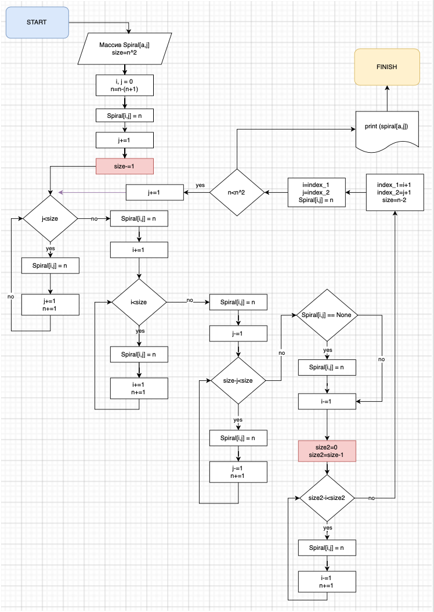

# **Инструкция для работы с Git**

## 1. **Простейший цикл по работе с Git**

* Редактирование, добавление, удаление файлов (собственно, сама работа с файлами);
* Индексация/добавление файлов в индекс (указание для Git, какие изменения нужно закоммитить);
* Коммит (фиксация изменений);
* Возврат к шагу 1 или отход ко сну.

## 2. **Первоначальная регистрация для работы с Git**

* Для начала работы нужно выполнить некоторые настройки:

        git config --global user.name "Your Name" (указываем имя пользователя, которым будут подписаны коммиты)

        git config --global user.email "e@w.com" (указываем электронную почту пользователя, которая будет в описании, при его коммитах)

## 3. **Перечень команд, необходимый для работы с Git**

### 3.1. **Создание локального репозитория в папке с проектом**

* Для создания локального репозитория используется команда:

        git init

### 3.2. **Добавление файлов в локальный репозиторий**

* Для добавления файлов используется команда:

        git add readme (readme имя файла)

* Для того, чтобы добавить все файлы в директории используется команда:

        git add.

* Для того, чтобы добавить файлы из текущей директории и всех поддиректориев, то используется команда:

        git add --all

* Для отмены добавления файла, используется команда:

        git rm --cached readme

### 3.3. **Просмотр текущего состояния**

* Для просмотра текущего состояния используется команда:

        git status

* Для сравнения рабочего файла и изменений, внесенных в файл, используется команда:

        git diff

### 3.4. **Создание версии проекта**

* После того, как мы добавили нужные файлы, мы можем создать версию проекта, с помощью команды:

        git commit -m "комментарий"

Причем каждая новая версия сопровождается комментарием.

* Для просмотра списка всех коммитов, воспользуйтесь командой:

        git log

или

        git log --oneline

Ключ --oneline нужен, чтобы уменьшить количество информации выдаваемой на экран. С этим ключем каждый коммит показывается в одну строчку.

* Для того, чтобы просмотреть изменения по конкретному коммиту, достаточно в команду git show добавить хеш значение коммита:

        git show 657a

* Для отмены последнего коммита (кроме самого первого) можно воспользоваться следующей командой:

        git reset HEAD~1

### 3.5. **Отмена изменений**

* Для перехода отмены изменений в файле и перехода к определенной версии используется команда, причем нужно добавить хеш значение коммита:

        git chekout asf1

### 3.6. **Работа с ветвями**

* Для проверки какие имеются ветви, вводим команду:

        git branch

* Для создания новой ветви, вводим команду:

        git branch branch_name

* Для того, чтобы создать и сразу перейти на ветку, вводим команду:

        git checkout -b branch_name

* Для того, чтобы переместиться на нужную ветку, вводим команду:

        git ckeckout branch_name

* Для того, чтобы произвести слияние веток, необходимо перейти в главную ветку иввести команду:

        git merge branch_name

* Для удаления ненужной ветви, вводим команду:

        git branch -d branch_name

### 3.7. **Создание репозитория на Github**

* Добавляем удаленный репозиторий (по протоколу SSH) под именем first_rep (вместо first_rep можно использовать любое другое имя):

        git remote add first_rep git@github.com:BuraevAA/first_rep.git

* Просмотр результата добавления можно осуществить с помощью команды:

        git remote -v

* Для того, чтобы отменить регистрацию удаленного репозитария введите:

        git remote rm first_rep

* Это может понадобиться, если вы захотите поменять SSH доступ на HTTPS. После этого можно добавить его опять, например под именем github и протоколом HTTPS:

         git remote add github https://github.com/BuraevAA/first_rep.git

* Следующей командой вы занесете все изменения, которые были сделаны в локальном репозитории на Github:

         git push -u first_rep main

* Все дальнейшие изменения вы можете переносить на удаленный репозиторий упрощенной командой:

         git push

### 3.8. **Перенос репозитория на другой компьютер**

* После того, как репозиторий был создан на Github, его можно скопировать на любой другой компьютер. Для этого применяется команда:

         git clone https://github.com/BuraevAA/first_rep.git

Результатом выполнения этой команды будет создание папки project в текущем каталоге. Эта папка также будет содержать локальный репозиторий.

* Для получения обновлений с удаленного репозитория воспользуйтесь командой:

         git pull

* Если вы изменили ваши локальные файлы, то команда git pull выдаст ошибку. Если вы уверены, что хотите перезаписать локальные файлы, файлами из удаленного репозитория то выполните команды:

         git fetch --all

         git reset --hard github/master

* В случае, если в удаленном репозитории лежат файлы с версией более новой, чем у вас в локальном, то команда git push выдаст ошибку. Если вы уверены, что хотите перезаписать файлы в удаленном репозитории несмотря на конфликт версий, то воспользуйтесь командой:

         git push -f 

### 3.9. **Работа с внесением паредложений в чужой репозиторий**

- Для того, чтобы предложить изменения в чужой проект захоим на сайт GitHub, находим аккаунт нужного пользователя, переходим в определенный репозиторий и нажимаем следующуюю команду:

        Fork

- Далее нажимаем команду:

        Create fork

- Далее выбираем команду:

        Code
и копируем ссылку на репозиторий.

- После этого переходим в терминал VS Code и вводим команду:

        git clone ссылка_на_удаленный_репозиторий

- После этого, чтобы перейти в папку репозитория вводим команду

        cd имя_папки

- После этого создаем новую ветку, в которой вносим изменения, также создав файл с описанием наших изменений README.md.

- Чтобы отправить наш локальный репозиторий в удаленный, вводим команду:

        git push 

- Далее переходим в GitHub, где после появиться команда:

        Compare & pull request

### 3.10. Работа с таблицами

- Для того, чтобы создать таблицу, требуется выполнить следующие действия:

| Заголовок 1 | Загловок 2 | Заголовок 3 |
|------------ | ---------- | ----------- |
| text| text | text|
| text| text | text|

- Для выравнивания текста в таблице используются двоеточия (если по левому краю двоеточие идет слева от тире, если поцентру тире выделяется двоеточиями, если выравнивание по правому краю, двоеточие ставится справа от тире):

| Заголовок 1 | Загловок 2 | Заголовок 3 |
|:------------ | :----------: | -----------: |
| text| text | text|
| text| text | text|

### 3.11 Работа с ссылками

- Для того чтобы создать ссылку, необходимо использовать конструкцию из символов :

[Ссылка на сайт по работе с Markdown](https://ru.markdown.net.br/rasshirennyy-sintaksis/)

- Можно добавить ссылку, используя выделение знаками <>:

<https://ru.markdown.net.br/rasshirennyy-sintaksis>

# Блок схема решения задачи

- **Решение пока очень сырое, скажем так первая итерация:**

