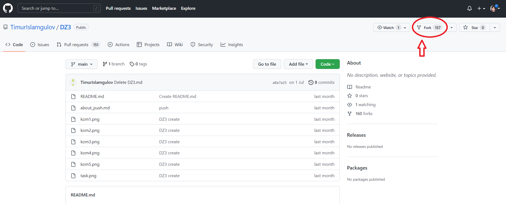

 #  **Инструкция к Git - Работа с удаленными репозиториями.**

**удаленный репозиторий** - это версии вашего проекта, сохраненные на удаленном сервере. Доступ к репозиторию на таком сервере может осуществляться по интернету или по локальной сети. 

даленный репозиторий – полноценный репозиторий, ничем не отличающийся от локального. У удаленного репозитория есть собственные ветки, собственный указатель HEAD, своя история коммитов и так далее.

Если мы подключим удаленный репозиторий к своему локальному, то у нас появятся копии всех ссылочных объектов удаленного репозитория. То есть, например, у удаленного репозитория есть ветка main, а у нас будет копия этой ветки – origin/main.

## **Клонирование удаленного репозитория.**

Необходимость клонировать существующий удаленный репозиторий возникает в ситуациях, когда вы решаете поработать над уже существующим кодом. Для выполнения этой операции в Git предусмотрена команда "**git clone.**

Ссылку на удаленный репозиторий можно получить следующим способом, нужно нажать на зеленую кнопку "**Code** на главной странице репозитория на GitHub.

На примере разберем, как происходит клонирование. Клонируем уже знакомый нам репозиторий DZ3. При выполнении команды git сlone https://github.com/TimurIslamgulov/DZ3.git произойдет следующее:

В директории, откуда вы запустили команду git clone, создается директория с именем репозитория. В нашем случае, если мы выполнили команду из директории пользователя, будет создана папка /home/vasiliy/GeeckLeson/Leson_Controll_Version/DZ3
В созданную директорию копируется репозиторий, все его ветки и коммиты.
В новосозданный локальный репозиторий добавляется удаленный репозиторий с именем origin и ссылкой, которую мы передавали в git clone.

## **Получение изменений из удаленного репозитория.**

Часто вместо получитьизменения и сразу обновлять рабочую копию так, чтобы она соответствовала удаленному репозиторию. И для этого в Git существует отдельная команда. Называется она "**git pull**

## **Отправка изменений в удаленный репозиторий.**

Осталось изучить, как загружать в удаленный репозиторий свои локальные изменения. Для этого в Git существует команда **git push**.

Давайте более подробно разберем, как работает эта команда.

Если изменения с нашей ветки можно слить с удаленной веткой в режиме fast-forward, то есть на удаленной ветке нет коммитов сделанных после наших, то все пройдет нормально.

Если на удаленной ветке есть коммиты, которые были сделаны позже наших, то есть слияние в режиме fast-forward выполнить невозможно, то команда завершится с ошибкой. Ведь в этом случае есть угроза перезаписи истории удаленного репозитория и удаления всех коммитов, созданных позже наших.

Но если вы вдруг передали флаг --force, то все коммиты, которых нет в вашем локальном репозитории, будут удалены. То есть удаленный репозиторий станет точной копией вашего локального.

## **Создание форка репозитория на GitHub. Пулл-реквесты.**

Итак, одной из самых важных частей GitHub является создание форков. 

Форк (от англ. fork – вилка) – точная копия репозитория, но в вашем аккаунте. Форки нужны, чтобы вносить свои изменения в проект, к репозиторию которого у вас нет прямого доступа. 

Пулл-реквест (от англ. pull-request – запрос pull) – функция GitHub, позволяющая попросить владельца репозитория, от которого мы сделали форк, загрузить наши изменения обратно в свой репозиторий. 

Если коротко, форки и пулл-реквесты нужны, чтобы любой пользователь мог внести свой вклад в любой открытый проект, репозиторий которого есть на GitHub. Кроме того, перед тем как влить ваши изменения в основной репозиторий, ответственные обязательно проверят ваш код на наличие ошибок и уязвимостей. Таким образом, даже если ваши изменения не примут, вы получите первоклассный code-review с указанием всех неточностей.

Теперь давайте рассмотрим пайплайн контрибуции (англ. contribution – внесение вклада) на примере реального репозитория.

1. Для начала зайдем на страницу репозитория проекта. Нажимаем на кнопку Fork, как показано на картинке. После этого Git создаст точную копию этого репозитория в вашем аккаунте.

2. Клонируем репозиторий к себе на компьютер командой **git clone**. Создадим файл README.md с описанием проекта, чтобы другим пользователям было понятно, в чем отличие этой реализации от остальных.

3. Сделаем коммит и выполним **git push**, чтобы загрузить наши изменения в удаленный репозиторий.

4. Теперь GitHub подсказывает нам, что наша ветка опережает ветку исходного репозитория на один коммит и предлагает сделать пулл-реквест.

5. Нажимаем на кнопку Compare на подсказке GitHub, либо переходим на вкладку Pull Requests и нажимаем style="color:green">**New pull request**. 

6. Перед нами откроется страница создания пулл-реквеста. 

Здесь мы можем просмотреть внесенные изменения и выбрать две ветки: одну в исходном репозитории, на нее будут залиты наши изменения, вторую – в нашем репозитории, с нее будут скачаны изменения. Как только мы выбрали ветки и убедились, что не внесли никаких лишних изменений, нажимаем кнопку **Create pull request**.

7. Теперь мы попадаем на страницу описания наших изменений.

Здесь необходимо описать, что за изменения вы внесли и почему они были необходимы. Сообщение, которое оставили мы, видно на картинке. Оно отражает суть и необходимость внесенных изменений. Как только мы закончили с описанием, можно нажимать кнопку **Create pull request**.

8. Теперь мы попадаем на страницу уже созданного пулл-реквеста в изначальном репозитоии. 

