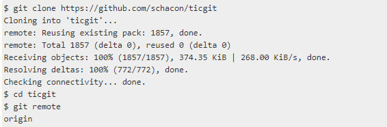
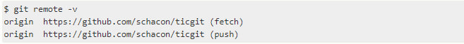

# Работа с удалёнными репозиториями

Удалённые репозитории представляют собой версии вашего проекта, сохранённые в интернете или ещё где-то в сети. Управление репозиториями включает в себя как умение добавлять новые, так и умение удалять устаревшие репозитории, а также умение управлять различными удалёнными ветками, объявлять их отслеживаемыми или нет и так далее.

## Просмотр удалённых репозиториев

Для того, чтобы просмотреть список настроенных удалённых репозиториев, вы можете запустить команду ___git remote___. Она выведет названия доступных удалённых репозиториев. Если вы клонировали репозиторий, то увидите как минимум ___origin___ — имя по умолчанию, которое Git даёт серверу, с которого производилось клонирование:

Вы можете также указать ключ ___-v___, чтобы просмотреть адреса для чтения и записи, привязанные к репозиторию:

## Добавление удаленного репозитория

Для того, чтобы добавить удалённый репозиторий и присвоить ему имя (shortname), просто выполните команду ___git remote add [shortname] [url]___

Теперь вместо указания полного пути вы можете использовать указанный _shortname_. Например, если вы хотите получить изменения, которые есть у вашего коллеги, но нет у вас, вы можете выполнить команду ___git fetch shortname___

## Получение изменений из удалённого репозитория — Fetch и Pull

Для получения данных из удалённых проектов, следует выполнить ___git fetch [remote-name]___

Важно отметить, что команда ___git fetch___ забирает данные в ваш локальный репозиторий, но не сливает их с какими-либо вашими наработками и не модифицирует то, над чем вы работаете в данный момент. Вам необходимо вручную слить эти данные с вашими, когда вы будете готовы.

С помощью команды ___git pull___ можно автоматически получить изменения из удалённой ветки и слить их со своей текущей.

Выполнение ___git pull___, как правило, извлекает (_fetch_) данные с сервера, с которого вы изначально клонировали, и автоматически пытается слить (_merge_) их с кодом, над которым вы в данный момент работаете.

## Отправка изменений в удалённый репозиторий (_Push_)

Когда вы хотите поделиться своими наработками, вам необходимо отправить их в удалённый репозиторий с помощью команды ___git push [remote-name] [branch-name].

Чтобы отправить вашу ветку master на сервер origin вы можете выполнить следующую команду: ___git push origin master___. Эта команда срабатывает только в случае, если вы клонировали с сервера, на котором у вас есть права на запись, и если никто другой с тех пор не выполнял команду ___push___.

## Просмотр удалённого репозитория

Команда ___git remote show remote___ выдаёт URL удалённого репозитория, а также информацию об отслеживаемых ветках. Если вы, находясь на ветке _master_, выполните ___git pull___, ветка _master_ с удалённого сервера будет автоматически влита в вашу.

## Удаление и переименование удалённых репозиториев

Для переименования удалённого репозитория можно выполнить ___git remote rename [old name] [new name]___, это также изменит имена удалённых веток в вашем репозитории.

Если по какой-то причине вы хотите удалить удалённый репозиторий, вы можете использовать ___git remote rm [name]___. При удалении ссылки на удалённый репозиторий все отслеживаемые ветки и настройки, связанные с этим репозиторием, так же будут удалены.
