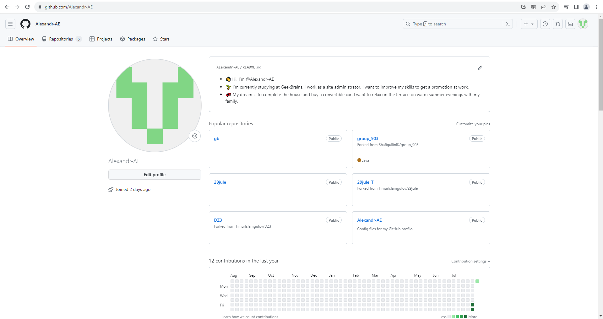

## Инструкция по командам git

1. **init** - *создание репозитория в папке*
2. **add** - добавление файлов к отслеживанию, индексация изменений
3. **commit -m "_комментарий_"** - сохранение сделанных изменений с комментарием
   *  **commit -am "_комментарий_"** - сохранение сделанных изменений с комментарием и одновременной индексацией (не нужно делать **add**)
4. **diff** - отображение изменений, сделанных с предыдущего **commit**`а
5. **log** - вывод всех commit'ов
   + **log _--graph_** - список commit'ов в виде дерева (графа)
6. **checkout** - переход между разными commit'ами и ветками
   + **git checkout -b** _<название_ветки>_ - создание новой ветки с одновременным переходом в нее
7. **branch** - список веток
   * **branch _name_** - создание ветки name
   * **branch _-d name_** - удаление ветки *name*

8. **status** - информация о текущем состоянии git
9. **reflog** - история изменений со всеми перемещениями
10. **merge** - слияние веток
11. **clone** - копирование внешнего репозитория на наш ПК
12. **push** - отправляет нашу версию репозитория во внешний репозиторий
13. **pull** - позволяет скачать все из текущего удаленного репозитория и автоматически сделать *merge* с нашей версией
14. **pull request** - команда для предложения изменений, cdзапрос на вливание изменений в репозиторий

## Скрин ко 2 заданию

## Блок-схема к 3 заданию

Справочник по Markdown:
https://docs.microsoft.com/ru-ru/contribute/markdown-reference
