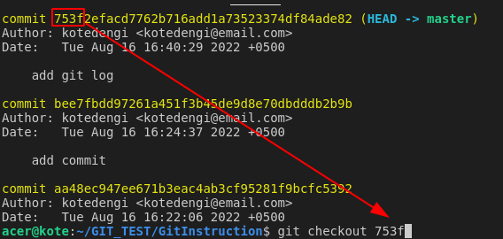
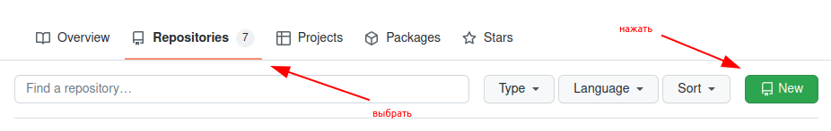
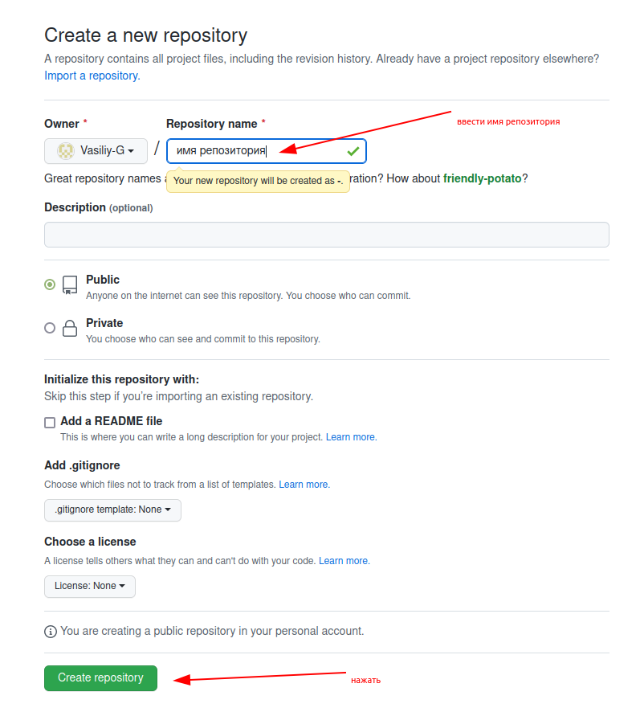
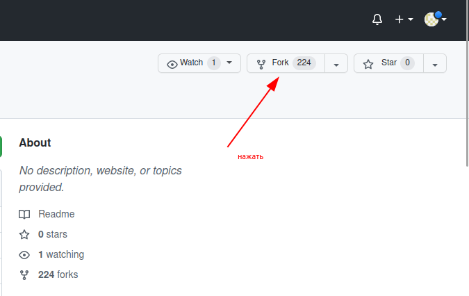
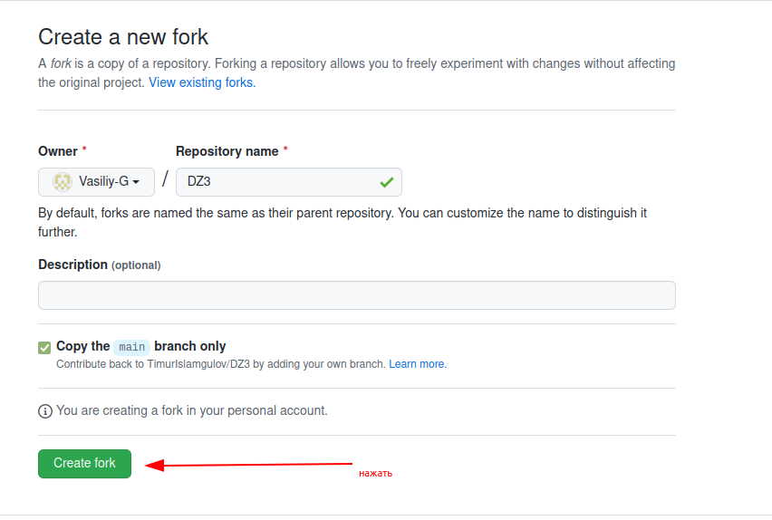
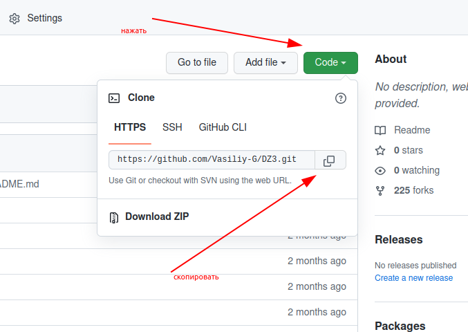
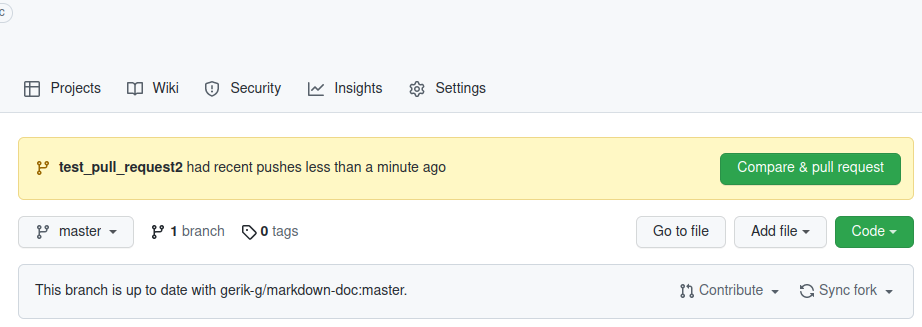

#  Краткая инструкция по работе с git  
  
***
*[Узнать подробнее про систему git на Wikipedia ](https://ru.wikipedia.org/wiki/Git)*
***
**Установить имя и email, которое будет использоваться  
при создании коммита:**

>*git config --global user.name "имя"*  
*git config --global user.email "email"*

**Вывести справку:**
>*git help*

**Узнать версию:**
>*git --version*

**Инициализация/создание репозитория:**
>*git init*

**Посмотреть сосотояние проекта, информация о файлах, изменениях,  
фиксациях и т.д:**
>*git status*

**Добавить файл для отслеживания изменений:**
>*git add имя файла*

**Добавить все файлы:**
>*git add .*

или

>*git add --all* 

**Создать commit (сохранить текущий статус с комметарием):**
>*git commit -m "комментарий"*

**Объединить add и commit:**
>*git commit -am "комментарий"*

**Посмотреть журнал изменения (список коммитов):**
>*git log*

**Посмотреть журнал в другом отображении  
(reflog - сокращение от reference logs):**
>*git reflog*

**Посмотреть дерево журнала изменения (список коммитов):**
>*git log --graph*

**Переключение (переход) между версиями:**
>*git checkout первые четыре символа имени commit  
(можно имя полностью)*

**Вернутся к самой последней версии изменений:**
>*git checkout master*

**Посмотреть разницу между текущим файлом и сохранённым:**
>*git diff*

**Просмотр текущей ветки и вывод всех веток:**
>*git branch*

**Создание новой ветки:**
>*git branch имя ветки*

**Переход на нужную ветку:**
>*git checkout имя ветки*

**Создание новой ветки и переход в неё**
>*git checkout -b имя_ветки*

**Слияние веток:**
>*git merge имя ветки*

Порядок действий:

* перейти в ветку "master"
    >*git checkout master*
* добавить в "master" "новую ветку"
    >*git merge имя ветки

*При слиянии может быть конфлик, когда в двух ветках есть что то перед слиянием.

**Отменить слияние веток:**
>*git merge --abort*

**Удалить ветку:**
>*git branch -d имя ветки*

**Скопировать (клонировать) удаленный репозиторий (чужой)  
в локальный репозиторий:**
>*git clone*

**Сохранить локальный репозиторий на github:**

Порядок действий:

* создать новый репозиторий на github
    >Выбрать "Repositories", затем нажать "New"*
    

    >Ввести имя репозитория, далее нажать "Create repository"*
    

    * добавить (подключить/указать) удаленный репозиторий
    >*git remote add origin ссылка на репозиторий*

    * указать основную ветку main
    >*git branch -M main*

    * отправить изменения в репозиторий
    >*git push -u origin main*

**Отправить изменения из локального в удаленный репозиторий:**
>*git push*

**Выкачать репозиторий с удаленного в локальный  
(синхронизировать локальный и удаленный репозиторий):**
>*git pull*

*При выкачивани происходит слияние (merge) и возможны конфликты.

**Как сделать pull request:**

Порядок действий:

* создать Fork (ответвление) необходимого репозитория на github
    >*Выбрать репозиторий, затем нажать "Fork"*

    >*Имя оставить тоже, далее нажать "Create fork"*

* Клонируем уже свою версию репозитория на локальный компьютер
    >*git clone http адрес репозитоия*

* Создаем новую ветку и в НЕЕ вносим свои изменения
    >*git checkout -b 'имя ветки'*

* Фиксируем изменения (делаем коммиты)
    >*git commit -am 'комментарий'*

* Отправляем свою версию в свой GitHub
    >*git push --set-upstream origin имя ветки*

* На сайте GitHub нажимаем кнопку pull request

