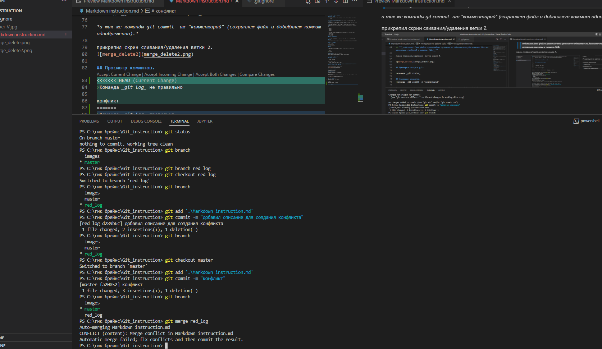

# Инструкция по работе с git

Программа [git](https://git-scm.com/downloads) необходима для организации системы контроля версий. Важно! Программа помогает сохранять не только файлы, но и разницу между ними. Чтобы начать работу, необходимо создать терминал в программе [Visual Studio Code](https://code.visualstudio.com/). 

*Внимание! Все нижеперечисленные команды git воодятся в терминале Visual Studio Code*.

## Основные команды git

### git init

Git работает с папкой, созданной в корневой системе компьютера. После создания папки ее необходимо превратить в репозиторий. Для этого необходимо ввести команду **git init**.

### git config

Перед началом работы с репозиторием необходимо представиться. Для этого вводим две команды: 
+ **git config --global user.name "ваше имя"**
+ **git config --global user.email "ваша электронная почта"**

### git add

Далее необходимо создать в репозитории файл и заставить git его отслеживать. Для этого вводим команду **git add название файла**.

*Важно! Файл необходимо передобавлять после __каждого__ его изменения*.

### git status

Чтобы проверить, нет ли в текущий момент ошибок в вашем git, введите команду **git status**. Git сам укажет вам на все ошибки, если они есть. Проверяйте статус, как можно чаще.

### git commit

Эта команда сохраняет внесенные изменения. Для этого нужно ввести в терминале команду **git commit -m "название вашего коммита"**

### git diff

Эта команда поможет вам увидеть несохарненные изменения. Для этого просто введите **git diff**.

### git branch

А теперь приступаем к контролю версий. При помощи git вы можете создать, к примеру, тестовую ветку вашего файла и вносить изменения только в нее, не затрагивая основной код. 

__Запомнить! Основная ветка всегда называется *master*__.

Чтобы вызвать список веток и проверить, на какой из них вы находитесь, необходимо ввести команду **git branch**.

Для создания новой ветки введите **git branch название ветки**.

### git checkout

Эта команда используется для перемещения между ветками. Для этого нужно ввести **git checkout
название ветки**.

### git merge

Если вы хотите слить две ветки, перейдите в ветку master и введите **git merge название ветки**.

### git log

Эта команда поможет вам увидеть ваши последние коммиты. Кроме того, здесь вы можете увидеть индексы ваших коммитов и перейти к любому из них при помощи команды **git checkout первые четыре знака индекса коммита**

### git log --graph

Эта команда покажет все ваши созданные и слитые ветки в виде удобного графика. для этого просто введите **git log --graph**

### git reflog

Эта команда поможет вам увидеть весь журнал ваших изменений, коммитов и прыжков между ветками. для этого введите **git reflog**.

### git rm

Удалить файлы из репозитория и перестать их отслеживать можно при помощи команды **git rm название файла**.

### git branch -d

Удалить ненужную ветку можно при помощи команды **git branch -d название ветки**

## Конфликт изменений

Конфликт появляется, если в сливаемых ветках есть разная информация в одних и тех же строках.

Пример на фото:

1. если коммит был проведен до появляения новой ветки, git использует стратегию Fast-Forward и внесет изменения согласно последнему коммиту.
2. если коммит был проведен после разделения веток и внесения в них изменений, то git предложит вам четыре варианта разрешения конфликта
+ отменить изменения
+ внести изменения
+ оставить информацию из обеих веток
+ сравнить изменения.

Выбирайте необходимый вам вариант!

## Ленивые команды

**git commit -am "название коммита"** - одновременно и обновляет файл и делает коммит

**git checkout -b "название ветки"** - создает ветку и одновременно переходит на нее.

## Ошибки и другие полезные фичи 

Если терминал завис и не хочет вводить информацию, нажмите "Q" или удалите терминал.

Кновпка tab поможет вам ввести только первые буквы файла, остльное git сделает за вас.

**_Важно! Для корректной рабты git называйте паки и файлы только на английском, не используя буквы верхнего регистра_**.

**Самое важное! Как говорит мой муж**:
> В любой непонятной ситуации делай коммит!

Возможно он не прав, но другой цитаты я не придумала)

## Работа с Github

Открываем сайт [Github](https://github.com/). Важно! Делаем это только в браузере по умолчанию.

Синхронизируем свой локальный Git с github при помощи иконки человечка в левом нижнем углу экрана.

### git push 

Предварительно связываем локальный репозиторий с удаленным с помощью команды **git remote add origin**.

А после обозначаем главную ветку с помощью команды **git branch -M main**.

Теперь используем команду **git push -u origin3 main**. И ура! Наш репозиторий отправился в удаленный.

### git pull

Чтобы стянуть удаленный репозиторий на свой компьютер, необходимо использовать компанду **git pull**

Важно! Эта команда не только стягивает изменения, но и сливает ветки. Возможны конфликты. Смотри раздел выше.

### pull request

Это набор команд, который позволяет предложить изменения в чужой репозиторий.

Что делаем?

1. Открываем чужой репозиторий. Нажимаем кнопку **fork**. Таким образом мы копируем к себе чужой репозиторий.
2. Нажимаем кнопку **code** и копируем получившуюся ссылку.
3. Стягиваем репозиторий себе на компьютер при помощи команды **git clone**
4. Открываем терминал для новой папки.
5. Обязательно создаем новую ветку. Вносить изменения в чужой репозиторий в ветке **main** нельзя.
6. Отправляем изменения при помощи команды **git push**. Далее следуем инструкциям git.
7. На Github после обновления страницы появится кнопка **Compare & pull request**.
8. Описываем и называем свои изменения.

Готово! Вы великолепны!