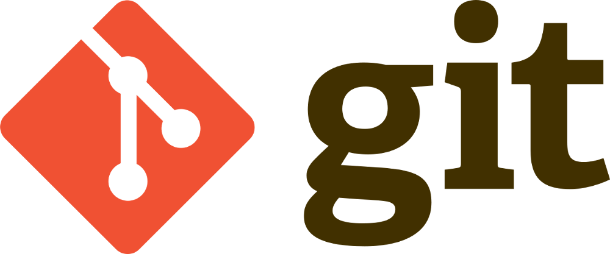

# **Очень краткая инструкция по GIT.**

## После установки необходимо «представиться» системе контроля версий. Это нужно сделать всего один раз, и git запомнит вас. Для этого нужно ввести в терминале 2 команды:

1. git config --global user.name «Ваше имя английскими буквами»

2. git config --global user.email ваша почта@example.com

# Команды Git.

**git --version** - *в терминале выводит версию программы.*

**git init** - *создаём репозиторий в этой директории*

**git status** - *показать состояние репозитория (отслеживаемые, изменённые, новые файлы).*

**git add .** - *добавить в индекс все новые, изменённые, удалённые файлы из текущей директории.*

**git commit -a** - *совершит коммит, автоматически индексируя изменения в файлах проекта. Новые файлы при этом индексироваться не будут! Удаление же файлов будет учтено.*

**git commit -m «commit comment»** — *комментирует коммит прямо из командной строки  вместо текстового редактора.*

**git log** - *Показывает несколько последних сохранений.*

**git checkout** - *Команда позволяет переключаться между коммитами.*

**git checkout master** - *Возврат на главную ветку.*

**git reflog** - *Показывает все сохранённые изменения.*

**git diff** - *Cравнивает рабочую директорию и индекс (неотслеживаемые файлы ИГНОРИРУЮТСЯ).*

**git branch** - *Создать ветку можно командой git branch. Делать это надо в папке с репозиторием: git branch <название новой ветки>*

**git merge** - *Команда для слияния веток.*

**git log --graph** - *Визуализация веток.*

**Git clone** - *Команда клонирования репозитория - используется для первоначального копирования репозитория.*

**git-pull** - *Извлечение и интеграция с другим репозиторием или локальной веткой.*

**git push** - *Используется для выгрузки содержимого локального репозитория в удаленный репозиторий.*

**pull request** - *Заявка на слияние кода из разных веток.*

# Начало работы с программой.

* Запускаем терминал **Visual Studio Code**. Для того чтобы проверить правильность установки GIT запускаем команду **git --version** и версия программы GIT появится в окне терминала.

* Для отслеживания выбранной папки вводим команду **git init** после чего GIT начинает отслеживать все изменения в папке.

* Для проверки текущего состояния папки вводим команду **git status**.

* При создании нового файла или его изменения необходимо сохранить **ctrl+s** или выбрать функцию автосохранение.

* Для вызова раннее введённых команд можно использовать стрелочки вверх, вниз.

* Для того чтобы GIT начал отслеживать созданный файл набираем команду **git add имя файла**

* Для сохранения изменений в файле вводим команду **git commit -m "коментарий к сохранению"**

* Команда **git commit -am "коментарий к сохранению"** объединяет команды **git add** и **git commit -m**.

* Для вывода на экран наших сохранений вводим команду **git log**.

* Чтобы вызвать раннее сохранённую версию используем команду **git checkout (первые 4 знака названия сохранения)**

* Для того чтобы вернуться к актуальному состоянию набираем команду **git checkout master**.

* Чтобы посмотреть изменения файла относительно сохранённого вводим команду **git diff**. Красным будет выделение того что было удалено, а зелёным что мы добавили.

* Если мы хотим увидеть все сохранения, то вводим команду **git reflog**.

* Если у нас несколько версий черновика, мы можем вывести на экран ветку, где находимся, командой **git branch**.

* Если потребуется переключиться с одной ветки на другую, вызовем команду **git checkout <имя ветки>**.

* Чтобы слить любую ветку с текущей, вызываем **git merge <имя ветки для слияния с текущей>**

* Ключ **-graf** в связке с командой **log** позволяет отобразить коммиты в виде дерева.

* Команда **git clone** составная: она не только загружает все изменения, но и пытается слить все ветки на локальном компьютере и в удаленном репозитории.

* **git pull** Эта команда позволяет скачать все из текущего репозитория и автоматически сделать **merge** с нашей версией.

* Отправить свою версию репозитория во внешний репозиторий поможет команда **git push**. При первом её использовании нужна авторизация.

* В больших компаниях один ответственный за проект создает аккаунт. Другие пользователи дают команду **pull request**. Предлагать изменения на **GitHub** нужно в отдельной ветке. Сначала пользователь копирует репозиторий на свой компьютер, делает **fork** репозитория, затем клонирует версию на своём ПК, создаёт ветку с предлагаемыми изменениями, отправляет изменения командой **push** в свой аккаунт на **GitHub** и даёт команду **pull request**. 