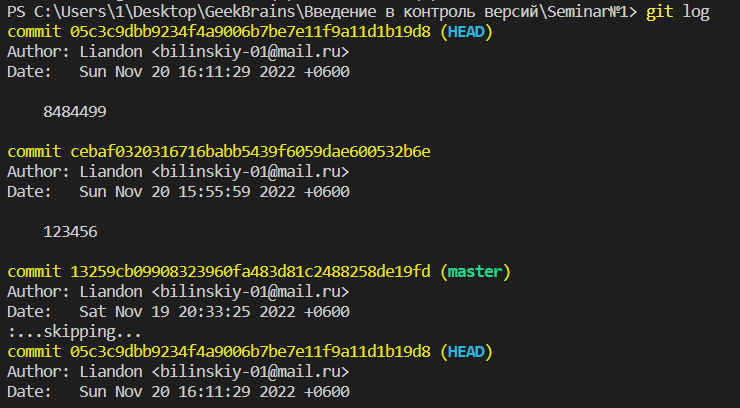

# Инструкция по пройденным командам git

## git init

**git init** - создаёт git-репозиторий в текущей папке, что даёт возможность для дальнейшего использования *git*'а.

## git status

**git status** - показывает текущий статус файлов репозитория в контексте работы с ними *git*'а, а также название ветки, на которой находится пользователь.

## git add

**git add <Имя файла>** - добавляет указанный файл к файлам, отслеживаемым *git*'ом, а также к файлам, изменения, в которых будут сохранены в следующем коммите.

## git commit

**git commit -m "<Сообщение/Название>"** - фиксирует изменения файлов, добавленных командой **git add**, помечая получившееся сохранение указанным сообщением.

## git diff

**git diff (Коммит1) (Коммит2)** - показывает разницу между:

* Если не указано ни одно имя коммита, то последним сохраненным состоянием отслеживаемых файлов и состоянием этих файлов в последнем коммите.

* Если указано только одно имя коммита, то последним сохраненным состоянием отслеживаемых файлов и состоянием этих файлов в указанном коммите.

* Если указано два имени коммитов, то состояниями отслеживаемых файлов в указанных коммитах.

## git checkout

**git checkout <Коммит/Ветка>** - приводит файлы репозитория в состояние, в котором они находились в указанном коммите, или, если указана ветка, то в последнем коммите указанной ветки.

## git log / git reflog

**git log** - показывает все коммиты с указанием автора и даты.

**git reflog** - показывает все коммиты, а также переходы между ними без указания автора и даты.

# Дополнение к инструкции. Ветвление

## git branch

**git branch (Имя ветки)** - Если не указывать параметр имя ветки, то показывает все сущесвующие ветки для данного репозитория и указывает на которой находится пользователь. Если указать имя ветки, создаёт новую ветку с указанным именем, если оно не занято.

## git merge

**git merge <Имя ветки>** - Применяет изменения, сохранённые в указанной ветке к текущей ветке.

# Дополнение к инструкции. Работа с удалёнными репозиториями

## git clone

**git clone <Адрес удалённого репозитория>** - Копирует указанный удалённый репозиторий в локальную папку.

## git remote add

**git remote add <Имя удалённого репозитория> <Адрес удалённого репозитория>** - связывает существующий локальный репозиторий с удалённым репозиторием

## git pull

**git pull (Имя репозитория/ветки)** - Берёт изменения, произошедшие в указанном репозитории или ветке(если не указывать, то будет использован связанный удалённый репозиторий) с момента ответвления, и мёрджит их в текущую ветку.

## git push

**git push** - отправляет сохранённые изменения на удалённый репозиторий.

## Что-то не точно, не верно или не понятно

Все ответы на любые вопросы по исполььзованию *git*'а можно найти в [документации](https://git-scm.com/docs/user-manual).