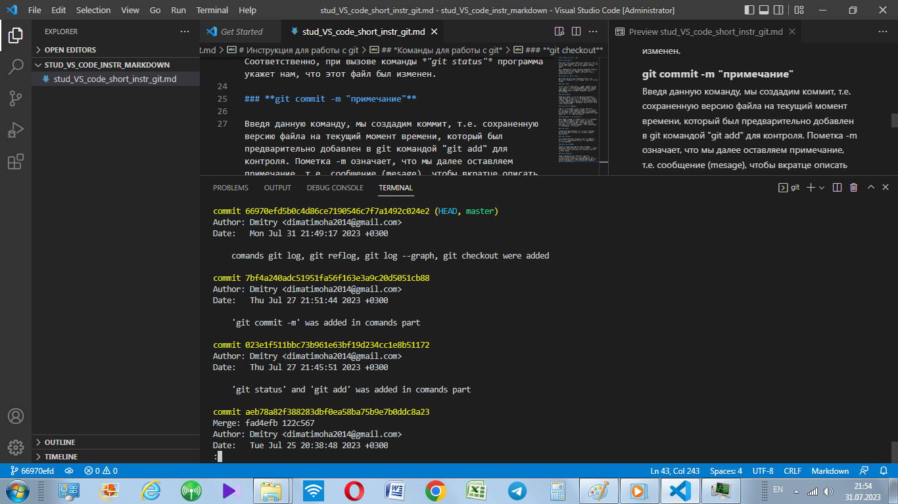

# Инструкция для работы с Markdown

## Выделение текста

Чтобы выделить тект курсивом необходимо обрамить (*) или знаком нижнего подчёркивания (_). Например, *вот так* или _вот так_

Чтобы выделить тект полужирным необходимо обрамить его двойными звёздочками (**) или двойным знаком нижнего подчёрчикания (__). Например, **вот так** или __вот так__.

Альтернативные способы выделения жирным или курсивом нужны для того, чтобы мы могли совмещать оба этих способа. Например, _текст может быть выделен курсивом и при этом быть **полужирным**_.

## Списки

Чтобы добавить не нумерованные списки необходимо пункты выделить (*) или знаком (+).
Например так:
* Элемент 1
* Элемент 2
* Элемент 3
+ Элемент 4

Что бы добавить нумерованные списки, необходимо пункты просто пронумеровать.
Например, так:
1. Первый пункт
2. Второй пункт

## Работа с изображениями

Чтобы вставить изображение в текст достаточно написать следующее: ![Камни] (kamni.jpg)

# Работа с командами GIT
## 1. git add
 git add — это первая команда в цепочке операций, предписывающей Git «сохранить» снимок текущего состояния проекта в истории коммитов. Когда git add используется как отдельная команда, она переносит ожидающие изменения из рабочего каталога в раздел проиндексированных файлов.        
 Пример: **git add first.txt**

## 2. git branch
Команда git branch позволяет создавать, просматривать, переименовывать и удалять ветки. Она не дает возможности переключаться между ветками или выполнять слияние разветвленной истории. Именно поэтому команда **git branch** тесно связана с командами git checkout и git merge .

## 3. git branch -d branch to delete
git branch – команда для удаления локальной ветки.
**-d** – флаг, опция команды git branch, сокращенный вариант записи **--delete**. Как и следует из названия, предназначен для удаления ветки.
**local_branch_name** – имя удаляемой ветки.

## 4. git branch new name
Чтобы создать новую ветку в Git необходимо выполнить команду (вместо mybranch укажите название вашей новой ветки):

**git branch mybranch**

После выполнения команды, будет создана новая ветка с именем, которое вы указали. Обратите внимание, что вы все еще находитесь в текущей ветке. Чтобы создать ветку и сразу же на нее переключиться, используется команда checkout с ключом **-b**:
**git checkout -b mybranch**

## 5. git checkout
Команда **git checkout** позволяет перемещаться между ветками, созданными командой **git branch**. При переключении ветки происходит обновление файлов в рабочем каталоге в соответствии с версией, хранящейся в этой ветке, а Git начинает записывать все новые коммиты в этой ветке.

Пример: **git checkout new_branch_name**

## 6. git commit
Каждая точка сохранения вашего проекта носит название коммит (commit). У каждого commit-a есть hash (уникальный id) и комментарий. Из таких commit-ов собирается ветка. Ветка - это история изменений. У каждой ветки есть свое название. Репозиторий может содержать в себе несколько веток, которые создаются из других веток или вливаются в них.

## 7. git diff
Для вывода изменений в файлах по сравнению с последним коммитом, используется **git diff** без параметров:

**git diff**

Команда выводит изменения в файлах, которые еще не были добавлены в индекс. Сравнение происходит с последним коммитом.
Если изменены какие-нибудь файлы в рабочем каталоге и добавили один или несколько из них в индекс (с помощью **git add**), то команда **git diff** не покажет изменения в этих файлах. 

## 8. git init
git init — инициализирует новый репозиторий GIT и начинает отслеживание существующего каталога. В существующий каталог добавляется скрытая вложенная папка, в которой размещается внутренняя структура данных, необходимая для управления версиями. Используется **git init** без параметров.

## 9. git log
**Git log** покажет список из всех коммитов, начиная с наиболее свежего(по дате) коммита.

## 10. git log -–graph
Опция **--graph** добавляет ASCII-граф, показывающий историю ветвлений и слияний.

## 11. git merge branch_name
Команда **git merge** используется для слияния веток и используется таким образом:

**git checkout master** - переключились на ветку master.

**git merge hotfix** - сделали слияние текущей ветки (master) с веткой hotfix. При этом ветка hotfix не меняется, меняется только master. 
То есть, Git не только изменит содержимое рабочего каталога, применяя вливаемые изменения, но и создаст "завершающий" коммит слияния. Таким образом, после слияния не нужно делать коммит, чтобы "зафиксировать" слияние. Однако следует помнить, что закоммичевание произойдет только в том случае, если при слиянии небыло конфликтов.

## Работа с удаленными репозиториями

**Git push** - *отправить версию репозитория с локального на удаленный репозиторий.*

**Git pull** - *забрать изменения с удаленного репозитория (мерж с локальным).*

**Git clone** - *копирует внешний репозиторий на наш ПК*

**Pull request** -  *команда для предложения изменений*
.................
