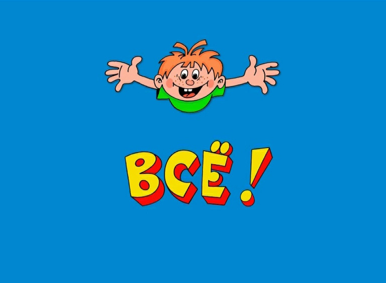

# Инструкция по работе с командами Git

### Команды в GIT и не только (Ветка 2)

**git init** – инициализация (от анг. - initialization) , создание репозитория в папке нахождения файла с которым работаем, команда старта работы. Пример, записи команды в Visual Studio Cod:

*  git init

**git add** (добавить) – команда для контроля версии файла (-ов) и отслеживания изменений в файле. Пример, записи команды, обязательно указывается наименование файла с расширением (txt, md или др.):

*  git init first.md

**git commit** – фиксация текущей версии файла, используется с комментарием (сопровожительным сообщением), например так:

*  git commit  
 –a –m  
 *“first.md внесены новые подпункты”* 

**git dif** – отображение (от анг. - difference) разницы между сохраненными версиям (предыдущими сохранениями с помощью команды git commit:

*  git dif

**git log** – выводит список всех действий/изменений зафиксированных с помощью git commit с указанием автора и даты внесения изменений:

*  git log

**git log –grahp** – выводит список commit в виде графа/дерева

**git checkout** – позволяет переходить между изменениями файла:

*  git checkout  
 a3459g  
– возвращение к конкретному commit

*  git checkout  
 branch_name  
– возвращение к определенной ветке (
 branch_name 
) с изменениями

**git checkout master** – переход обратно к самой последней сохраненной версии файла, ветке

*  git checkout master  

**git branch** – выводит на экран список веток которые есть для данного файла

*  git branch  

*  git branch vetka1  – создание новой ветки

**git clear** – очищение экрана команд, истории команд:

*  git claer  

**git merge** – слияние веток, т.е. присоединение к главной ветке master ветки с изменениями:

*  git merge vetka1 

**git branch –d  vetka1** – удаление ветки  vetka1

### Дополнительные функции для работы с удаленным репозиторием: 

для внесения изменений в файл .md пользователя с Github, форкните в свой репозиторий необходимый файл на GitHub, затем командой git clone ... (вставляете ссылку файла в git), создаете новую ветку, а после внесения изменений c обязательными коммитами командой git push отправляете изменения обратно на GitHub

для инфо, командой pull request - стягиваем с Github файлы на рабочий бук 

