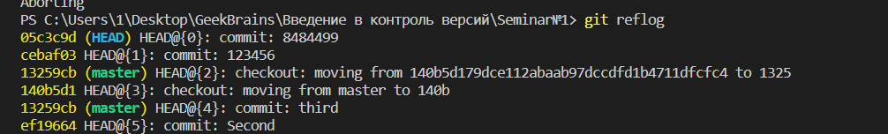

# Инструкция по работе с GIT

Ссылка на этот файл на Яндекс Диске [скачать по ссылке](https://disk.yandex.ru/d/kmvATsnsNccphg)

**Важно !  Все команды вводятся в терминале**
***
## Проверка какой версии установлен GIT

 **git --version**

 

## Работа с гитом

 _Чтобы создать локальный репозиторий, нужно написать:_

 **git init**
  

  _После этого будет создана папка .git в том месте, где находится консоль._ 
  
  _.git — это папка, которая хранит всю информацию о гит репозитории._

  
_Далее, добавляются файлы в этот проект, и их состояние становится Untracked. Чтобы посмотреть, какой статус работы на данный момент, пишем:_

**git status**

  

_Таким образом видно, какие файлы изменены, но еще не добавлены в состояние_ **staged**. _Чтобы добавить их в состояние_ **staged**, _нужно написать_- **git add**. _Здесь может быть несколько вариантов, например:_

**git add .** _— добавить все файлы из этой папки и все внутренних._;
**git add <имя файла>** _— добавляет только конкретный файл. Здесь можно пользоваться регулярными выражениями, чтобы добавлять по какому-то шаблону. Например,_ __git add *.md__: _это значит, что нужно добавить только файлы с расширением md._

_Чтобы проверить статус, используем уже известную нам команду:_

**git status**

_И, наконец, последний этап — закоммитить и создать новый коммит:_

**git commit -m “File instruction added to the project"**

## Команды 

_Далее есть отличная команда, чтобы посмотреть на историю коммитов в ветке:_

**git log**

**git reflog**

**git diff**

**git checkout**

## Работа с .gitignore 

_Чтобы гит игнорировал некоторые файлы, например, картинки, есть специальный файл, который нужно создать. Делаем это: создаем файл в корне проекта с названием .gitignore, и в этом файле каждая строка будет шаблоном для игнорирования._

* *.txt  _— это игнорирование всех файлов с расширением .txt_
* *.jpeg  _— это игнорирование всех файлов с расширением .jpeg_
* *.png  _— это игнорирование всех файлов с расширением .png_
* target/ _— это игнорирование папки target и всего, что она содержит_
* *.iml _— это игнорирование всех файлов с расширением .iml;_

