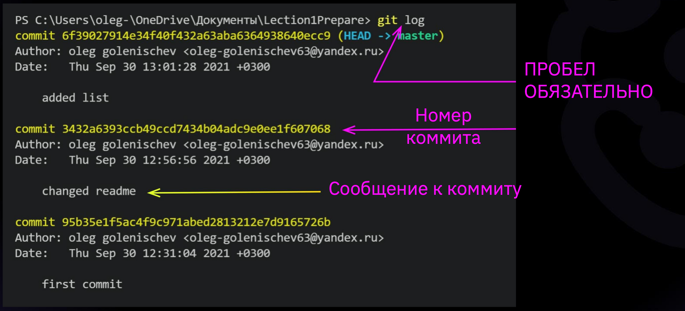
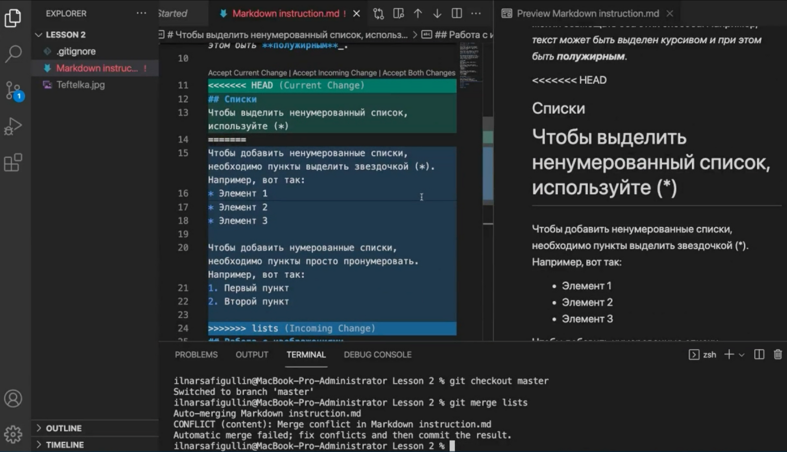
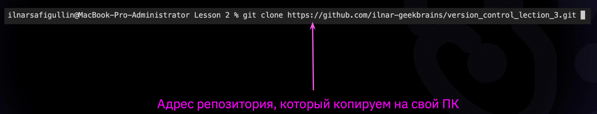
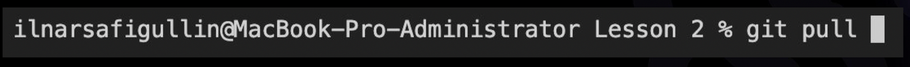

# ИНСТРУКЦИЯ ПО РАБОТЕ С GIT

## Оглавление

* Начало работы
* Инициализация
* Добавление репозитория
* Добавление коммита
* Статус
* Журнал
* Переход к определенному коммиту
* Разница

## **Начало работы**
Для начала работы с Git необходимо представиться, то есть указать своё имя и почтовый ящик. Это делается при помощи команд в терминале :

*git config --global user.name "Имя пользователя"*

*git config --global user.email "Почтовый ящик"*

Далее необходимо создать папку на вашем ПК и открыть ее для работы в Visual Studio Code. В проводнике, рядом с названием папки выбираем пункт
**Создать файл** и вводим название файла с необходимым расширением после точки.

## **Инициализация репозитория**
С помощью команды
*git init* указываем папку, в которой 
git начнёт отслеживать изменения
В папке создаётся скрытая папка с расширением .git .
## **Добавление содержимого рабочего каталога**
Команда 
*git add*
добавляет содержимое рабочего каталога 
в индекс (staging area) для последующего коммита. Эта команда дается после добавления 
файлов. Писать название целиком не обязательно: терминал дозаполнит данные автоматически.

## **Добавление коммита**

**Сommit** - зафиксировать или сохранить.
По умолчанию *git commit* использует лишь этот индекс, так что вы можете использовать *git add* 
для сборки слепка вашего следующего коммита.
Команда *git commit* берёт все данные, добавленные в индекс с помощью *git add*, и сохраняет их 
слепок во внутренней базе данных, а затем сдвигает указатель текущей ветки на этот слепок.

Добавление коммита выглядит так :

## **Журнал**
Команда *git log* вызывает журнал изменений.
Перед переключением версии файла в Git 
используйте команду *git log*, чтобы увидеть 
количество сохранений.

## **Статус**
Команда *git status* показывает текущее состояние гита, есть 
ли изменения, которые нужно закоммитить 
(сохранить).

## **Переход к определенному коммиту**
Переключение между версиями осуществляется при помощи команды *git checkout*. 
Для работы нужно указать не только 
интересующий вас коммит путем добавления его номера (можно первые 4 символа), но и вернуться 
в тот, где работаем, при помощи команды 
*git checkout master*.

## **Разница**
Команда *git diff* показывает разницу между текущим файлом 
и сохранённым.
Перед переключением версии файла в Git 
используйте команду *git log*, чтобы увидеть 
количество сохранений.

Для более полной информации см. [30 основных команд Git](https://habr.com/ru/company/ruvds/blog/599929/).

## **Git ignore**
Так как в Git не добавлять изображения, их хранят на сторонних 
носителях. Чтобы исключить ненужные файлы 
из загрузки, есть команда git ignore.

...
## **Работа с ветками**
Ветки часто нужны для делигирования задач (один выполняет свою задачу, другой свою, а потом работа обоих пользователей объединяется в одно).
Создать ветку можно командой *git branch*. 
Делать это надо в папке с репозиторием: 
*git branch <название новой ветки>*
Проверить какие ветки в наличии можно с помощью команды *git branch*.
Для перехода в другую ветку нужно использовать команду *git checkout <название новой ветки>*.
После завершения работы с новой веткой ее содержимое можно добавить к основной ветке. Это делается при помощи команды *git merge <название новой ветки>* (при этом нужно находиться на той ветке, к которой мы хотим присоединить данные).
После проверки успешности процедуры новую ветку можно удалить с помощью команды *git branch -d <название новой ветки>*. 

## **Конфликт**
При работе в двух ветках одновременно может 
возникнуть ситуация, когда в одной и другой 
ветке мы по-разному изменили блок текста. 
Если затем мы попробуем слить эти ветки, Git 
сообщит о конфликте и предложит выбрать, 
какие же изменения записать. 
Поэтому у проекта в репозитории должен быть один 
ответственный пользователь, наделённый правом проводить 
слияния и разрешать конфликты.

## **Визуализация**
*git log --graph*
Ключ *-graf* в связке с командой *log* позволяет отобразить коммиты в виде дерева.

## **Работа с удаленными репозиториями в Git**

Для работы с внешними репозиториями  существует сервис *GitHub*. Это сервис, представленный Microsoft и являющийся самым популярным сервисом Git. В *GitHub* существует множество полезных функций для работы с удаленными репозиториями.А так же огромный архив различного публичного 
кода.
Для начала работы необходимо склонировать удаленный репозиторий на наш ПК. Это можно сделать при помощи команды *git clone*.

Команда *git pull* позволяет скачать все из текущего репозитория и автоматически 
сделать merge с нашей версией.

Команда *git push* позволяет отправить нашу версию репозитория на внешний 
репозиторий. **ТРЕБУЕТ АВТОРИЗАЦИИ** на внешнем репозитории.

## **Как сделать pull request**

* Делаем **fork** репозитория 
* Делаем **clone** СВОЕЙ версии репозитория 
* Создаем новую ветку и в НЕЕ вносим свои изменения 
* Фиксируем изменения (делаем коммиты) 
* Отправляем свою версию в свой *GitHub* 
* На сайте *GitHub* нажимаем кнопку **pull request** 

