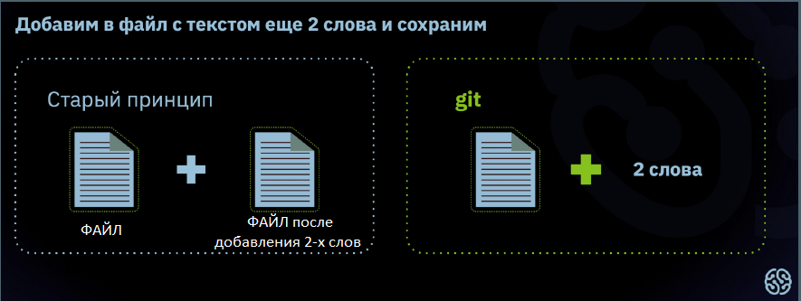
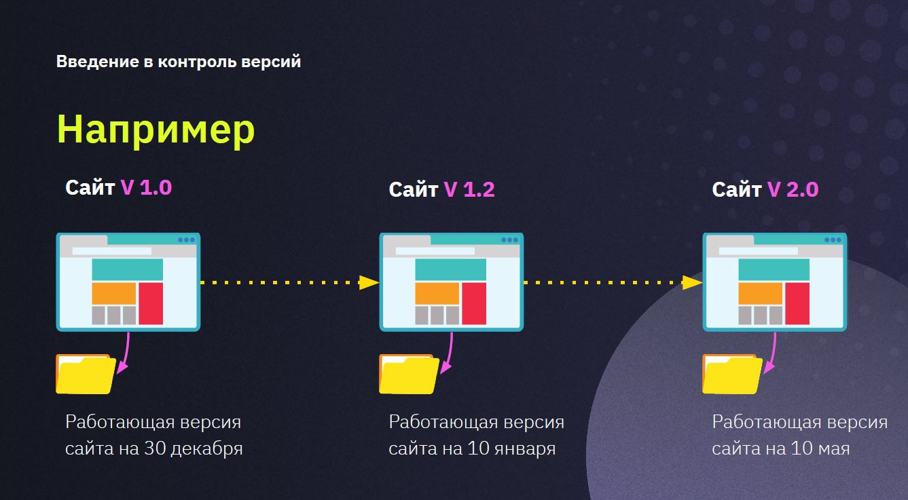
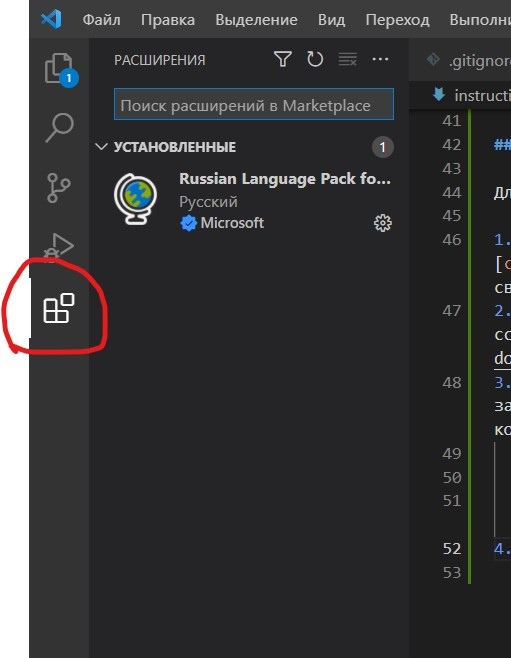
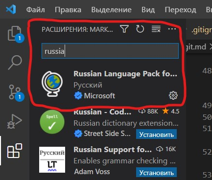

# **GIT**

## _Содержание:_

1. [Что такое Git и как он работает](#что-такое-git-и-как-он-работает)
2. [Возможности](#возможности)
3. [Примеры контроля версий](#примеры-контроля-версий)
4. [Начало работы и некоторые команды Git](#начало-работы-и-некоторые-команды-git)
5. [Работа с удаленными репозиториями](#работа-с-удаленными-репозиториями)
6. [Настройка совместной работы](#настройка-совместной-работы)
7. [Pull request, что это и как работает?](#pull-request-что-это-и-как-работает)
___

### *__Что такое Git и как он работает__*

Автор программы — **<code>[Линус Торвальдс](https://ru.wikipedia.org/wiki/Торвальдс,_Линус)</code>**, создатель ОС Linux. Подробнее об авторе можно прочиать по ссылке.

Git - это программа, которая берет на себя вопросы контроля версий над проектом. Она самая популярная, но не единственная. Стоит обратить внимание на то, что Git сохраняет в памяти не файлы целиком, а разницу между ними.

*Например:*

### *__Возможности:__*

Git необхоим, чтобы:

* хранить разные версии проекта
* возвращаться к разным версиям проекта

Хранение версий сводится к созданию копий информации на компьютере или сервере. Функцию возврата реализуют за счёт восстановления предыдущих версий.

Таким образом, система контроля — это реализованная возможность замены информации с использованием сохраненных версий.

> Когда вы работаете в команде, контроль версий помогает синхронизировать усилия.

### *__Примеры контроля версий:__*

Самый распространенный пример из жизни - это возможность сохраниться в компьютерной игре.

Также, пример можно представить в следующем виде:

### *__Начало работы и некоторые команды Git:__*

 *__Для начала работы с Git необходимо сделать следующее:__*

1. Вам необходимо скачать и установить Git по ссылке: <code>[скачать Git](https://git-scm.com/downloads)</code>, выбрав свою операционную систему.
2. Скачать и установить Visual Studio Code по следующей ссылке: <code>[скачать VS Code](https://code.visualstudio.com/download)</code> , выбрав свою операционную систему.
3. После скачивания и установки программ, Вам необходимо запустить командную строку Git Bash и ввести следующие команды, чтобы представиться системе:
    > git config --global user.name "Ваше ФИО"

    > git config --global user.email ваш адрес электронной почты
4. В VS Code можно установить расширение на русском языке, для этого:

    * Нажимаем на значек "Расширения" (выделен красным кружком)

         

    * В поисковике набрать Russian Language Pack и установить расширение.

        

    * Перезапустить VS Code

*__Запомним некоторые команды Git:__*

*git --version* - смотрим текущую версию git'a, установленную на компьютере;

*git init* - инициаизация: указываем папку, в которой git начнет отслеживать изменения;

*git status* - показывает текущее состояние git'a, есть ли изменения, которые нужно закоммитить (сохранить);

*git add "название файла"* - добавляет содержимое рабочего каталога в индекс для последующего коммита (указанный файл становится отслеживаемым);

*git add .* - добавляет все файлы рабочего каталога в индекс для последующего коммита (все неотслеживаемые файлы становятся отслеживаемыми), данная команда экономит время;

*git commit -m "некое сообщение"* - берет все данные (внесенные изменения) и сохраняет их слепок во внутренней базе данных. В сообщении следует писать короткое и понятное описание того, какие изменения были внесены;

*git log* - журнал изменений, в нем можно найти коммит, к которому необходимо вернуться;

*git checkout "4-6 первых знака коммита из журнала"* - переключение между версиями файла;

*git checkout master* - возвращает нас в последний актуальный коммит (master - название основной ветки);

*q* - выход из режима просмотра списка в исходное состояние терминала;

*git diff* - показывает разницу между текущим состоянием и последним сохраненным;

*git branch* - выводит список веток в репозитории;

*git branch "new_branch_name"* - создать новую ветку с именем "new_branch_name";

*git branch -d "branch_to_delete"* - удалить ветку с именем "branch_to_delete";

*git checkout "branch_name"* - переключение на ветку с именем "branch_name";

*git merge "branch_name"* - слияние ветки "branch_name" с текущей веткой;

*git log --graph* - выводит список коммитов в виде красивого графа/дерева;

### *__Работа с удаленными репозиториями:__*

Для работы с удаленными репозитариями необходимо запомнить три основные команды:

*git clone + ссылка на репозиторий* - с помощью данной команды создается локальный репозиторий на ПК, аналогичный удаленному. Будет полезна, если мы захотим поработать над проектом на другом ПК, на котором нет файлов для работы над данным проектом.

*git push* - отправляет локальную версию репозитория на внешний (удаленный) репозиторий. **Может требоваться авторизация на внешнем репозитории!**

*git pull* - позволяет выкачивать из удаленного репозитория в локальный, все изменения, которые были сделаны. Например, если мы работали над проектом на другом ПК, отправили изменения на удаленный репозиторий, а теперь нам надо актуализировать версию локального репозитория на своем ПК.

*__Важно!__* Команда *git pull* составная: она не только загружает все изменения, но и пытается слить (сделать merge) все ветки на локальном ПК и в удаленном репозитории.

### *__Настройка совместной работы:__*

### *__Pull request, что это и как работает:__*