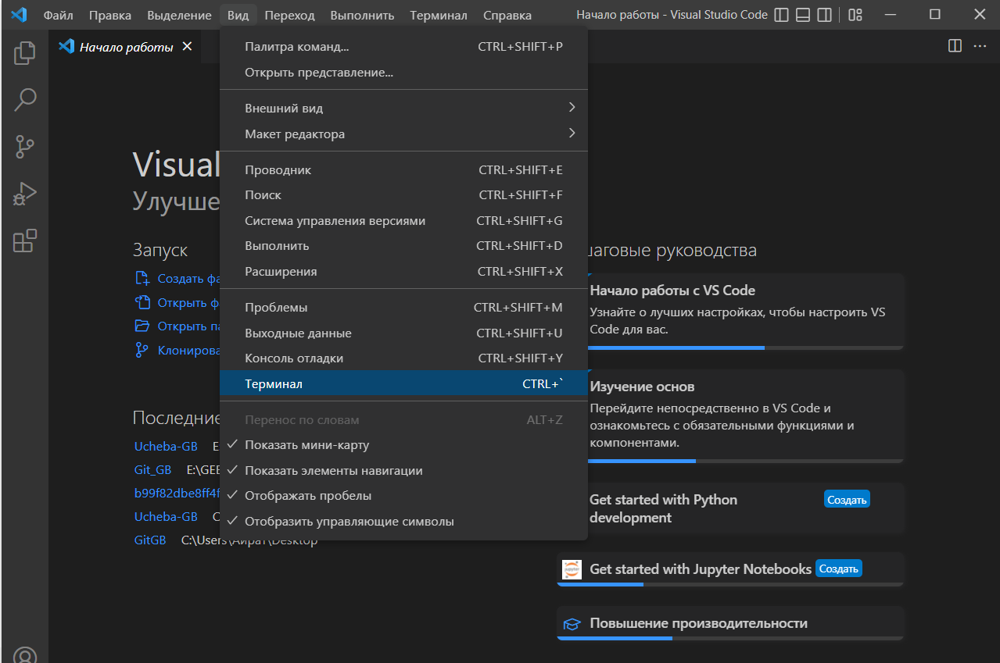
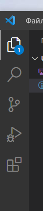
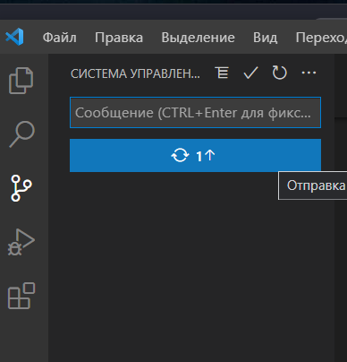

# Дбрый день!

### Меня зовут 
### **Завьялво Руслан Евгеньевич**

>Я прохожу обучение в онлайн школе по IT образрванию **GeekBrains**
## Данный текст написан при испольвонаии синтаксиса ***Markdown***

### *Ниже приведены его возможности:*
* Для того чтобы вставить изображение, его необходимо поместить в корневую папку. Далее добавлеяем командку:

**< img src="имя_файла.расширение" width="200"/>** где **width="размер изображения"**

*(Для правильной работы кода - необходиом убрать пробел после символа "<").*

***Итак, с вставкой изображения разобрались, идем дальше:***

* Для написания текста курсивом, необходимо текст поместить между символами "*" - Пример *Текст*

* Для выделения текста полужирным, необходимо текст поместить между символами "**" - Пример: **Текст**

* Для написания текста полужирным курсивом, необходимо текст поместить между символами "***" - Пример: ***Текст***

* Для написания зачеркнутого текста, необходимо текст поместить между символами "~~" - Пример ~~Текст~~

* Для выделения заголовка используется символ в начале строки "#".
В зависимости от количества символов будут создаваться разные уровни заголовков.
# Заголовок первого уровня
## Заголовок второго уровня
### Заголовок третьего уровня
#### Заголовок четвертого уровня
##### Заголовок пятого уровня
###### Заголовок шестого уровня
####### Заголовок седьмого уровня - уже много, максиму доступно 6 уровней заголовков.

### ***Существует также подчеркивание текста:***

* Для этого необходимо прописать на следующей строке знак "="

Пример:

Текст
=

### ***Перейдем к нумерации списков:***

*Для нумерации списков, достаточно просто проставлять порядковый № с точкой. Пример:

1. Один
2. Два
3. Три

### ***Теперь рассмотрим оформление кода:***

`код` в строке выделяется `обратными апострофами` " ` " Тильда (Ё)
"```javascript
var s = "Подсветка JavaScript";
alert(s);
`` ` "
 ```javascript
var s = "Подсветка JavaScript";
alert(s);
```

"```python
s = "Подсветка Python"
print s
`` ` " 
```python
s = "Подсветка Python"
print s
```
 
" ```
Язык не указан, синтаксис не подсвечен.
Но мы вставим в него <b>тег</b>.
`` `" 
```
Язык не указан, синтаксис не подсвечен.
Но мы вставим в него <b>тег</b>.
```
### ***Перейдем к написанию таблиц:***
* Для написания таблицы, вертикальные линии "|" обозначают столбцы:
| Таблицы       | Это                | Круто |
| ------------- |:------------------:| -----:|
| столбец 3     | выровнен вправо    | $1600 |
| столбец 2     | выровнен по центру |   $12 |
| зебра-строки  | прикольные         |    $1 |
Внешние вертикальные линии (|) не обязательны, и они нужны только чтобы сам код Markdown выглядел красиво. Тот же код можно записать так:
Markdown | не такой | красивый
--- | --- | ---
*Но выводится* | `так же` | **клево**
1 | 2 | 3
### ***Завершим наши познания Цитатами:***
* Для написания циатат вначале необходимо написать символ ">"
> С помощью цитат очень удобно в письме обозначать исходный текст.
> Эта строка - часть той же цитаты.
## На данный момент это пока всё, что я изучил в синтаксисе ***Markdown***


# Тееперь рассмотри работу с Git

Для начала работы с Git:
1. Вам необходтмо скачть Git по ссылке https://git-scm.com/downloads выбрав свою операционную систему.
2. После скачивания и установки Git, Вам необходимо запустить командную строку Git Bash и ввести следующие команды:
>git config --global user.name "Ваше ФИО"
>git config --global user.email ваш_адрес_электронной@почты.ru
3. Скачать и установить Visual Studio Code по следующей ссылке https://code.visualstudio.com/download , выбрав свою операционную систему.

4. После скачивания и устанвоки, при необходимости устанвоить в Visual Studio Code русский язык, для этого, вам нужно нажать кнопку Расширения в левом столбике (нижняя иконка "квадратики")


после чего в поисковике набрать Russian Language Pack и установить расширение. Перезапустить Visual Studio Code.
5. После того как будет все готово, Вам необходимо создать папку в корне диска с названием на английском языке, без пробелов. Далее в VSCode Перейти и нажать сверху слева - ФАЙЛ > Открыть Папку > и открыть ранее созданную Вами папку.


6. Дальше переходим сверху в раздел Вид > Терминал



7. В строке терминала вводим команду:
>```git init ```
После чего Git начинает отслеживать изменения в вашей созданной папке.
8. Создаем файл с любым названием на английском языке, например readme.md с расширением md.


9. Ввводим в терминале команду:
>```git add readme.md```
После чего в репозиторий будет добавлен Ваш файл readme.
10. Далее вносим данные, текс и т.д. в созданный вами файл readme. После внесения всех изменений, необходиом Перейти сверху слева в ФАЙЛ > Сохранить.
11. После сохранения ваших изменений, необходимо данные изменения предоставить (передвть/добавить) в репозиторий, для этого набираем следующие команды:
>```git add readme.md```
>```git commit -m "v.1.0"``` - Здесь в " " указывается комментарий к изменениям. Может быть номер версии и прочее.
12. Далее переходим в левый столбик и кликаем на иконку



Третья сверху (с тремя кружочками) и нажимаем отправка фиксаций



13. Преходим на GitHub и видим свои изменения и сохранения.

# Продолжаем изученеи Git
## Перейдем к изучению веток(Branch)
+ Для создания новой ветуи необходимо пропистаь следующую команду:
> git brahc название_ветки
+ Для удаления ветки необходимо пропистаь команду:
> git branch -b название_ветки
+Для переключениями между ветками необходимо набратьь следующую команду:
> git checkout назвние_ветки _на_которую_хотите_перейти
+ Для "Слияния" веток, находясь в ветве master,необходимо прописать следующую команду:
> git merge название_ветки_которую_нужно_слить_с_master
+ Для просмотра дерева коммитов необходимо прописать следующую команду:
> git log --graph
+ Для просмотра списка созданных и имеющихся веток, необходимо прописать следующую команду:
> git branch
+ Для просмотрасписка всех имеющихся коммитов, необходимо набрать слудующую команду:
<<<<<<< HEAD
> git log oneline

+ Чтобы посмотреть удаленные ветки, необходимо ввести следующую команду:
> git branch -r
+ Чтобы просмотреть все ветки (локальные и удаленные) необходимо набрать следующую команду:
> git branch -a


# Перейдем к управлению удаленным репозиторием.
## Изучим команды для выполнения синхронизаций с удаленным репозиторием:
* Для отправки измененных данных из локального репозитория на удаленный, после сохранения и коммита,  необходимо написать следующую команду:
> git push
* Для загрузки измененных данных из удаленного репозитория в локальный, необходимо прописать следующую команду:
> git pull
* Для просмотра удалённых репозиториев, связанных с локальным, необходимо ввести следующую команду:
> git remote -v
* Для удаления привязки удаленного репозитория с сокращенным именем origin необходимо набрать следующую команду:
> git remote remove origin
* Для удаления привязки удалённого репозитория можно ввести команду:
> git remote rm origin
* Для получения данных об удалённом репозитории с именем origin необходимо ввести команду:
> git remote show origin
* Для того чтобы скачать все ветки созданные на удаленном репозитории, но не сливать с локальными, необходимо ввести команду:
> git fetch origin # если указать далее название ветки, то скачается указанная ветка
## *Спасибо за внимание и приятного дня!* 
