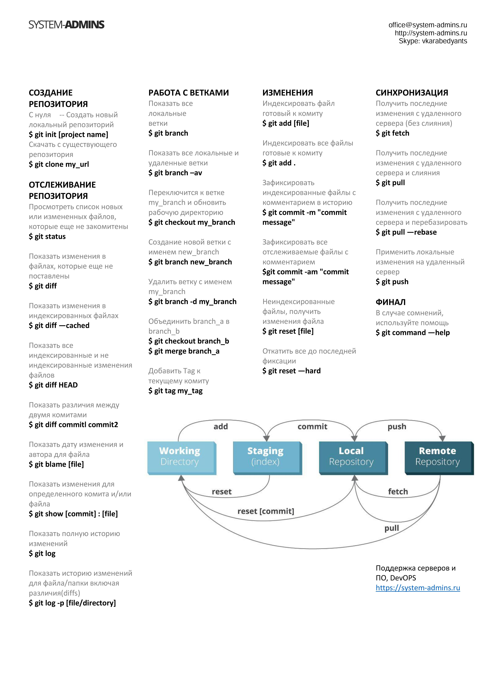

# Начало работы  с GIT

## Установка GIT
- Для начала работы с GIT нужно скачать установочные файлы программы: [Установщик GIT](https://git-scm.com/downloads)

---
## Имя пользователя
- Первое, что вам следует сделать после установки Git — указать ваше имя и адрес электронной почты. Это важно, потому что каждый коммит в Git содержит эту информацию, и она включена в коммиты, передаваемые вами, и не может быть далее изменена:

* *git config --global user.name "John Doe"*
* *git config --global user.email johndoe@example.com*

## Выбор редактора
- Теперь, когда вы указали своё имя, самое время выбрать текстовый редактор, который будет использоваться, если будет нужно набрать сообщение в Git. По умолчанию Git использует стандартный редактор вашей системы, которым обычно является Vim. Если вы хотите использовать другой текстовый редактор, например, Emacs, можно проделать следующее:

* *git config --global core.editor emacs*

## Основные команды Git: 

## Работа с удалёнными репозиториями

### Просмотр удалённых репозиториев
- Для того, чтобы просмотреть список настроенных удалённых репозиториев, вы можете запустить команду git remote. Она выведет названия доступных удалённых репозиториев.

### Добавление удалённых репозиториев

- Для того, чтобы добавить удалённый репозиторий и присвоить ему имя (shortname), просто выполните команду git remote add <shortname> <url>

### Получение изменений из удалённого репозитория — Fetch и Pull
- Таким образом, git fetch origin извлекает все наработки, отправленные на этот сервер после того, как вы его клонировали (или получили изменения с помощью fetch).

- Выполнение git pull, как правило, извлекает (fetch) данные с сервера, с которого вы изначально клонировали, и автоматически пытается слить (merge) их с кодом, над которым вы в данный момент работаете.

### Отправка изменений в удаленный репозиторий (Push)

-Когда вы хотите поделиться своими наработками, вам необходимо отправить их в удалённый репозиторий. Команда для этого действия простая: git push <remote-name> <branch-name>.

### Просмотр удаленного репозитория

- Если хотите получить побольше информации об одном из удалённых репозиториев, вы можете использовать команду git remote show <remote>.

### Удаление и переименование удалённых репозиториев

- Для переименования удалённого репозитория можно выполнить git remote rename. 

## Ну и на последок, цитата о программировании:

>__Не волнуйтесь, если что-то не работает. Если бы всё работало, вас бы уволили.__

>**Mosher’s Law of Software Engineering**

