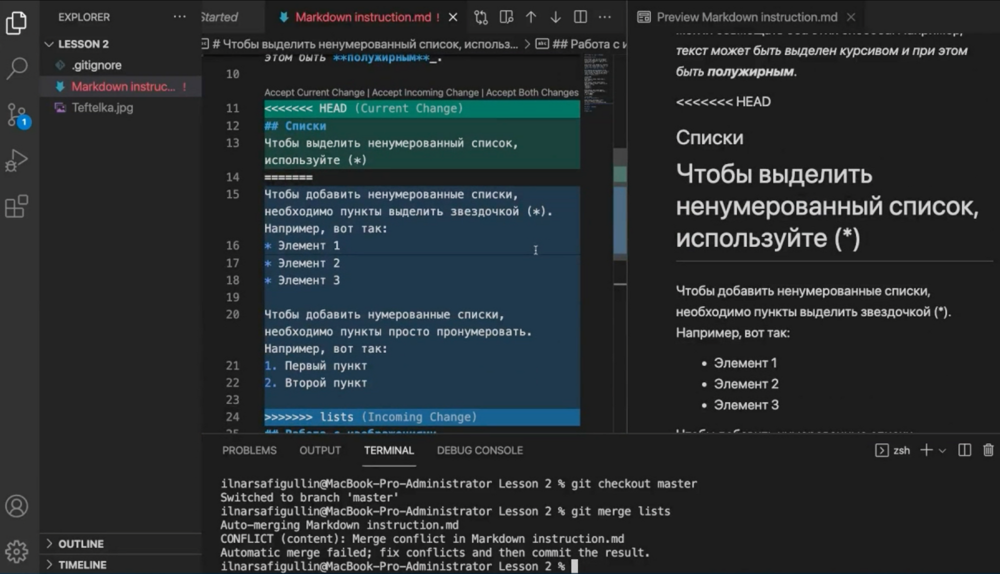
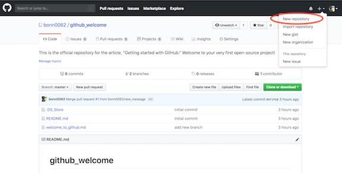
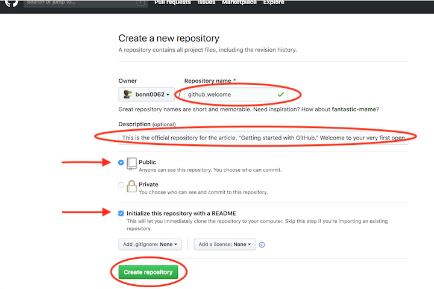
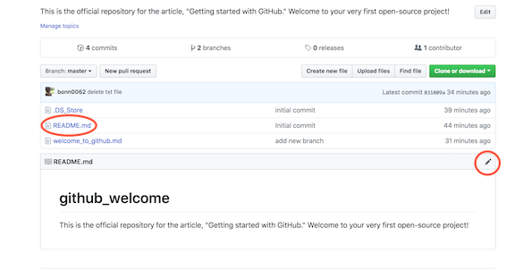
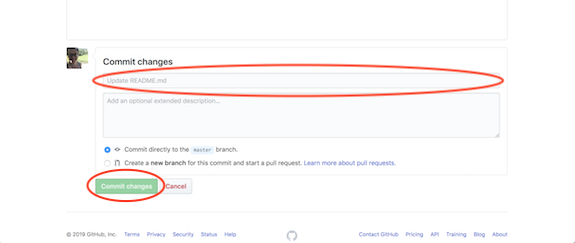
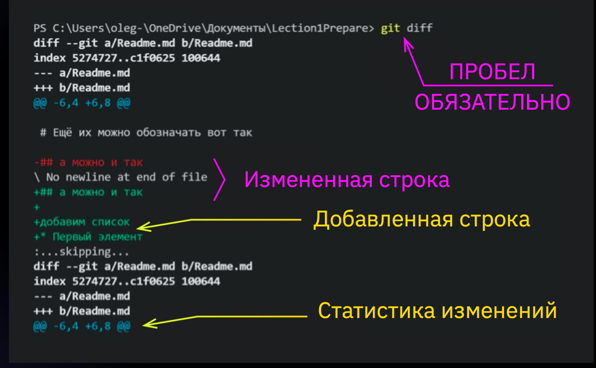

### Основные команды для работы с GIT 
После первого запуска Git нужно произвести настройку

 Установим имя для вашего пользователя

Вместо <ваше_имя> можно ввести, например, Petr Perviy

Кавычки оставляем
    
    git config --global user.name "<ваше_имя>"

Теперь установим email. Принцип тот же.

    git config --global user.email "<адрес_почты@email.com>"

### Затем создаем первый репозиторий

Для этого создаем папку лучше в корне диска и там набираем команду

    git init 

 Проверяем .

 Создаем в нутри папки фаил txt 

 Затем вводим команду 

     git status

И видми что у нас есть фаил,но изменеия в нем пока не отслеживаються.

Для этого надо ввести команду

     git add <name fail> 

[пример применения команды]  

Для фиксации изменений используеться команда
git commit -m [*название точки сохранения*]

Для фиксации изменений используеться команда 

     git commit -m [название точки сохранения]

Для просмотра всех комитов используется команда

     git log

Пример применения команды git log[пример применения команды]

[пример применения команды]

    git reflog - показывает журнал сохраненых изменений 

    git diif- показыввает различия между двумя сохранениями

[пример применения команды]

### Работа с удаленными репозиториями 

Берем ссылку репозитория с которым будем работать 

*пример*  

Делаем Fork проекта в свой репозиторий

Пример

Делаем клон репозитория в VS 

    git clon <https://github.com/.......>

*Пример* 

Переходим в образовавшуюся (папку хранящуюся в репозитории) и там открываем ее терминал

Создаем там новую ветку и переходим туда

    git barnch <name_branch> 

можно сразу создать и перейти в новую ветку для это используем код 

    git checkout -b <newbranchname>

Пример 

Добавляем файл для отслеживания

    git add <name_fail> 

Пример 

Вносим изменения в фаил и создаем комит этих изменений

    git commit <name_comit>

Пример 

Теперь отправляем эти изменения в свой github на ветку в которой производились изменения

     git push origin <name branch>

Пример 

Идем в гитхаб и делаем там pull recvest в дочерний репозиторий

Пример 

Видим что появилось обновление и принимаем его ,там его можно переименовать и дать комментарий более полный

Пример 

После нажатия кнопки create pull request фаил с изменениями отправляется в дочерний гитхаб откуда мы его и взяли. Его владелец может посмотреть изменения и одобрить или нет слияние. Выбрав merge и потом его подтвердив. 
Это если нет конфликтов в файлах. Если же есть конфликт действуем так же как в случии слияния в локальном репозитории.

Для того что бы не мешали лишние фаилы , рекомендуеться создать фаил , который будет их игнорировать.

Фаил должен называтся *.gitignore*