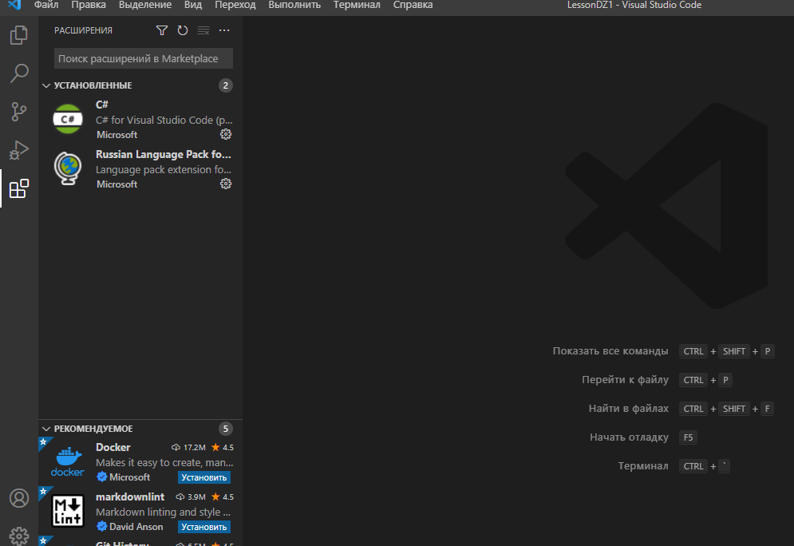
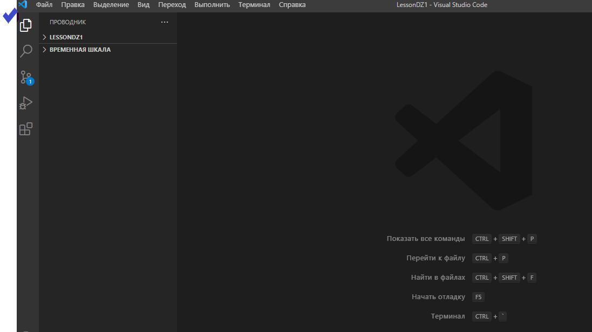

# **Иструкция по работе с Git** #

### Git — это система контроля версий, которая позволяет отслеживать и фиксировать изменения в коде, с возможностью изменить, восстановить код или откатить до более ранних версий.Также это мощный инструмент для взаимодействия нескольких разработчиков на одном проекте. ###

____________

## **Содержание** ##

1. ### Установка Git ###
2. ### Работа с VS Code и основные команды ##
3. ### Основные команды Git ###
4. ### Последовательность действий для начала работы в Git ###
5. ### Команды для создания и управления ветками (черновиками) ###
6. ### Команды необходимые для работы с удаленными репозиториями ###
7. ### Составные "ленивые)" команды** ###

_____________

### **Установка Git** ###

_____________

Введение в Git начинается с [**установки Git**](https://git-scm.com/book/ru/v2/Введение-Установка-Git). Скачайте и установите Git для Windows, macOS или Linux. Также рекомендуется скачать и установить редактор [**Visual Studio Code (VS Code)**](https://code.visualstudio.com/) — текстовый редактор, разработанный Microsoft для Windows, Linux и macOS. Служит для работы с Git, позиционируется как редактор кода для разработки веб- и облачных приложений.

### **Работа с VS Code и основные команды** ##

По желанию VS Code можно русифицировать, для этого после установки кликаем на иконку расширений, затем в поле поиска вводим russian, находим пакет Russian Language Pack for Visual Studio Code и жмём Install.

_

_

Для работы с нашим будущим проектом, нужно создать папку на компьтере, в которой он будет храниться. Далее, через VS Code, открываем нашу папку, для этого кликаем на иконку проводник в левом верхнем меню редактора.

_

  

_  
  
После установки необходимо «представиться» системе контроля версий. Это нужно сделать всего один раз, и git запомнит вас. Для этого нужно ввести в терминале 2 команды:
* git config --global user.name «Ваше имя английскими буквами»
* git config --global user.email ваша почта@example.com
Данные не проверяются, то есть вы можете указать любую почту и тем более любое имя. Но лучше написать реальные данные или, как минимум что-то осмысленное). Эти данные будут указываться, когда вы будете делать коммиты (о них подробнее на лекции), а указание реальных данных упростит командную работу.

___________

### **Основные команды Git** ###

___________

* git init — создать новый локальный репозиторий с заданным именем.

* git status — полный список изменений файлов, ожидающих коммита.

* git diff — показать изменения в файлах

* git add . — сделать все измененные файлы готовыми для коммита и отслеживаемыми для Git

* git add '*.txt' — добавить только файлы, соответствующие указанному выражению.

* git commit -m "message" — записать изменения с заданным сообщением.

* git commit -am "message" — добавить и одновременно записать изменения с заданным сообщением.

* git log — список изменения текущей ветки.

* git checkout b9533bb - переключиться на коммит с указанным номером (переместить HEAD на указанный коммит, рабочую директорию вернуть к состоянию, на момент этого коммита).

* git checkout master - переключиться на коммит, на который указывает master.

git reflog - показать последние изменений положения указателя HEAD

______________

 ### **Последовательность действий для начала работы в Git** ###

 _____________

*Создание нового репозитория, первый коммит, привязка удалённого репозитория с gthub.com, отправка изменений в удалённый репозиторий.*

* git init - создаём репозиторий в директории
* touch readme.md - создаем файл readme.md
* git add readme.md - добавляем файл в индекс
* git commit -m "Save001" - создаем коммит
* git remote add origin https://github.com/Avlnosorog/Programming-languare-C-.git - добавляем предварительно созданный пустой удаленный репозиторий

* git push -u origin master - отправляем данные из локального репозитория в удаленный (в ветку master).

_____________

### **Команды для создания и управления ветками (черновиками)** ###

_____________

* git branch "name" - создаём ветку с заданным именем "name".

* git branch - команда показывает список имеющихся веток с указанием той ветки, на которой мы находимся.

* git checkout "name" - переключаемся на ветку имя которой мы указали.

* git merge "name" - слияние текущей ветки с веткой, которую мы указали "name".

_________________

### **Команды необходимые для работы с удаленными репозиториями** ###

_________________

* git clone - клонируем репозиторий из GitHub на свой ПК. Обратите внимание: не нужно пользоваться командой "git init", команда "clone" не только скачивает файлы из интернета, но и инициализирует репозиторий в скачанной папке. Команда "git clone" составная: она не только
загружает все изменения, но и пытается слить 
все ветки на локальном компьютере и в
удаленном репозитории.

* git pull - эта команда позволяет скачать все 
из текущего репозитория и автоматически
сделать "merge" с нашей версией.

* git push - отправить свою версию репозитория во
внешний репозиторий. При первом её использовании нужна авторизация.

____________

### **Составные "ленивые)" команды** ###

____________

* git checkout -b "name" - команда создаёт ветку с указанным именем "name" и одновременно перенаправляет на эту ветку.

* git commit -am "message" — добавить и одновременно записать изменения с заданным сообщением.

* git branch -d "name","name","name" - позволяет удалять ветки с заданными именами.
