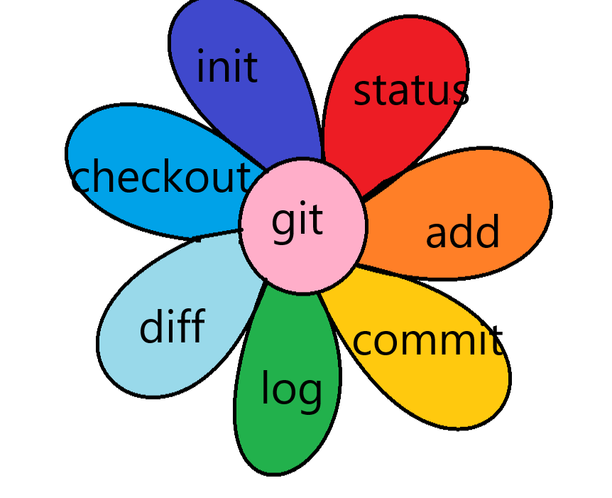

# инструкция по командам git

Подробные и полные инструкции по командам git можно посмотреть [GitHub](https://github.com/) или найти самостоятельно

наш чудо-цветочек покажет без чего нельзя обойтись 

**git init** -создание локального репозитория

**git status** -Показывает текущее состояние гита

**git add** -добавляет содержимое рабочего каталога

**git commit** -зафиксировать или сохранить

**git log** -Журнал изменений

**git checkout** -Переключение между версиями

**git diff** -Показывает разницу между текущим файлом
и сохранённым

**git clone** -Эта команда позволяет скопировать внешний репозиторий на наш ПК

**git pull** - скачать все из текущего репозитория и автоматически сделать merge с нашей версией

**git push** -эта команда позволяет отправить нашу версию репозитория на внешний репозиторий

Для работы с удаленными репозиториями в GitHub существует **pull request**

__*Как сделать pull request*__
* Делаем fork репозитория

* Делаем clone СВОЕЙ версии репозитория

* Создаем новую ветку и в НЕЕ вносим свои изменения

* Фиксируем изменения (делаем коммиты)

* Отправляем свою версию в свой GitHub

* На сайте GitHub нажимаем кнопку pull request 
