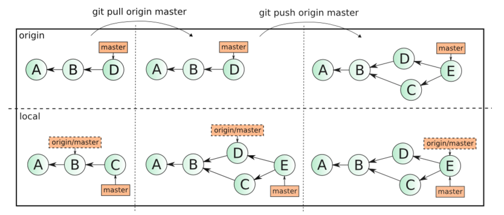

## Как работает ##
Если посмотреть на картинку, то становиться чуть проще с пониманием. Каждый кружок, это commit. Стрелочки показывают направление, из какого commit сделан следующий. Например C3 сделан из С2 и т. д. Все эти commit находятся в ветке под названием main. Это основная ветка, чаще всего ее называют master . Прямоугольник main* показывает в каком commit мы сейчас находимся, проще говоря указатель.

В итоге получается очень простой граф, состоящий из одной ветки (main) и четырех commit. Все это может превратиться в более сложный граф, состоящий из нескольких веток, которые сливаются в одну.

Об этом мы поговорим в следующих статьях. Для начала разберем работу с одной веткой.

Установка
Основой интерфейс для работы с Git-ом является консоль/терминал.